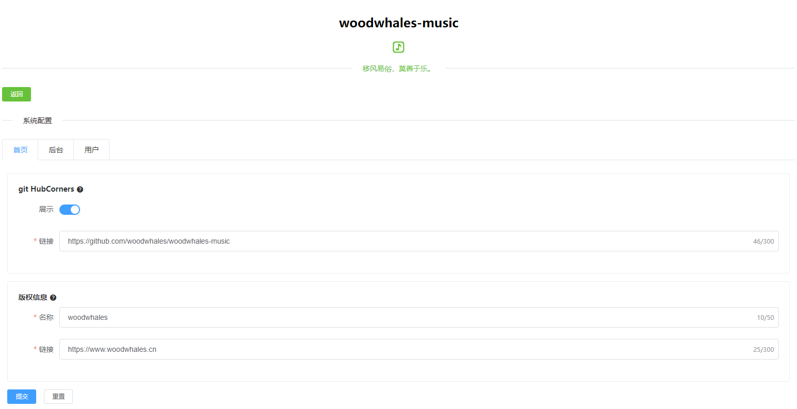
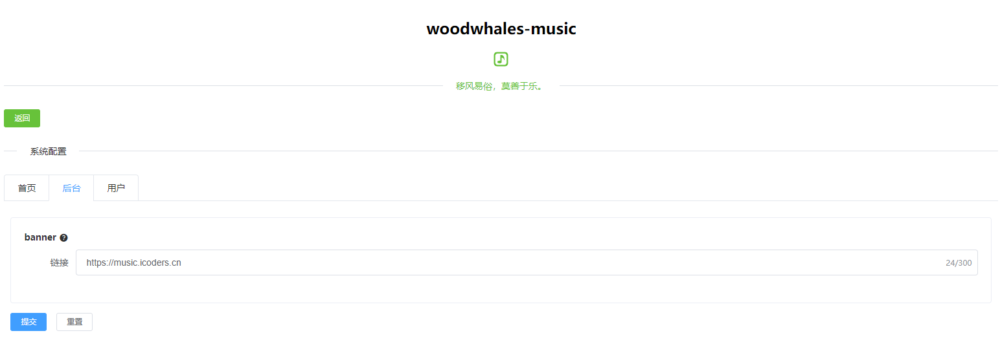
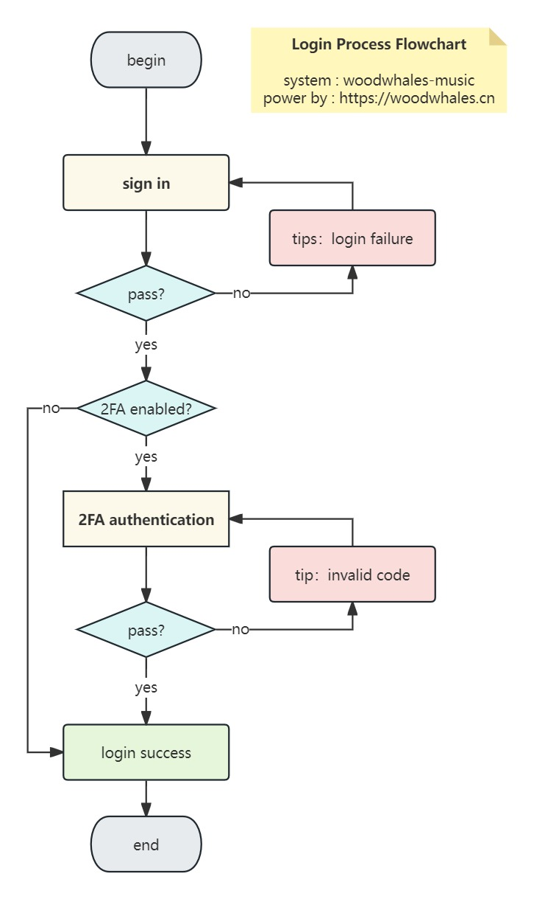
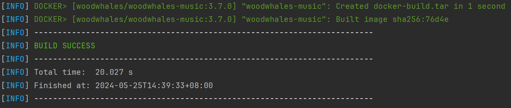
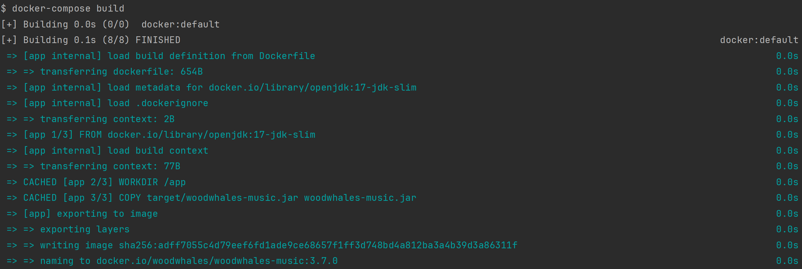

# woodwhales-music

[](https://music.icoders.cn) 

> 基于 SpringBoot 的开源超简洁音乐播放器
> 
> A open source Music Player developed based on Java SpringBoot

<div align=center>在线播放：<a href="https://music.icoders.cn">https://music.icoders.cn</a></div>

环境要求：JDK 17+

前端技术栈：Vue 2.0 + Element-UI + Thymeleaf + Axios + APlayer

后端技术栈：Spring Boot3 + Spring Security6 + jsoup + MyBatis-Plus + MySQL

## 1. 前台效果图

dev 环境：http://127.0.0.1:8084/


## 2 后台效果图

dev 环境：http://127.0.0.1:8084/music/admin/

dev 环境账号密码：admin / admin

### 2.1 首页


音乐名称为<font color='gree'>绿色字体</font>，表示该音乐**已关联**音频链接和专辑封面链接。

音乐名称为<font color='red'>红色字体</font>，表示该音乐**未关联**音频链接和专辑封面链接。

### 2.2 登录页面

#### 2.2.1 账号密码登录


#### 2.2.2 2FA认证


### 2.3 添加/编辑

太懒了，加了个解析音乐平台的解析器，一旦解析成功，自动填充：音乐名称、作者、专辑名称。

> 支持：网易云、QQ 音乐、虾米音乐（平台已关闭）
>
> 建议开发者自行搭建 [alist](https://github.com/alist-org/alist) 并维护音乐源文件


### 2.4 解析

1. 复制要解析的 html 源码。

2. 选择要解析的平台，粘贴 html 源码，点击解析：


#### 2.4.1 网易云

class 为：`g-bd4 f-cb`的 html 源码


#### 2.4.2 QQ 音乐

class 为：`main`的 html 源码


#### 2.4.3 虾米（平台已关闭）

class 为：`page-container`的 html 源码


### 2.5 系统配置

#### 2.5.1 首页配置



#### 2.5.2 后台配置



#### 2.5.3 用户配置


## 2. 系统说明

### 2.1 配置文件

#### 2.1.1 SQL 文件

> 系统启动时会执行 [woodwhales-music/src/main/resources/init.sql](https://github.com/woodwhales/woodwhales-music/blob/master/src/main/resources/init.sql) 脚本进行库表结构初始化

文件位置：

- woodwhales-music/doc/sql/open_music_适用高于v3.6.0版本.sql
- woodwhales-music/doc/sql/open_music_适用高于v3.6.0版本_只含库表结构.sql
- woodwhales-music/doc/sql/open_music_适用高于v3.6.0版本_只含数据.sql

文件说明：

- 不建议使用低于 v3.6.0 版本的 SQL 文件
- 只导入库表结构，则使用：open_music_适用高于v3.6.0版本_只含库表结构.sql
- 导入数据，则使用：open_music_适用高于v3.6.0版本_只含数据.sql，开发者可导入后从后台页面做批量删除操作。

#### 2.1.2 系统配置

> 配置文件使用 yml 语法

**文件位置**

- 默认环境：[woodwhales-music/src/main/resources/dev/application.yml](https://github.com/woodwhales/woodwhales-music/blob/master/src/main/resources/application.yml)
- dev 环境：[woodwhales-music/src/main/resources/dev/application-dev.yml](https://github.com/woodwhales/woodwhales-music/blob/master/src/main/resources/dev/application-dev.yml)

**环境配置**

举例，配置生产环境 `prod` 配置文件：

1. 在 woodwhales-music/src/main/resources/ 下创建以文件夹，名称为：prod

2. 在 prod 文件夹下，创建 application-prod.yml 配置文件

3. 在 pom 配置文件中，配置 profiles 节点：

    ```XML
    <profiles>
        <profile>
            <id>prod</id>
            <properties>
                <profiles.active>prod</profiles.active>
            </properties>
        </profile>
    </profiles>
    ```

 4. 使用 maven 命令打包工程时，-P 参数指定 `prod` 环境参数

    ```shell
    mvn install -Pprod
    ```

**文件说明**

- 后台系统账号、密码

    - 后台系统密码：`system.init.password`
    
    ```yaml
    system:
    init:
    # 后台系统admin账号的登录密码，每次初始化都会初始化
    password: xxx
    ```
    
- GitHub Corners

    - 是否展示 GitHub Corners：`github.show`
    - github 链接：`github.url`

    ```yaml
    github:
      # 是否展示 GitHub Corners
      show: true
      # github 链接
      url: "https://github.com/woodwhales/woodwhales-music"
    ```

- 版权信息

    - 作者名称：`author.name`
    - 作者网站：`author.website`

    ```yaml
    author:
      # 作者名称
      name: "woodwhales"
      # 作者网站
      website: "https://www.woodwhales.cn"
    ```

- 音乐链接来源

    - 首页展示的音乐链接来源：`music.link.source`

    ```yaml
    music:
      link:
        # 链接来源：0-github，1-alist
        source: 1
    ```
    
- 音乐网站首页

    - 音乐网站首页：`music.site`，用于后台 banner 快捷跳转至网站首页

### 2.2 后台登录流程图



## 3. 编译打包

### 3.1 打包 jar 文件 

执行 mvn 命令打包：

```shell
mvn clean package -Pdev
```

打包成功的 woodwhales-music.jar 文件在项目根目录下的 target 文件目录中。

上述 -P 表示打包 dev 环境参数配置文件。

目前项目中的 pom.xml 配置文件中只指定了 dev 和 prod，开发者可根据需要指定其他环境参数：

> 如果配置生产环境，则需要在 [woodwhales-music/src/main/resources/](https://github.com/woodwhales/woodwhales-music/tree/master/src/main/resources) 中创建 prod 文件夹，并创建 application-prod.yml 配置文件，打包时 -P 参数指定为：prod

```xml
<profiles>
    <profile>
        <id>dev</id>
        <activation>
            <activeByDefault>true</activeByDefault>
        </activation>
        <properties>
            <profiles.active>dev</profiles.active>
        </properties>
    </profile>
    <profile>
        <id>prod</id>
        <properties>
            <profiles.active>prod</profiles.active>
        </properties>
    </profile>
</profiles>
```

### 3.2 docker 构建

> 本系统在 docker hub 仓库中提供了最新版本镜像
>
> ```shell
> docker pull woodwhales/woodwhales-music
> ```

本系统提供俩种构建方式：

#### 方式1：mvn 命令构建

命令行执行目录切换到项目根目录，执行如下命令：

```shell
mvn clean install
```
或者：

```shell
mvn clean package docker:build
```

控制台输出 BUILD SUCCESS 信息，即表示构建成功。



#### 方式2：docker-compose 命令构建

命令行执行目录切换到项目根目录，执行如下命令：

```shell
docker-compose build
```

控制台输出 docker 镜像信息，即表示构建成功



## 4. 启动方式

注意：本系统服务需要依赖 mysql 数据库，在第一次安装之前请自行准备一个可以访问的 mysql 服务。

执行创建名为 open-music 数据库 sql 命令：

```sql
CREATE DATABASE IF NOT EXISTS open_music CHARACTER 
	SET utf8mb4 COLLATE utf8mb4_unicode_ci;
```

### 方式1：jar 包启动

系统安装 jdk 版本 17 以上，命令行切换至 woodwhales-music.jar 所在目录，执行如下命令：

```shell
java -jar woodwhales-music.jar
```

如果出现数据库链接失败，则检查在编译打包 jar 文件时指定什么环境参数，确认数据库链接是否配置正确。

### 方式2：docker 启动

完整的 docker 启动命令：

```shell
docker run -d \
--restart=always \
--name woodwhales-music \
-p 8084:8084 \
-e "MYSQL_HOST=host.docker.internal" \
-e "MYSQL_DATABASE=open_music" \
-e "MYSQL_PORT=3306" \
-e "MYSQL_USER=root" \
-e "MYSQL_PASSWORD=root1234" \
-e "SYSTEM_INIT_PASSWORD=admin" \
woodwhales/woodwhales-music:latest
```

环境命令参数说明：

| 环境参数             | 说明                                                         | 默认值                  |
| -------------------- | ------------------------------------------------------------ |----------------------|
| MYSQL_HOST           | mysql 数据库服务的链接地址，默认值针对 windows、mac 系统生效，linux 系统需要用户强制指定宿主机 IP | host.docker.internal |
| MYSQL_DATABASE       | 数据库名称                                                   | open_music           |
| MYSQL_PORT           | mysql 数据库服务的端口号                                     | 3306                 |
| MYSQL_USER           | mysql 数据库服务的账号名称                                   | root                 |
| MYSQL_PASSWORD       | mysql 数据库服务的账号密码                                   | root1234             |
| SYSTEM_INIT_PASSWORD | woodwhales-music 系统的后台管理员 admin 账号登录密码，**生产环境请勿必自定义** | admin                |

## 5. 功能说明

### V3.7.7

- 页面底部UI样式更新
- 修复解析音乐图片下载按钮不重置问题

### V3.7.6

- 修复点击音乐播放未更新点击次数
- 页面底部UI样式更新
- 回到顶部UI样式更新

### V3.7.5

- 增加页面访问人次、歌曲点击人次
- 增加系统版本信息
- 重构后台页面底部信息

### V3.7.4

- 修复后台首页搜索问题
- 优化新增、编辑链接文本框（自适应文本高度）
- 后台增加友情链接配置

### V3.7.3

- 优化首页
- 修复依赖冲突导致的控制台日志打印问题

### V3.7.2

- 支持对音乐增加标签
- 2FA 验证文本样式优化

### v3.7.1

- 添加、编辑音乐时，可以根据 html 页面源码解析封面链接
- 增加 favicon
- 修复分页大于 100 时页码数据不对问题

### v3.7.0

- Spring Boot 2.0 升级至 Spring Boot 3.0，Spring Security 5.0 升级至 Spring Security 6.0（JDK 版本要求 17 以上）
- 系统启动时增加默认执行初始化库表 SQL 脚本
- 增加 2FA 认证
- 后台可视化配置 2FA 认证
- 重构后台登录页面
- README 文档说明排版更新
- 增加 docker 构建配置文件

### v3.6.3

- 后台首页增加系统配置快捷按钮，跳转至系统配置管理页面，可实时动态修改：

  - 首页的底部版权信息和 GitHub Corners 可进行
  - 后台页面公共头部的 icon 跳转首页链接配置

- 修复在 jdk17 版本以上编译失败

### v3.6.2

- 重构后台页面头
- 后台页面头增加跳转前台页面链接

### v3.6.1

- 后台音乐列表支持可排序列：排序、创建时间、更新时间
- 首页增加增加 GitHub Corners，可以通过 application.yml 自定义配置：是否展示，github 链接
- 修复开发环境后台列表查询数据接口响应失败

### v3.6.0

- **与低于 v3.6.0 版本的库表不兼容，请使用 doc 中的 [open_music_适用高于v3.6.0版本.sql](./doc/sql/open_music_适用高于v3.6.0版本.sql) 进行库表数据初始化操作**

    > 低于  v3.6.0 版本的库表数据初始化 SQL： [open_music_适用低于v3.6.0版本.sql](./doc/sql/open_music_适用低于v3.6.0版本.sql) 

- 后台 UI 页面全面升级（使用 vue + element-ui 进行重构）

- 列表查询、新增、编辑音乐页面增加播放 APlayer 播放器，可支持实时听音乐

- 音乐链接支持 github、alist 来源

### v3.5.5

- 修复 cdn.jsdelivr.net 因未翻墙而无法访问题
- woodwhales-common 版本依赖更新

###  v3.5.0

- 引入 [woodwhales-common](https://github.com/woodwhales/woodwhales-common) 依赖

### v3.0.0

- 支持导出已关联音乐清单。

### v2.0.0

-   添加、编辑音乐信息时，当填写了音乐链接或者封面链接其中之一后，可自动填充另外一个文本内容。

### v1.0.0

-   前端页面加载完毕，可离线播放。
-   后台系统可添加、编辑、删除音乐，并对音乐列表排序。
-   添加音乐：可从音乐平台 html 动态解析，支持：网易云、QQ云音乐、虾米音乐（平台已关闭）。

## 6. 歌单

已收录 1429 首音乐

| 序号 | 音乐名称 | 专辑 | 作者 |
| --- | ------ | ------ | --- |
| 1 | Someone Like You | Someone Like You | Adele |
| 2 | いつも何度でも | 千と千尋の神隠し サウンドトラック | 木村弓 |
| 3 | 容易受伤的女人(国) | 阿菲正传 | 王菲 |
| 4 | Glad You Came | The Wanted (Special Edition) | The Wanted |
| 5 | 红日 | 红日 | 李克勤 |
| 6 | Goodbye | Goodbye Lullaby | Avril Lavigne |
| 7 | Imagine | Imagine: John Lennon | John Lennon |
| 8 | 后来 | 我等你 | 刘若英 |
| 9 | Comptine D'un Autre Été, L'après-Midi | Le Fabuleux Destin d'Amélie Poulain | Yann Tiersen |
| 10 | 听说 | Rene | 刘若英 |
| 11 | 光亮 | 光亮 | 周深 |
| 12 | Journey | Serenity | Capo Productions |
| 13 | 惊蛰 | 二十四节气 | 音阙诗听 / 王梓钰 |
| 14 | 孤勇者 | 孤勇者 | 陈奕迅 |
| 15 | 关于郑州的记忆 | 《你好，郑州》 | 李志 |
| 16 | 哀歌 (M-5) | 犬夜叉 音楽篇 | 和田薫 |
| 17 | 野狼disco | 野狼disco | 宝石Gem |
| 18 | 童年 | 罗大佑自选辑 | 罗大佑 |
| 19 | For the Love of a Princess | Braveheart (Original Motion Picture Soundtrack) (Expanded Edition) | James Horner |
| 20 | 老街 | 小黄 | 李荣浩 |
| 21 | 恋曲1990 | 昨日情歌74-89 | 罗大佑 |
| 22 | 光阴的故事 | 命中注定最犀利 | 罗大佑 |
| 23 | 金风玉露 | 金风玉露 | 旅行新蜜蜂 |
| 24 | 情非得已 | 遇见100%幸福1 烈爱红盘 | 庾澄庆 |
| 25 | 你要相信这不是最后一天 | 你要相信这不是最后一天 | 华晨宇 |
| 26 | 蜀绣 | 蜀绣 | 李宇春 |
| 27 | Jasmine Flower | Love Ballads | Kenny G |
| 28 | 赤伶 | 赤伶 | 邓寓君(等什么君) |
| 29 | 追梦赤子心 | 追梦痴子心 | GALA |
| 30 | 太阳照常升起 | 太阳照常升起 电影原声大碟 | 久石譲 |
| 31 | Destiny | 마녀유희 OST | 李成旭 |
| 32 | 1965 | 1965 | Zella Day |
| 33 | A Thousand Years | A Thousand Years | Christina Perri |
| 34 | Come By the Hills | Song of the Irish Whistle 2 | Joanie Madden |
| 35 | La Valse D'Amelie | Le Fabuleux destin d'Amélie Poulain | Yann Tiersen |
| 36 | 理想三旬 | 浓烟下的诗歌电台 | 陈鸿宇 |
| 37 | 东风破 | 叶惠美 | 周杰伦 |
| 38 | The Long And Winding Street | Mellow Candle | Robert de Boron |
| 39 | 安和桥 | 安和桥北 | 宋冬野 |
| 40 | The Cello Song | The Piano Guys: Hits Volume 1 | Steven Sharp Nelson |
| 41 | 当我想你的时候 | 当我想你的时候 | 汪峰 |
| 42 | 明天，你好 | Lost & Found 去寻找 | 牛奶咖啡 |
| 43 | 芒种 | 二十四节气 | 音阙诗听 / 赵方婧 |
| 44 | 漂浮地铁 | N+1 Evolution 珍藏版 | 李宇春 |
| 45 | 别送我 | 别送我 | 陈鸿宇 / 苏紫旭 / 刘昊霖 / 寒洛&鼓润 |
| 46 | 稻香 | 魔杰座 | 周杰伦 |
| 47 | 认真的雪 | 未完成的歌 | 薛之谦 |
| 48 | 浅草キッド | GOLDEN☆BEST | 北野武 |
| 49 | 晚风花香 | 原乡情浓 | 邓丽君 |
| 50 | 沉默是金 | 张国荣经典金曲精选 | 张国荣 |
| 51 | Best of 2012: Payphone/Call Me Maybe/Wide Awake/Starship/We Are Young | Anthem Lights Covers | Anthem Lights |
| 52 | 为爱痴狂 | 收获 新歌+精选 | 刘若英 |
| 53 | Lemon Tree | Dish Of The Day | Fool's Garden |
| 54 | 广东十年爱情故事 | 广东十年爱情故事 | 广东雨神 |
| 55 | Turning Tables | 21 | Adele |
| 56 | Monsters | Monsters | Katie Sky |
| 57 | A Day at a Time | Life In a Day (O.S.T) | Ellie Goulding Matthew Herbert |
| 58 | 我的八十年代 | 别再问我什么是迪斯科 | 张蔷 |
| 59 | 南山南 | 南山南 | 马頔 |
| 60 | 后会无期 | 后会无期 | G.E.M.邓紫棋 |
| 61 | 画心 | 画心 | 张靓颖 |
| 62 | 为爱痴狂_陈梦嘉 | THUG LIFE | 陈梦嘉 |
| 63 | 夜空中最亮的星 | 世界 | 逃跑计划 |
| 64 | Yellow | Best Of British | Coldplay |
| 65 | 一百万个可能 | 一百万个可能 | Christine Welch |
| 66 | 习惯了寂寞 | 习惯了寂寞 | 牛奶咖啡 |
| 67 | 我的歌声里 | Everything In The World (白金庆功版) | 曲婉婷 |
| 68 | 女人花 | 女人花 | 梅艳芳 |
| 69 | 一剪梅 | 花神 | 黄渤 / 左小祖咒 |
| 70 | A Life So Changed | Titanic: Music from the Motion Picture Soundtrack | James Horner |
| 71 | Here We Are Again (纯音乐) (《喜剧之王》电影插曲) | Here We Are Again (纯音乐) (《喜剧之王》电影插曲) | Cagnet (キャグネット) |
| 72 | 相思好比小蚂蚁 | 特别的日子 | 张蔷 |
| 73 | 阿珍爱上了阿强-五条人 | 梦幻丽莎发廊 | 五条人 |
| 74 | Almost Lover | Almost Lover | A Fine Frenzy |
| 75 | Down By The Salley Gardens | camomile | 藤田恵美 (ふじた えみ) |
| 76 | With An Orchid | If I Could Tell You | Yanni |
| 77 | 宝贝 (in a day) | Original | 张悬 |
| 78 | 这世界那么多人 | 这世界那么多人 | 莫文蔚 |
| 79 | 明天你是否依然爱我 | 其实你不懂我的心 | 童安格 |
| 80 | 爱如潮水 | 张信哲精选 | 张信哲 |
| 81 | 7 Years | The Young Pope (Original Series Sountrack) | Lukas Graham |
| 82 | The Sound of Silence (Reprise) | The Graduate | Simon & Garfunkel |
| 83 | BINGBIAN病变 (女声版) | BINGBIAN病变 (女声版) | 鞠文娴 |
| 84 | Don't You Remember | 21 | Adele |
| 85 | かごめと犬夜叉 (M-11+6) | 犬夜叉 音楽篇 | 和田薫 |
| 86 | 吉姆餐厅 | 吉姆餐厅 | 赵雷 |
| 87 | 很爱很爱你 | 很爱很爱你 | 刘若英 |
| 88 | 我们的时光 | 吉姆餐厅 | 赵雷 |
| 89 | Women of Ireland | Song of the Irish Whistle | Joanie Madden |
| 90 | Traveling Light | Traveling Light | Joel Hanson |
| 91 | 醉赤壁 | JJ陆 | 林俊杰 |
| 92 | 笑看风云 (Live) | 汪小敏 笑看风云 | 汪小敏 |
| 93 | 再度重相逢 | 泪桥 | 伍佰 & China Blue |
| 94 | The Way Of Life | 오! 필승 봉순영 OST | 吴硕浚 |
| 95 | 世界这么大还是遇见你 (清新的小女孩（中文版）) | 清新的小女孩（中文版） | 程响 |
| 96 | The Sounds Of Silence 寂静之音 | Silence With Sound From Nature | Bandari |
| 97 | 夏日漱石 (Summer Cozy Rock) | 浪潮上岸 (Tears In Ocean) | 橘子海 (Orange Ocean) |
| 98 | Chasing Pavements | Chasing Pavements | Adele |
| 99 | Right Here Waiting | Ballads | Richard Marx |
| 100 | ル一ジユ（口红）-中岛美雪 | 美雪集-原曲流行极品 | 中島みゆき |
| 101 | 成都 | 成都 | 赵雷 |
| 102 | Faidherbe square (instrumental) | Curses from past times | ProleteR |
| 103 | Easy Breeze | Something Simple | Thomas Greenberg |
| 104 | Spring In My Step | Spring In My Step | Silent Partner |
| 105 | Free Loop | Cf, Movie & Drama Hits 广告，开麦拉！ | Daniel Powter |
| 106 | 世界が終るまでは･･･ (直到世界尽头) | 世界が終るまでは･･･ | WANDS (ワンズ) |
| 107 | I Could Be The One | Acoustic | Donna Lewis |
| 108 | 不让我的眼泪陪我过夜 | 丝路 | 齐秦 |
| 109 | Unchained Melody | Ghost | Alex North |
| 110 | Let Her Go | All The Little Lights | Passenger |
| 111 | Jar Of Love | Everything In The World (白金庆功版) | 曲婉婷 |
| 112 | 菊花爆满山 | 菊花爆满山 | 马博 |
| 113 | John of the Glen | Song of the Irish Whistle 2 | Joanie Madden |
| 114 | Illusionary Daytime（幻昼）-Shirfine | Endless Daydream | Shirfine |
| 115 | 青丝 | 青丝（完整版） | 等什么君(邓寓君) |
| 116 | Marry You | Now Los Mejores Exitos Del Ano 2012 | Bruno Mars |
| 117 | Seve | Seve | Tez Cadey |
| 118 | 似水流年 | Salute | 张国荣 |
| 119 | Rolling In The Deep | Rolling In The Deep | Adele |
| 120 | 喜欢你 | Beyond 25th Anniversary | Beyond |
| 121 | 我只在乎你 | 我只在乎你 | 邓丽君 |
| 122 | Coachella - Woodstock In My Mind | Lust For Life | Lana Del Rey |
| 123 | 辞九门回忆 | 辞九门回忆 | 等什么君(邓寓君) |
| 124 | 海阔天空 | 乐与怒 | Beyond |
| 125 | 你把我灌醉-G.E.M.邓紫棋 | The Best of G.E.M. 2008 - 2012 (Deluxe Version) | G.E.M.邓紫棋 |
| 126 | 傲气傲笑万重浪 | 黄飞鸿系列电影原声精装版 | 黄霑 |
| 127 | 倩女幽魂 | Ultimate | 张国荣 |
| 128 | Angolan Women | Life In a Day (O.S.T) | The Three Angolan Women |
| 129 | 清明雨上 | 自定义 | 许嵩 |
| 130 | Last Dance (Live)-五条人 | 乐队的夏天2 第7期 | 五条人 |
| 131 | A Day In The Life (Remastered)-The Beatles | Sgt. Pepper's Lonely Hearts Club Band (Remastered) | The Beatles |
| 132 | That Girl | 24 HRS (Deluxe) | Olly Murs |
| 133 | Set Fire to the Rain | 21 | Adele |
| 134 | 小情歌 | 小宇宙 | 苏打绿 |
| 135 | 阳光总在风雨后 | 都是夜归人 | 许美静 |
| 136 | Day by Day | 마녀유희 OST | 赵冠宇 |
| 137 | The Sound of Silence (Album Version) | Forever Friends 'Just For You' | Simon & Garfunkel |
| 138 | Refrain | Eternal Light | 阿南亮子 (あなん りょうこ) |
| 139 | 盛夏的果实 | 莫后年代 莫文蔚20周年世纪典藏 | 莫文蔚 |
| 140 | 若把你 | 若把你 | Kirsty刘瑾睿 |
| 141 | Dark Paradise | Born To Die (Deluxe Version) | Lana Del Rey |
| 142 | Dirty Paws | Summer Acoustic | Of Monsters And Men |
| 143 | Miracle In The Middle Of My Heart (Original Mix) | Miracle In The Middle Of My Heart (Original Mix) | Clément Bcx |
| 144 | 老朋友 | 老朋友 | 杨尘,王旭(旭日阳刚) |
| 145 | Whistle | Glee: The Music - The Complete Season Four | Glee Cast |
| 146 | She | 7 Years and 50 Days | Groove Coverage |
| 147 | 十月：我和曾经的我们 | 迷藏 | 钟城 / 姚望 |
| 148 | Stronger | Kids Top 20 - De Grootste Hits Van 2013 - Summer Edition 2013 | Kelly Clarkson |
| 149 | A Penny At A Time | Life In A Day OST | Matthew Herbert |
| 150 | The Immigrant | Song of the Irish Whistle | Joanie Madden |
| 151 | 家族の风景 | 虹の歌集 | 手嶌葵 |
| 152 | 爱拼才会赢 | 爱拼才会赢 | 叶启田 |
| 153 | 我只在乎你-刘惜君 | 惜 . 君 | 刘惜君 |
| 154 | 单身情歌 | 单身情歌．超炫精选 | 林志炫 |
| 155 | 丑八怪 | 意外 | 薛之谦 |
| 156 | 沧海一声笑 | 沧海一声笑 | 许冠杰 |
| 157 | 桔梗谣 | 桔梗谣 | 阿里郎 |
| 158 | Intro | xx | The xx |
| 159 | Need You Now | iTunes Session | Lady A |
| 160 | 父亲 | 父亲 | 筷子兄弟 |
| 161 | 桔梗谣 | 织谣 | 斯琴格日乐 |
| 162 | 盗墓笔记·十年人间-李常超（Lao乾妈） | 盗墓笔记·十年人间 | 李常超（Lao乾妈） |
| 163 | 姑娘在远方 | 姑娘在远方 | 柯柯柯啊 |
| 164 | Crystal Ball-Lenka | Attune | Lenka |
| 165 | Anacreon-Bear McCreary | Foundation: Season 1 (Apple TV+ Original Series Soundtrack) | Bear McCreary |
| 166 | 湘江中路-庄达菲 | 湘江中路 | 庄达菲 |
| 167 | 夜空中最亮的星 | 世界 | 逃跑计划 |
| 168 | 般若波罗蜜多心经 | 《大唐玄奘》电影片尾曲 | 王菲 |
| 169 | 彩云之南 | 彩云之南 | 徐千雅 |
| 170 | 合肥的石头 | 赤脚青春 | 飘乐队 |
| 171 | 似夜流月 | 热门华语234 | 宗次郎 (そうじろう) |
| 172 | 北国之春 (日文版)-邓丽君 | 邓丽君15周年但愿人长久 | 邓丽君 |
| 173 | A Day in the Life-John Lennon | Imagine: John Lennon | John Lennon |
| 174 | Caribbean Blue 加勒比海蓝 | Moonlight Bay | Bandari |
| 175 | Five hundred miles | America, Vol. 10: Country - The Folk Revival Revolution | The Journeymen |
| 176 | Right Now (Na Na Na) | Right Now (Na Na Na) | Akon |
| 177 | Victory | Battlecry | Two Steps From Hell |
| 178 | 桔梗谣(道拉基) (朝鲜民谣) | 恋恋金达莱 | 蒋薇 |
| 179 | Down By the Salley Gardens | Song of the Irish Whistle | Joanie Madden |
| 180 | 李白的酒杜甫的愁-王一佳 | 李白的酒杜甫的愁 | 王一佳 |
| 181 | 追梦人 | 浮世情怀 | 凤飞飞 |
| 182 | 小鱼儿的思绪 | 武侠音乐系列第二部之思情篇（截取版） | 麦振鸿 |
| 183 | 故乡 | 我只有两天.许巍精选 | 许巍 |
| 184 | Bubbly | So Fresh - The Hits Of Autumn 2008 | Colbie Caillat |
| 185 | 勇敢的心 | 勇敢的心 | 汪峰 |
| 186 | 我很好 | I'm fine | 刘沁 |
| 187 | 江南 | 他是…JJ林俊杰 | 林俊杰 |
| 188 | 年少有为 | 耳朵 | 李荣浩 |
| 189 | Price Tag | Price Tag | Jessie J / B.o.B |
| 190 | The Sound of Silence_轻音乐 | The Best Pan Pipes in the World...Ever! | Panpipes |
| 191 | Eversleeping | Eversleeping | Xandria |
| 192 | Breaking My Heart | Unreleased | Lana Del Rey |
| 193 | Dying In the Sun | Bury the Hatchet | The Cranberries |
| 194 | See You Again | See You Again | See You Again |
| 195 | I Am You | I Am You | Kim Taylor |
| 196 | I'm Yours | I'm Yours | Jason Mraz |
| 197 | Innocence | The Best Damn Thing: Deluxe Edition | Avril Lavigne |
| 198 | 路口-张震岳 | OK | 张震岳 |
| 199 | 如果这都不算爱-张学友 | 学友 热 | 张学友 |
| 200 | 一生所爱 | 齐天周大圣之西游双记 电影歌乐游唱版 | 卢冠廷 / 莫文蔚 |
| 201 | 潇洒地走 | 潇洒地走 | 张蔷 |
| 202 | Apologize | Dreaming Out Loud (Tour Edition) | OneRepublic |
| 203 | Better Than One | The Score EP 2 | The Score |
| 204 | 停格 | 停格 | 蔡健雅 |
| 205 | When You're Gone | When You're Gone | Avril Lavigne |
| 206 | Astronomia | Astronomia | Vicetone / Tony Igy |
| 207 | 容易受伤的女人 | 阿菲正传 | 王菲 |
| 208 | River Flows In You | Kuschelklassik Piano Dreams, Vol. 2 | Martin Ermen |
| 209 | 倔强 | 神的孩子都在跳舞 | 五月天 |
| 210 | 牛仔很忙 | 我很忙 | 周杰伦 |
| 211 | 凄美地-郭顶 | 飞行器的执行周期 | 郭顶 |
| 212 | 面会菜-林生祥 | [大佛普拉斯] 电影配乐 | 林生祥 |
| 213 | 当爱在靠近 | Love & the City | 刘若英 |
| 214 | 日晷之梦 | 幸福时光 精选辑 | Kevin Kern |
| 215 | Last Reunion | Lament of Valkyrie (Epicmusicvn Series) | Peter Roe |
| 216 | 起风了 | 起风了 | 吴青峰 |
| 217 | Concerning Hobbits | The Lord of the Rings: The Fellowship of the Ring (Original Motion Picture Soundtrack) | Howard Shore |
| 218 | 叱咤红人 | 相依为命: 20年精彩印记 | 陈小春 |
| 219 | 天才白痴梦 | 天才与白痴 | 许冠杰 |
| 220 | 分手以后才知道最珍贵 | 回到家乡 | 胡力 |
| 221 | 往事只能回味 | 怀念老歌一 | 高胜美 |
| 222 | 原来你也在这里 | 我的失败与伟大 | 刘若英 |
| 223 | 我这家伙的答案是你 | AsuRa BalBalTa | Leessang / 河琳 |
| 224 | 往事只能回味 | 我是歌手第四季 第9期 | 金志文 |
| 225 | 勇敢的心 | 最新热歌慢摇88 | Various Artists |
| 226 | 等一分钟 | 滕爱Teng Love | 徐誉滕 |
| 227 | 我想大声告诉你 (《蜗居》电视剧片尾曲) | 我想大声告诉你 | 樊凡 |
| 228 | 光阴的故事 | 光阴的故事 | 黄晓明 邓超 佟大为 |
| 229 | 越长大越孤单 | 越长大越孤单 | 牛奶咖啡 |
| 230 | 2002年的第一场雪-刀郎 | 2002年的第一场雪 | 刀郎 |
| 231 | 往事只能回味 | 说时依旧 | 好妹妹 |
| 232 | 知足 | 知足 最真杰作选 | 五月天 |
| 233 | 一起摇摆 | 生来彷徨 | 汪峰 |
| 234 | 演员 | 绅士 | 薛之谦 |
| 235 | 南方姑娘 | 赵小雷 | 赵雷 |
| 236 | 我最亲爱的 | 你在看我吗 | 张惠妹 |
| 237 | 篇章-张韶涵 / 王赫野 | 篇章 | 张韶涵 / 王赫野 |
| 238 | 你的样子 | 罗大佑自选辑 | 罗大佑 |
| 239 | 문을 여시오 (New Ver.) 请开门 | 문을 여시오 | 任昌丁 / 金昌烈 |
| 240 | Cornfield Chase | Interstellar (Original Motion Picture Soundtrack) | Hans Zimmer |
| 241 | Riverside | Philharmonics (Deluxe Edition) | Agnes Obel |
| 242 | Gotta Have You | Say I Am You | The Weepies |
| 243 | Big Big World | Big Big World | Emilia |
| 244 | 认错 | 自定义 | 许嵩 |
| 245 | My Heart Will Go On | Love Ballads | Kenny G |
| 246 | 月光下的凤尾竹 (葫芦丝) | 金耳朵.发烧民乐 | 纯音乐 |
| 247 | Love The Way You Lie | Life After Recovery | Eminem / Rihanna |
| 248 | 好汉歌 | 好汉歌 | 刘欢 |
| 249 | 布拉格广场 | 看我72变 | 蔡依林 / 周杰伦 |
| 250 | 粉红色的回忆 | 粉红色的回忆 | 韩宝仪 |
| 251 | 大敦煌-刀郎 | 谢谢你 | 刀郎 |
| 252 | Childhood Memory 童年 | Sunny Bay | Bandari |
| 253 | Dream Catcher 追梦人 | Relaxation - Dreams | Bandari |
| 254 | 小苹果 | 老男孩之猛龙过江 电影原声 | 筷子兄弟 |
| 255 | 穿越时空的思念 (DiESi Remix) | 穿越时空的思念 | DiESi |
| 256 | Hello | Hello | Adele |
| 257 | Chiru (Saisei No Uta) | Nostalgic | Robert de Boron |
| 258 | Southampton | Titanic: Music from the Motion Picture Soundtrack | James Horner |
| 259 | 雪见·落入凡尘 | 仙剑奇侠传三 电视剧原声带 | 麦振鸿 |
| 260 | 时间都去哪儿了 | 听得到的时间 | 王铮亮 |
| 261 | 土耳其进行曲 | 土耳其进行曲 | Various Artists |
| 262 | That's Not My Name | That's Not My Name | The Ting Tings |
| 263 | The Mountain of Women | Song of the Irish Whistle | Joanie Madden |
| 264 | Hymn To The Sea | Titanic: Music from the Motion Picture Soundtrack | James Horner |
| 265 | Don't push me | Jade - silver edition | sweetbox |
| 266 | Just Give Me A Reason | The Truth About Love | P!nk Nate Ruess |
| 267 | いつも何度でも | Prime Selection | 宗次郎 |
| 268 | 光年之外 | 光年之外 | G.E.M.邓紫棋 |
| 269 | 差生 | 少年中国 | 李宇春 |
| 270 | 人民不需要自由 | 108个关键词（李志的自我修养2012年度汇报演出） | 李志 |
| 271 | Nocturne No. 2 in E Flat Major, Op. 9, No. 2 | The Chopin Collection: The Nocturnes | Arthur Rubinstein |
| 272 | 青花瓷 | 我很忙 | 周杰伦 |
| 273 | Beyond The Memory | Beyond The Memory | July |
| 274 | 十年 | 黑白灰 | 陈奕迅 |
| 275 | All of Me-John Legend | Love In The Future | John Legend |
| 276 | 送别 | 送别 | 朴树 |
| 277 | 曹操 | 曹操 | 林俊杰 |
| 278 | 涛声依旧-毛宁 | 请让我的情感留在你身边 | 毛宁 |
| 279 | 一辈子的孤单 | 涩女郎 电视原声带 | 刘若英 |
| 280 | 黑板情书 | 黑板情书 | 后弦 |
| 281 | I can't let this go on any further | I can't let this go on any further | Savior |
| 282 | 因为爱情 | Stranger Under My Skin | 陈奕迅 王菲 |
| 283 | New Morning 清晨 | Mist | Bandari |
| 284 | Love the Way You Lie Part III (Original Demo) | Don't Look Down | Skylar Grey |
| 285 | 我从崖边跌落 | 算云烟 | 谢春花 |
| 286 | 往事只能回味 | 往事只能回味 | 岳云鹏 / 宋小宝 |
| 287 | 兰亭序 (慢四版)-周杰伦 | 兰亭序 | 周杰伦 |
| 288 | 君が好きだと叫びたい~TV Version~（好想大声说爱你）-BAAD | Slam Dunk Complete Vocal Collection ~TV Version~ | BAAD |
| 289 | 我只在乎你-齐秦 | 柒年·七个音乐故事 | 齐秦 |
| 290 | それが大事（最重要的事） | それが大事 | 大事MANブラザーズバンド / 渡辺禎史 |
| 291 | Never An Absolution | Titanic: Music from the Motion Picture Soundtrack | James Horner |
| 292 | Rose | Titanic: Music from the Motion Picture Soundtrack | James Horner |
| 293 | Secrets | Secrets | OneRepublic |
| 294 | 突然的自我 | 忘情1015精选辑 | 伍佰 & China Blue |
| 295 | 赤木の不安-徳永暁人 | Slam Dunk Complete Vocal Collection ~TV Version~ | 徳永暁人 |
| 296 | 春风十里 | 所有的酒，都不如你 | 鹿先森乐队 |
| 297 | Roses and Gold | Dust Diaries | Robin Jackson |
| 298 | Yesterday Once More | Yesterday Once More | Carpenters |
| 299 | 星座书上 | 自定义 | 许嵩 |
| 300 | 粉末 | 粉末 | 李宇春 |
| 301 | 苏州城外的微笑 | 很有爱 | 后弦 |
| 302 | Hey Jude | It's a Battle | John Lennon / Paul McCartney / It's a Cover Up |
| 303 | 天下 | 明天过后 | 张杰 |
| 304 | Last Dance | 爱情的尽头 | 伍佰 & China Blue |
| 305 | May It Be(电影《指环王：魔戒再现》插曲)-Enya | The Lord of the Rings: The Fellowship of the Ring (Original Motion Picture Soundtrack) | Enya |
| 306 | The 1950's-Zhao Jiping | Lifetimes (Vivre!) [Original Motion Picture Soundtrack] | Zhao Jiping |
| 307 | Miss Misery | Good Will Hunting (Music from the Miramax Motion Picture) | Elliott Smith |
| 308 | 风继续吹 | 风继续吹 | 张国荣 |
| 309 | Rain after Summer | Rain after Summer | 羽肿 |
| 310 | 宝贝 (in the night) | Original | 张悬 |
| 311 | 不再犹豫 | Beyond The Stage | Beyond |
| 312 | 舞女-韩宝仪 | 舞女 | 韩宝仪 |
| 313 | Take a Bow | Good Girl Gone Bad | Rihanna |
| 314 | 泡沫 | Xposed | G.E.M.邓紫棋 |
| 315 | 天堂 (Live)-腾格尔 | 歌手2018 第7期 | 腾格尔 |
| 316 | 夕焼けの歌（夕阳之歌） | Matchy Best | 近藤真彦 |
| 317 | 梦醒时分-伍佰 & China Blue | 单程车票 | 伍佰 & China Blue |
| 318 | 无论你多怪异我还是会喜欢你-江惠莲 | 刺客伍六七 动画歌曲OST | 江惠莲 |
| 319 | 没有什么不同 | 我的歌声里 | 曲婉婷 |
| 320 | 夜太黑 | 夜太黑 | 林忆莲 |
| 321 | Rise - Epic Music | Rise - Epic Music | John Dreamer |
| 322 | 故乡的原风景 | 武侠音乐精装特辑 | 宗次郎 |
| 323 | 亲爱的那不是爱情 | Ang 5.0 | 张韶涵 |
| 324 | 红色高跟鞋 | 若你碰到他 | 蔡健雅 |
| 325 | The End of the World | The End of the World | Skeeter Davis |
| 326 | 怒放的生命 | 怒放的生命 | 汪峰 |
| 327 | 有多少爱可以重来-迪克牛仔 | 别港 | 迪克牛仔 |
| 328 | 大约在冬季 | 冬雨 | 齐秦 |
| 329 | 喜欢你 | 喜欢你 | G.E.M. 邓紫棋 |
| 330 | 挪威的森林 | 爱情的尽头 | 伍佰 & China Blue |
| 331 | 本草纲目 | 依然范特西 | 周杰伦 |
| 332 | 小刀会序曲 | 武侠音乐系列之豪气中天 | 商易 / 夏飞云 / 上海民族乐团 |
| 333 | 红尘客栈-周杰伦 | 十二新作 | 周杰伦 |
| 334 | 问题出现我再告诉大家-五条人 | 县城记 | 五条人 |
| 335 | Nijamena | Nijamena | Anurag Kulkarni /Anup Rubens |
| 336 | 2 Soon | Not Thinking Bout 2morrow | Jon Young |
| 337 | 彩云追月 | Edell.Love | 爱戴 |
| 338 | 我要去西藏-乌兰托娅 | 我要去西藏 | 乌兰托娅 |
| 339 | 忧伤倒数 | 夫妻那些事 电视剧原声带 | 小昔米 |
| 340 | 爱情转移 | 认了吧 | 陈奕迅 |
| 341 | 阳光下的我们 | Say The Words | 曲婉婷 |
| 342 | 今天 | 真永远 | 刘德华 |
| 343 | 隐形的翅膀 | 潘朵拉 | 张韶涵 |
| 344 | 称王称圣任纵横-游戏科学、8082Audio | 《黑神话：悟空》游戏音乐精选集 | 游戏科学 / 8082Audio |
| 345 | 蝴蝶泉边 | 崽崽 | 黄雅莉 |
| 346 | Tassel | Dulcet Series spring special collection | Cymophane |
| 347 | 生如夏花 | 生如夏花 | 朴树 |
| 348 | Sugar | V | Maroon 5 |
| 349 | 七里香 | 七里香 | 周杰伦 |
| 350 | 辞·九门回忆 | 辞·九门回忆 | 冰幽 / 解忧草 |
| 351 | 庐州月 | 寻雾启示 | 许嵩 |
| 352 | 我可以抱你吗-张惠妹 | 我可以抱你吗？爱人 | 张惠妹 |
| 353 | Only Time | Only Time: The Collection (Box Set) | Enya |
| 354 | 香水有毒 (DJ版) | 香水有毒(宣传单曲) | 胡杨林 |
| 355 | 有何不可 | 自定义 | 许嵩 |
| 356 | 真的爱你 | BEYOND IV | Beyond |
| 357 | Blurred Lines | Blurred Lines | Robin Thicke / T.I. / Pharrell Williams |
| 358 | Remember The Time | The Ultimate Collection | Michael Jackson |
| 359 | 漫步人生路-刘惜君 | 惜 . 君 | 刘惜君 |
| 360 | 你的样子 | 一个人的样子 | 林志炫 |
| 361 | Teenage Dream | Teenage Dream | Katy Perry |
| 362 | 莫扎特：《小夜曲》第一乐章 | 2008-2011 演奏实况合集 | 中国国家交响乐团 |
| 363 | Loves Me Not | t.A.T.u. - The Best | t.A.T.u. |
| 364 | 幸せ（幸福）-中岛美雪 | Singles 2000 | 中島みゆき |
| 365 | 穿越时空的思念2 时代を超える想い2 | 映画“犬夜叉 时代を越える想い 音楽篇” | 和田薫 |
| 366 | 毕业说分手 | 毕业说分手 | 冰冰超人 |
| 367 | The South Wind | Song of the Irish Whistle | Joanie Madden |
| 368 | 精忠报国-屠洪刚 | 精忠报国 | 屠洪刚 |
| 369 | 所念皆星河 | 所念皆星河 | CMJ |
| 370 | 可能 | 可能 | 程响 |
| 371 | The Scientist | The Scientist | Coldplay |
| 372 | 大海 | 70老男孩 | 张雨生 |
| 373 | 八年的爱 | 八年的爱 | 冰冰超人 |
| 374 | 漫步人生路-邓丽君 | 邓丽君-传奇的诞生 | 邓丽君 |
| 375 | TiK ToK | Animal | Kesha |
| 376 | Underneath Your Clothes | Laundry Service | Shakira |
| 377 | My Heart Will Go On | My Love: Ultimate Essential Collection (North American Version) | Celine Dion |
| 378 | Rock House Jail | The Rock (Original Motion Picture Score) | Nick Glennie-Smith / Hans Zimmer / Harry Gregson-Williams |
| 379 | 有何不可（自白版）-许嵩 | 自定义 | 许嵩 |
| 380 | 我变了 我没变 | 我变了 我没变 | 杨宗纬 |
| 381 | Trip | Trip | Axero |
| 382 | 断桥残雪 | 断桥残雪 | 许嵩 |
| 383 | 春天里 | 信仰在空中飘扬 | 汪峰 |
| 384 | Lifetimes-Zhao Jiping | Lifetimes (Vivre!) [Original Motion Picture Soundtrack] | Zhao Jiping |
| 385 | 未来へ (向着未来) | 長い間 ～キロロの森～ | Kiroro (キロロ) |
| 386 | What A Wonderful World | All Time Greatest Hits | Louis Armstrong |
| 387 | 光明 | 信仰在空中飘扬 | 汪峰 |
| 388 | 光辉岁月 | 光辉岁月 | Beyond |
| 389 | Rhythm Of The Rain | Let It Be Me | Jason Donovan |
| 390 | Five Hundred Miles (《醉乡民谣》电影主题曲|《一路繁花相送》电视剧插曲) | Inside Llewyn Davis: Original Soundtrack Recording | Justin Timberlake / Carey Mull |
| 391 | 关山酒-等什么君(邓寓君) | 关山酒 | 等什么君(邓寓君) |
| 392 | 画皮-刀郎 | 山歌寥哉 | 刀郎 |
| 393 | 21 Guns | 21st Century Breakdown | Green Day |
| 394 | The truth that you leave | The truth that you leave | Pianoboy高至豪 |
| 395 | 雨过天不晴 | 雨过天不晴 | 柯柯柯啊 |
| 396 | Snowdreams 雪之梦 | Rhine River | Bandari |
| 397 | Not a Single Day 하루도 | Rain's World (Special Edition) | Rain |
| 398 | Summer Vibe | Summer Vibe | Walk off the Earth |
| 399 | We Are One | Super Deluxe Sound I | Kelly Sweet |
| 400 | 北京北京 | 勇敢的心 | 汪峰 |
| 401 | Don't Wanna Know/We Don't Talk Anymore | Don't Wanna Know/We Don't Talk Anymore | Sam Tsui / Alex Blue |
| 402 | We Don't Talk Anymore | We Don't Talk Anymore | Alex Blue TJ Brown |
| 403 | Will and Elizabeth | Pirates of the Caribbean: The Curse of the Black Pearl | Klaus Badelt |
| 404 | You Got Me | Breakthrough | Colbie Caillat |
| 405 | Where Is the Love | Best of Both Worlds | Josh Vietti |
| 406 | Love Story | Women's Day 2019 | Taylor Swift |
| 407 | I Do | I Do | Colbie Caillat |
| 408 | BLUE | Blue Neighbourhood (Deluxe) | Troye Sivan Alex Hope |
| 409 | A Little Story | My View | Valentin |
| 410 | ひとり上手（习惯孤独） | 大吟醸 | 中島みゆき |
| 411 | Memories | 마녀유희 OST | 金有京 |
| 412 | MELANCHOLY | MELANCHOLY | White Cherry |
| 413 | Sundial Dreams | In the Enchanted Garden | Kevin Kern |
| 414 | If | 마녀유희 OST | 全慧彬 |
| 415 | 相思赋予谁 | 春生 | 好妹妹 |
| 416 | 小河淌水-龚琳娜 | 小河淌水 | 龚琳娜 |
| 417 | 画离弦 (柯柯吉他版) | 画离弦 | 柯柯柯啊 |
| 418 | 筝锋 | 功夫 电影原声大碟 | 黄英华 |
| 419 | Thinking Out Loud | NOW That's What I Call Music! 90 | Ed Sheeran |
| 420 | Righteous Path | Introducing Mellow | Blazo |
| 421 | Somebody That I Used To Know | Making Mirrors | Gotye Kimbra |
| 422 | Hard to Sleep | This Is What It Feels Like | Gracie Abrams |
| 423 | Aloha Heja He | Melancholie und Sturmflut (Bonus Tracks Edition) | Achim Reichel |
| 424 | Palace Memories | Sound. Earth. Nature. Spirit. - Vol. Sound | S.E.N.S. |
| 425 | 回家(萨克斯风) | 金耳朵Ⅲ | Kenny G |
| 426 | Breath and Life | The Platinum Series III: Eterna | Audiomachine |
| 427 | East of Eden | East of Eden | Zella Day |
| 428 | Carpe Diem | Dead Poets Society | Maurice Jarre |
| 429 | 姑娘别哭泣-柯柯柯啊 | 姑娘别哭泣 | 柯柯柯啊 |
| 430 | Beautiful In White (Demo) | Beautiful In White (Demo) | Shane Filan |
| 431 | 萱草花-张小斐 | 你好，李焕英 电影原声大碟 | 张小斐 |
| 432 | Keating's Triumph | Dead Poets Society | Maurice Jarre |
| 433 | Better Man | Sing When You're Winning | Robbie Williams |
| 434 | 理想三旬（女声版）-藤柒吖 | 理想三旬 | 藤柒吖 |
| 435 | Bridge of Faith(缘分一道桥)-王力宏、谭维维 | The Great Wall (Original Motion Picture Soundtrack) | 王力宏 / 谭维维 |
| 436 | Love Me Like You Do | Delirium | Ellie Goulding |
| 437 | Summer | ENCORE | 久石譲 |
| 438 | Viva La Vida | Viva La Vida Or Death And All His Friends | Coldplay |
| 439 | 诺言 (郭有才版) | 诺言（郭有才版） | 郭有才 |
| 440 | 爱向着我来的那天 사랑아 내게 오기만 해 (PartⅠ) | 마녀유희 OST | Ashily |
| 441 | You're Beautiful | So Beautiful 1 | James Blunt |
| 442 | 思念是一种病 | OK | 张震岳 / 蔡健雅 |
| 443 | Careless Whisper-George Michael | Ladies And Gentlemen... The Best Of George Michael | George Michael |
| 444 | 难却 (DJ细霖版|待上浓妆好戏开场) | 难却 | 平生不晚 |
| 445 | 月光-胡彦斌 | 音乐斌潮 | 胡彦斌 |
| 446 | Sunburst | Sunburst | Tobu / Itro |
| 447 | 须尽欢-钟棋煜 (渡) | 须尽欢 | 钟棋煜 (渡) |
| 448 | 像风一样自由-许巍 | 在路上…… | 许巍 |
| 449 | The Mass-Era | The Mass | Era |
| 450 | 精卫-30年前，50年后 | 丧失年轻，勿失年华 | 30年前，50年后 |
| 451 | Farewell to Camraw | When the Pipers Play | Black Kilts Berlin /Robert Mathieson |
| 452 | 想太多 | 想太多 | 李玖哲 |
| 453 | Booty Music | Git Fresh | Deep Side |
| 454 | Genie | THE BEST ~New Edition~ | 少女时代 |
| 455 | Caravan-a_hisa | Single Collection | a_hisa |
| 456 | 樱花草 | 花言乔语 (精装版) | Sweety |
| 457 | Girlfriend | The Best Damn Thing: Deluxe Edition | Avril Lavigne |
| 458 | 出山-花粥、王胜娚 | 粥请客（四） | 花粥 / 王胜娚 |
| 459 | 道山靓仔-五条人 | 县城记 | 五条人 |
| 460 | 精卫-一颗狼星_许篮心 | 精卫（戏腔） | 一颗狼星_许篮心 |
| 461 | Remember The Name | Sampler Mixtape | Fort Minor |
| 462 | Right Here Waiting (Piano) | Right Here Waiting (Piano) | Basil Jose /Richard Marx |
| 463 | The Long Way Home | The Bright Side | Lenka |
| 464 | 单车恋人 | 9公主 | 后弦 |
| 465 | 愤怒的消失 그게 말이죠 | 마녀유희 OST | 木单车 |
| 466 | 西厢 | 古·玩 | 后弦 |
| 467 | Bye Bye Bye | Rising Love | Lovestoned |
| 468 | Star of the County Down | Musique Celtic | Rosheen |
| 469 | 同桌的你-刘若英 | 在一起 | 刘若英 |
| 470 | 一格格-卫兰 | 一格格 | 卫兰 |
| 471 | Main Title (The Godfather Waltz) | The Godfather I | Nino Rota |
| 472 | 命运的恶作剧 운명의 장난 | 마녀유희 OST | MC 真理 / 哈哈 |
| 473 | Far Away From Home | Greatest Hits | Groove Coverage |
| 474 | Damn You | The Unreleased Collection | Lana Del Rey |
| 475 | The Happy Troll (Griefing Theme Song)-D1ofaquavibe | The Happy Troll (Griefing Theme Song) | D1ofaquavibe |
| 476 | 乌兰巴托之夜-谭维维 | 高原之心 | 谭维维 |
| 477 | Love Yourself (Natio Remix) | Love Yourself (Natio Remix) | Natio / Justin Bieber / Conor Maynard |
| 478 | Red River Valley | Journey Home | Bronn Journey |
| 479 | 去年夏天 | 去年夏天 | 王大毛 |
| 480 | 冲动的惩罚-刀郎 | 2002年的第一场雪 | 刀郎 |
| 481 | My Happy Ending | Under My Skin (Special Edition) | Avril Lavigne |
| 482 | 友谊之光 | 监狱风云 | 玛莉亚 |
| 483 | The Moon Represents My Heart | Love Ballads | Kenny G |
| 484 | Auld Lang Syne | The Greatest Gift | Charlie Landsborough |
| 485 | 口弦 | 听见凉山 电视剧原声带 | 赵艺涵 |
| 486 | 芦苇飞-泡芙芙Scarlett | 芦苇飞 | 泡芙芙Scarlett |
| 487 | 奇异恩典 | 最新热歌慢摇73 | Various Artists |
| 488 | 吻别-张学友 | 吻别 | 张学友 |
| 489 | Flower Dance | A Cup Of Coffee | DJ Okawari |
| 490 | Come And Get It | Chartsurfer Vol. 30 | Selena Gomez |
| 491 | 我们的纪念-李雅微 | 我们的纪念 | 李雅微 |
| 492 | Heartbeats | Swings and Roundabouts | Amy Deasismont |
| 493 | Hero | Hero | Enrique Iglesias |
| 494 | 春不晚 (女生版)-冰洁 | 春不晚 (DJ阿卓版) | 冰洁 |
| 495 | 风中有朵雨做的云-孟庭苇 | 风中有朵雨做的云 | 孟庭苇 |
| 496 | I Just Wanna Run | Take Action! Volume 9 | The Downtown Fiction |
| 497 | Payphone-Boyce Avenue | Cover Sessions, Vol. 2 | Boyce Avenue |
| 498 | 莫失莫忘 | 仙剑奇侠传 电视原创配乐 | 麦振鸿 |
| 499 | I Want You to Know | I Want You to Know | Zedd / Selena Gomez |
| 500 | We Are Young | Dancing Bear Best Of 2012 International | Fun. Janelle Monáe |
| 501 | 罗刹海市-刀郎 | 山歌寥哉 | 刀郎 |
| 502 | The Day You Went Away | The Day You Went Away: The Best of M2M | M2M |
| 503 | Sleepyhead | Acoustic Daydreams | Galen Crew |
| 504 | Moon As My Heart | Harmonica Sound of Hong Kong | Robert Bonfiglio |
| 505 | Solstice-K-391 | Solstice | K-391 |
| 506 | 西海情歌-刀郎 | 刀郎Ⅲ | 刀郎 |
| 507 | 卡农D大调 | 胎教音乐 | 群星 |
| 508 | My Soul | Time... | July |
| 509 | 爱你-徐俊雅 | 我的秘密 | 徐俊雅 |
| 510 | 弱水三千-周传雄 | 蓝色土耳其 | 周传雄 |
| 511 | Conquest of Paradise-Vangelis | 1492 - Conquest Of Paradise | Vangelis |
| 512 | 富士山下 | What's Going On…? | 陈奕迅 |
| 513 | New Soul | Irlande | Vox Angeli |
| 514 | 乌兰巴托的夜 (丹正母子版) | 乌兰巴托的夜 | 丹正母子 |
| 515 | 青丝-唐伯虎Annie | 青丝 | 唐伯虎Annie |
| 516 | If I Die Young | If I Die Young - Single | The Band Perry |
| 517 | The Godfather (Love Theme) | The Godfather I | Nino Rota |
| 518 | 原来你也在这里-周笔畅 | 原来你也在这里 | 周笔畅 |
| 519 | Moves Like Jagger-Maroon 5、Christina Aguilera | Moves Like Jagger | Maroon 5 / Christina Aguilera |
| 520 | Hero's Theme-Steven Burke | Kameo: Elements of Power O.S.T | Steven Burke |
| 521 | My Love (Radio Edit) | Coast to Coast | Westlife |
| 522 | What Are Words | What Are Words | Chris Medina |
| 523 | 弱水三千 (抒情版)-瑕吕汀汀 | 弱水三千 (抒情版) | 瑕吕汀汀 |
| 524 | 离别开出花-就是南方凯 | 离别开出花 | 就是南方凯 |
| 525 | Young For You | Young For You | GALA |
| 526 | The Ludlows | Legends Of The Fall Original Motion Picture Soundtrack | James Horner |
| 527 | 雪の華（雪之花）-中岛美嘉 | 雪の華 | 中島美嘉 |
| 528 | Believer-Imagine Dragons | Believer | Imagine Dragons / Lil Wayne |
| 529 | 让我欢喜让我忧-周华健 | 让我欢喜让我忧 | 周华健 |
| 530 | Pop Danthology 2012 | Pop Danthology | DJ Daniel Kim |
| 531 | 向云端-小霞&海洋Bo | 向云端 | 小霞 / 海洋Bo |
| 532 | 城南花已开 | 城南花已开 | 三亩地 |
| 533 | Paris | Paris | Else |
| 534 | Monsters (Live)-周深 | 歌手·当打之年 第5期 | 周深 |
| 535 | 颠倒歌-刀郎 | 山歌寥哉 | 刀郎 |
| 536 | 花心 | Keep Wakin 1987-2002 周而复始 | 周华健 |
| 537 | 呼唤 오나라 I | 대장금 OST | 김지현 |
| 538 | 爱向着我来的那天2 사랑아 내게 오기만 해 (Part II) | 마녀유희 OST | Ashily |
| 539 | 再见 | 再见 | 张震岳 |
| 540 | 千千阙歌 | 千千阙歌 | 陈慧娴 |
| 541 | Night Crusing(夜间巡航) (Inst.)-牛尾憲輔 | ピンポン OST | 牛尾憲輔 (agraph) |
| 542 | 萍聚 | 萍聚/珍重再见 | 李翊君 / 李富兴 |
| 543 | Kiss The Rain 비를 맞다 | The Best - Reminiscent 10th Anniversary | Yiruma |
| 544 | 黄风起兮-熊竹英、游戏科学、8082Audio | 《黑神话：悟空》游戏音乐精选集 | 熊竹英、游戏科学、8082Audio |
| 545 | 千百度-许嵩 | 苏格拉没有底 | 许嵩 |
| 546 | Runner | Runner | Dustin O'Halloran |
| 547 | This Is the Life | Weathered | Angie Miller |
| 548 | 从头再来 | 从头再来 | 刘欢 |
| 549 | Dead Poets Society (Finale) | Filmharmonic II | The Royal Philharmonic Orchestra Maurice Jarre |
| 550 | The sally gardens | Arias Ancora | Laure Green |
| 551 | Friendships-Pascal Letoublon | Friendships | Pascal Letoublon |
| 552 | 序曲：天地孤影任我行 | 东邪西毒(电影音乐) | 陈勋奇 |
| 553 | 送别 | 送别 | 韩红 |
| 554 | 安静 钢琴版 | 纯音乐流行歌曲钢琴版 | Paul Liu |
| 555 | Wrecking Ball | Wrecking Ball | Miley Cyrus |
| 556 | 是啊 그래 | 마녀유희 OST | 나창현 |
| 557 | Six Feet Under | Six Feet Under | Billie Eilish |
| 558 | 穿越时空的思念1 时代を超える想い1 | 映画“犬夜叉 时代を越える想い 音楽篇” | 和田薫 |
| 559 | 千千阙歌 (Live)-周深 | 聚划算55青春选择之夜晚会Live | 周深 |
| 560 | 偷功 | 太极张三丰 电影原声带 | 胡伟立 |
| 561 | Umbrella | Now That's What I Call Music! 25 Years | Rihanna / Jay-Z |
| 562 | Waka Waka (Esto Es África) | Waka Waka (This Time For Africa) (The Official 2010 Fifa World Cup Song) | Shakira |
| 563 | 假如爱有天意(电视剧《最食人间烟火色》插曲)-贺三 | 假如爱有天意 | 贺三 |
| 564 | In The End | In The End | Linkin Park |
| 565 | Shots (Broiler Remix)-Imagine Dragons | Shots | Broiler / Imagine Dragons |
| 566 | Monody | Monody | TheFatRat / Laura Brehm |
| 567 | The Show | The Show | Lenka |
| 568 | 野子 (Live) | 我是歌手第四季 第3期 | 苏运莹 |
| 569 | Gee | The First Mini Album Gee | 少女时代 (소녀시대) |
| 570 | Ship In The Sand | Dear Me, Look Up | Marble Sounds |
| 571 | Summertime Sadness | Summertime Sadness | Lana Del Rey |
| 572 | Trouble Is A Friend-Lenka | Trouble Is A Friend - The Remixes | Lenka |
| 573 | 慕情 (M-4) | 犬夜叉 音楽篇 | 和田薫 |
| 574 | 最浪漫的事-赵咏华&好妹妹 | 追梦人 | 赵咏华 / 好妹妹 |
| 575 | Honor (Main Title Theme from "The Pacific") | The Pacific (Music From the HBO Miniseries) | Hans Zimmer / Geoff Zanelli / Blake Neely |
| 576 | 花妖-刀郎 | 山歌寥哉 | 刀郎 |
| 577 | 爱-小虎队 | 爱 | 小虎队 |
| 578 | 兰亭序 (粤语版)-邓千荧 | 兰亭序 | 邓千荧 |
| 579 | Requiem For A Tower | Escala | Escala |
| 580 | 乌兰巴托的夜-左小祖咒 | 美国 The U.S.A（电影原声配乐） | 左小祖咒 |
| 581 | I Love You (Remix) | I Love You | United Idol |
| 582 | 你还要我怎样 | 意外 | 薛之谦 |
| 583 | 发现爱 | 西界 | 林俊杰 / 金莎 |
| 584 | 轻轻地告诉你-杨钰莹 | 月亮船 | 杨钰莹 |
| 585 | 黑色毛衣-周杰伦 | 十一月的萧邦 | 周杰伦 |
| 586 | 思念是一种病+爱人同志+爱如潮水+你现在还好吗(Live)-纵贯线 | Live in Taipei 出发/终点站 | 纵贯线 |
| 587 | 桥边姑娘 | 桥边姑娘 | 海伦 |
| 588 | 犯错 | 犯错 | 顾峰 / 斯琴高丽 |
| 589 | 那年初夏 | 毕业了我们一无所有 | 任然 |
| 590 | 北京欢迎你 | 北京2008年奥运会歌曲专辑 | 群星 |
| 591 | Red River Valley | Cowboy Songs | Michael Martin Murphey |
| 592 | 500 Miles | Buck The Trend | Peter, Paul & Mary |
| 593 | 500 Miles | Christ Is My Hope | The Innocence Mission |
| 594 | 500 Miles | Let's Folk | The Brothers Four |
| 595 | 画离弦 (柯柯版) | 画离弦 | 柯柯柯啊 |
| 596 | Ferrari-Jayvine Ramma | Ferrari | Jayvine Ramma |
| 597 | Annie's Wonderland 安妮的仙境 | Wonderland | Bandari |
| 598 | 阿凡达与屌丝男 | 心花路放 电影原声带 | 许鹤缤 |
| 599 | 花 ~すべての人に心の花を~ (オリジナル・ヴァージョン) | ザ・ニュー・ベスト・オブ・喜納昌吉＆チャンプルース | 喜納昌吉 (きな しょうきち) |
| 600 | Princesses Don't Cry-CARYS | Songs About Boys | CARYS |
| 601 | Skinny Love | Skinny Love | Birdy |
| 602 | 我的歌声里 | 我的歌声里 | 李代沫 |
| 603 | 情人 | 海阔天空 | Beyond |
| 604 | 给我一个吻-杨子姗 | 重返20岁 电影原声带 | 杨子姗 |
| 605 | 桔梗谣 | 노들강변 매화타령 민요 | 노들강변 매화타령 민요 |
| 606 | 为爱痴狂 | 《中国好声音》2012跨年演唱会 | 金志文 |
| 607 | Mariage d'amour | Lettre à ma Mère | Richard Clayderman |
| 608 | 我可以抱你吗 (Live)-孟根花 | 我可以抱你吗 | 孟根花 |
| 609 | 世界第一等 | 世界第一等 | 浪哥 |
| 610 | 晴天-周杰伦 | 叶惠美 | 周杰伦 |
| 611 | Unable To Stay, Unwilling To Leave | Titanic: Music from the Motion Picture Soundtrack | James Horner |
| 612 | 带我到山顶 | 听见凉山 | 赵艺涵 |
| 613 | Baby | Baby | Justin Bieber / Ludacris |
| 614 | 美丽的神话(Endless Love 2)-韩红、孙楠 | 恋曲神话 | 韩红 / 孙楠 |
| 615 | 须尽欢(人间烟火)-海伦、刘兆宇 | 须尽欢·人间烟火 | 海伦 / 刘兆宇 |
| 616 | 春娇与志明 | 春娇与志明 | 街道办GDC /欧阳耀莹 |
| 617 | Nevada | Monstercat - Best of 2016 | Vicetone / Cozi Zuehlsdorff |
| 618 | 游山恋-海伦 | 游山恋 | 海伦 |
| 619 | 听妈妈的话 | 依然范特西 | 周杰伦 |
| 620 | Whataya Want from Me-Adam Lambert | For Your Entertainment (Tour Edition) | Adam Lambert |
| 621 | Jambalaya | 不朽的声音(人生最难忘的歌) | Carpenters |
| 622 | 红尘情歌 | 情路无悔 | 高安 /黑鸭子组合 |
| 623 | 海角七号-东来东往 | 路过.爱 | 东来东往 |
| 624 | 须尽欢 (女版)-弹棉花的小花 | 须尽欢 (女版) | 弹棉花的小花 |
| 625 | 莉莉安-宋冬野 | 安和桥北 | 宋冬野 |
| 626 | Prendre sa main | Cri d'amour | Angel Lover |
| 627 | 安静 | 范特西 | 周杰伦 |
| 628 | 梦中蝶影 | 歌曲合辑 | 华语群星 |
| 629 | 姑娘我爱你 | 姑娘我爱你 | 索朗扎西 |
| 630 | 借我 | 算云烟 | 谢春花 |
| 631 | Always With Me | 幸福的味道 | 木村弓 / 奥户巴寿 |
| 632 | 총맞은것처럼 (像中枪一样)-白智英 | Sensibility | 白智英 (백지영) |
| 633 | 兰亭序 | 魔杰座 | 周杰伦 |
| 634 | The Red Sun | 20 Years of Achievement around the World | Richard Clayderman |
| 635 | 快乐崇拜-潘玮柏、张韶涵 | Wu Ha | 潘玮柏 / 张韶涵 |
| 636 | 纯真年代 | 大小世界 | 爱朵女孩 |
| 637 | Vincent | Legendary Don McLean | Don McLean |
| 638 | 平凡之路 | 猎户星座 | 朴树 |
| 639 | 李白 | 模特 | 李荣浩 |
| 640 | You | YOU | Approaching Nirvana |
| 641 | Coming Home | Coming Home | Skylar Grey / Diddy-Dirty Money |
| 642 | Turnin' | Young Rising Sons | Young Rising Sons |
| 643 | 意外 | 意外 | 薛之谦 |
| 644 | Promise | Promise | sapientdream |
| 645 | 那些年 | 那些年，我们一起追的女孩 电影原声带 | 胡夏 |
| 646 | 有一种爱叫做放手 | 有一种爱叫做放手 | 阿木 |
| 647 | 童年 | 童年 | 北京天使合唱团 |
| 648 | 弱水三千 (抒情女声戏腔版)-柳桐非 | 弱水三千 (抒情女声戏腔版) | 柳桐非 |
| 649 | Still D.R.E (Instrumental Version)-Dr. Dre Snoop Dogg | Still D.R.E. | Dr. Dre / Snoop Dogg |
| 650 | 赤伶(DJ版) | 赤伶 | DJ名龙 |
| 651 | 我最亲爱的 | 我的歌声里 | 李代沫 |
| 652 | April 四月之春 | Sunrise Hill | Bandari |
| 653 | Fight | Fight | BeatBrothers |
| 654 | 我希望 | 匆匆那年 电视原声带 | 杨玏 |
| 655 | 笑傲江湖曲(琴箫合奏)-胡伟立 | 武侠音乐系列之疗伤神法 | 胡伟立 |
| 656 | 恋曲1990-高胜美 | 经典金选1 哭砂 | 高胜美 |
| 657 | 知道不知道 | Rene | 刘若英 |
| 658 | 屁-者来女、游戏科学、8082Audio | 《黑神话：悟空》游戏音乐精选集 | 者来女 / 游戏科学 / 8082Audio |
| 659 | 春庭雪（DJ小瑞版） | 春庭雪（DJ小瑞版） | 小瑞 |
| 660 | Jiazhen Leaves Fughi-Zhao Jiping | Lifetimes (Vivre!) [Original Motion Picture Soundtrack] | Zhao Jiping |
| 661 | 花-喜納昌吉 | The Celebrations | 喜納昌吉 / チャンプルーズ |
| 662 | Don't Worry Be Happy | Pretty Donkey Girl | Holly Dolly |
| 663 | Say Hello | These Friends Of Mine | Rosie Thomas / Sufjan Stevens |
| 664 | 大风吹 (Live)-刘惜君、王赫野 | 天赐的声音第二季 第12期 | 刘惜君 /王赫野 |
| 665 | 海阔天空-G.E.M.邓紫棋 | T.I.M.E. | G.E.M.邓紫棋 |
| 666 | 我记得 | 署前街少年 | 赵雷 |
| 667 | The Right Path | Age of Innocence (Original Soundtrack) | Thomas Greenberg |
| 668 | 相思 | 腔.调 | 毛阿敏 |
| 669 | 云宫迅音-许镜清 | 西游记 电视剧配乐原声 | 许镜清 |
| 670 | Seven Lonely Days | Remember When? - 25 Golden Memories | Georgia Gibbs |
| 671 | 相对 | 子曰 第一册 | 子曰乐队 |
| 672 | Sally Gardens | Spring | The O'Neill Brothers |
| 673 | 2 Phút Hơn (KAIZ Remix) | 2 Phút Hơn (KAIZ Remix) | Pháo / KAIZ |
| 674 | 你的酒馆对我打了烊-陈雪凝 | 你的酒馆对我打了烊 | 陈雪凝 |
| 675 | Valder Fields | A Plea en Vendredi | Tamas Wells |
| 676 | 诺言(中视八点档《孽海花》片头曲)-李翊君 | 诺言 | 李翊君 |
| 677 | 刚好遇见你 | 刚好遇见你 | 李玉刚 |
| 678 | Way Back then | 오징어게임 OST | 郑在日 (정재일) |
| 679 | 轻轻地告诉你(电影《独行月球》七夕推广曲)-沈腾、马丽 | Moon Man (Original Motion Picture Soundtrack) - (《独行月球》电影原声专辑) | 沈腾 / 马丽 |
| 680 | 探故知 (超梦幻DJ版)-浅影阿 | 探故知 | 浅影阿 |
| 681 | 爱要坦荡荡-萧潇 | Beautiful Angel | 萧潇 |
| 682 | 你的答案-阿冗 | 你的答案 | 阿冗 |
| 683 | 借口-周杰伦 | 七里香 | 周杰伦 |
| 684 | 敢问路在何方-蒋大为 | 中国歌唱大师名家经典 蒋大为 | 蒋大为 |
| 685 | 桃花诺(电视剧《上古情歌》片尾曲)-G.E.M.邓紫棋 | 上古情歌 电视剧原声带 | G.E.M.邓紫棋 |
| 686 | Luv Letter | 髙橋大輔～フェイヴァリット・ミュージック～ | 神津裕之 |
| 687 | 海阔天空 | 一声所爱 大地飞歌（第九期） | 汪小敏 |
| 688 | 半妖-和田薫 | TVアニメーション「犬夜叉」オリジナルサウンドトラックアルバム「犬夜叉 音楽篇」 | 和田薫 |
| 689 | 男と女（男和女） | Standing Ovation | CHAGE and ASKA |
| 690 | 万水千山总是情 | 万水千山总是情 电视剧原声带 | 汪明荃 |
| 691 | 希望 | Grace & Charm | 陈慧琳 |
| 692 | Anak (remix: Freddie Aguilar|Remix) | 清尘 | 清尘 |
| 693 | Liability | Melodrama | Lorde |
| 694 | Never Say Good Bye | 마이걸 | Mario & Nesty (마리오&네스티) |
| 695 | 城府 | 自定义 | 许嵩 |
| 696 | Rompasso-Angetenar（DEITIES remix）-DEITIES Ghetto Artist | Angetenar (DEITIES Remix) | DEITIES / Ghetto Artist |
| 697 | All Falls Down | All Falls Down | Alan Walker / Noah Cyrus / Digital Farm Animals / Juliander |
| 698 | 梦中的婚礼 | Richard Clayderman | Richard Clayderman |
| 699 | Ferrari-Bebe Rexha | Expectations | Bebe Rexha |
| 700 | Faded | Faded | Alan Walker / Iselin Solheim |
| 701 | 须尽欢 (释怀版)-王梓钰 | 须尽欢（释怀版） | 王梓钰 |
| 702 | 被遗忘的时光-蔡琴 | 出塞曲 | 蔡琴 |
| 703 | Take It From Me | Say I Am You | The Weepies / Deb Talan / Steve Tannen |
| 704 | You Belong To Me | To You | Carla Bruni |
| 705 | 鼓楼 | 无法长大 | 赵雷 |
| 706 | 发如雪 | 十一月的萧邦 | 周杰伦 |
| 707 | Bad Romance (Radio Edit)-Lady Gaga | Bad Romance | Lady Gaga |
| 708 | Windy Hill（风之谷） | Windy Hill | 羽肿 |
| 709 | Bloom of Youth | クドわふたー オリジナル サウンドトラック | 清水淳一 |
| 710 | Your Man | Double Cream 5: 20 Years of Nashville #1's 1992-2012 | Josh Turner |
| 711 | 天地龙鳞(大型纪录片《紫禁城》主题歌)-王力宏 | 大型纪录片《紫禁城》主题歌音乐专辑 | 王力宏 |
| 712 | 鸿雁-额尔古纳乐队 | 往日时光 | 额尔古纳乐队 |
| 713 | 热爱105°C的你 | 热爱105°C的你 | 腾格尔 / 艾伦 / 沈腾 |
| 714 | Eventide | Eventide | Nylon |
| 715 | Because of You | Because Of You | Kelly Clarkson |
| 716 | 等爱的玫瑰-凤凰传奇 | 吉祥如意 | 凤凰传奇 |
| 717 | Demons | Continued Silence EP | Imagine Dragons |
| 718 | Take Me To Church | Bravo Hits 86 | Hozier |
| 719 | Just One Last Dance (Album Version) | Key To My Soul | Sarah Connor /Marc Terenzi |
| 720 | Love The Way You Lie (Part III (Original Demo)) | Relaxing Acoustic | Skylar Grey |
| 721 | 可能否-木小雅 | 可能否 | 木小雅 |
| 722 | 老男孩 | 父亲 | 筷子兄弟 |
| 723 | 安和桥（女声版）-藤柒吖 | 安和桥 | 藤柒吖 |
| 724 | 我是一只小小鸟 | 我是一只小小鸟 | 赵传 |
| 725 | 漂洋过海来看你-刘明湘 | 我不要再比了 | 刘明湘 |
| 726 | 星晴-周杰伦 | Jay | 周杰伦 |
| 727 | Shots-Imagine Dragons | Shots | Imagine Dragons |
| 728 | Fragile-George Skaroulis | Reunion | George Skaroulis |
| 729 | 青丝（DJ小瑞版） | 青丝（一缕青丝一声叹） | 小瑞 |
| 730 | 独家记忆 | 独家记忆 (Hong Kong Version) | 陈小春 |
| 731 | Be What You Wanna Be | Darin | Darin |
| 732 | 好久不见 | 认了吧 | 陈奕迅 |
| 733 | A Place Called You | Enchanted | Emma Stevens |
| 734 | Young And Beautiful | Triple J Hottest 100 Vol 21 | Lana Del Rey |
| 735 | 长路漫漫任我闯 | 林子祥精选之天长地久 | 林子祥 |
| 736 | Frail Love | Frail Love | Cloves |
| 737 | Scarborough Fair | The Very Best of Sarah Brightman 1990-2000 | Sarah Brightman |
| 738 | 从头再来 | 经典20年 珍藏锦集 | 刘欢 |
| 739 | 浮夸 | U-87 | 陈奕迅 |
| 740 | Asphyxia 窒息 | asphyxia | 逆时针向 |
| 741 | The Ocean (Radio Edit) | The Ocean | Mike Perry / SHY Martin |
| 742 | 琴师-要不要买菜 | 琴师 | 要不要买菜 |
| 743 | 西海情歌-黑鸭子 | 典盛集5 | 黑鸭子 |
| 744 | 乌兰巴托的夜-葱香科学家（王悠然） | 乌兰巴托的夜 | 葱香科学家（王悠然） |
| 745 | 听 | 拾 | 张杰 |
| 746 | Lonely | Nana | Nana |
| 747 | 冰雨-刘德华 | 爱在刻骨铭心时 | 刘德华 |
| 748 | Unity | Sounds of Syndication, Vol .1 (Presented by Syndicate) | TheFatRat |
| 749 | Hey, Soul Sister | Save Me, San Francisco | Train |
| 750 | Waltz No.6 'Petit Chien' in D Flat Major Op.40-1 | 越听越聪明 1 | Classical Artists |
| 751 | 我们的纪念-弦子 | 我们的纪念 | 弦子 |
| 752 | Elsinore Revisited(重访埃尔西诺) | Rosencrantz & Guildenstern are Undead | Sean Lennon |
| 753 | Too Far | King in the Mirror | Anna F |
| 754 | Inspire | Serenity | Capo Productions |
| 755 | 映山红(电影《闪闪的红星》插曲)-刘欢 | 六十年代生人 | 刘欢 |
| 756 | Happy-Pharrell Williams | Happy (From "Despicable Me 2") | Pharrell Williams |
| 757 | 让我偷偷看你 | 阿弥陀佛么么哒·一个孩子的心愿 | 赵雷 |
| 758 | やわらかな光(柔和之光)-やまだ豊 | フジテレビ系ドラマ「僕のいた時間」オリジナルサウンドトラック - (日剧《我存在的时间》原声带) | やまだ豊 |
| 759 | 夜的钢琴曲五 | 夜的钢琴曲 Demo集 | 石进 |
| 760 | Sutter's Mill | The Music of Dan Fogelberg | Dan Fogelberg |
| 761 | Please Don't Go | Please Don't Go | Joel Adams |
| 762 | 曾经的你 | 每一刻都是崭新的 | 许巍 |
| 763 | 最伟大的作品-周杰伦 | 最伟大的作品 | 周杰伦 |
| 764 | Don't Let Me Fall-Lenka | Lenka (Expanded Edition) | Lenka |
| 765 | Stay Here Forever | Valentine's Day OST | Jewel |
| 766 | 存在 | 生无所求 | 汪峰 |
| 767 | Stay Alive | The Secret Life Of Walter Mitty (Music From And Inspired By The Motion Picture) | José González |
| 768 | Counting Stars-OneRepublic | Native (Deluxe Version) | OneRepublic |
| 769 | 往生咒（黑神话：悟空）-游戏科学 | 黑神话：悟空（Black Myth：WuKong） | 游戏科学 |
| 770 | 我就喜欢你这样的丫头 | 匆匆那年 电视原声带 | 杜维瀚 |
| 771 | Everybody | Everybody | Ingrid Michaelson |
| 772 | 传奇 | 传奇 | 王菲 |
| 773 | 易燃易爆炸 | 如也 | 陈粒 |
| 774 | 飞向别人的床 | 飞向别人的床 | 沉珂（C.K）& 光光 |
| 775 | 赤伶 (弹唱版) | 赤伶 | 孙鹏凯 |
| 776 | Astronomia（黑人抬棺古风版） | 黑人抬棺古风版 | litterzy、水玥儿 |
| 777 | I Want My Tears Back | Imaginaerum | Nightwish |
| 778 | 红颜 | MuSiC混合体 | 胡彦斌 |
| 779 | 혼자시킨 사랑 独自的爱情 | 명랑소녀 성공기 OST | True Bird |
| 780 | 潮湿的心 | 蜕变1少女的心情故事 | 卓依婷 |
| 781 | brave heart | brave heart | 宮崎歩 |
| 782 | 世界第一等-伍佰 | 滚石香港黄金十年 伍佰精选 | 伍佰 |
| 783 | 明天过后 | 明天过后 | 张杰 |
| 784 | 暖暖-1个球 | 暖暖 | 1个球 |
| 785 | Love Theme | 명랑소녀 성공기 OST | 吴振宇 |
| 786 | Read My Mind | Jade | Sweetbox |
| 787 | 千里之外-周杰伦、费玉清 | 依然范特西 | 周杰伦/费玉清 |
| 788 | Let It Out | Let It Out | Frances |
| 789 | Love Song | 명랑소녀 성공기 OST | 赵长赫 |
| 790 | 芒种(梦幻西游普陀山门派曲)-腾格尔 | 芒种 | 腾格尔 |
| 791 | 飞得更高 | 笑着哭 | 汪峰 |
| 792 | 花火 | 花火 | 汪峰 |
| 793 | 直到永远 | 生死不离 我们在一起 | 汪峰 |
| 794 | 跟往事干杯 | 不朽金曲精选 Ⅰ | 姜育恒 |
| 795 | 枫-周杰伦 | 十一月的萧邦 | 周杰伦 |
| 796 | 蓝莲花 | 时光.漫步 | 许巍 |
| 797 | 娃娃脸 | 娃娃脸 | 后弦 |
| 798 | 我爱你中国 | 怒放的生命 | 汪峰 |
| 799 | 星象仪 プラネタリウム | プラネタリウム | 大塚爱 |
| 800 | 推理(オリジナル・ヴァージョン)-大野克夫 | 「名探偵コナン」サントラ・スーパー・ベスト- (名侦探柯南) | 大野克夫 |
| 801 | 一直很安静 | 寂寞在唱歌 | 阿桑 |
| 802 | 生活不止眼前的苟且 | 生活不止眼前的苟且 | 许巍 |
| 803 | Mark's Theme-顾嘉辉 | 英雄本色1&2 | 顾嘉辉 |
| 804 | Tears Of A Clown | Mastercutor | U.D.O. |
| 805 | 運命のルーレット廻して (转动命运之轮) | 運命のルーレット廻して | ZARD (ザード) |
| 806 | The Dawn-Dreamtale | Beyond Reality (Japanese Edition) | Dreamtale |
| 807 | 兰亭序 (粤语版) (Single Version) | 兰亭序 | 王十三 |
| 808 | For Free | Folk For Kids | Lana Del Rey / Zella Day / Weyes Blood |
| 809 | Poker Face-Lady Gaga | Poker Face | Lady Gaga |
| 810 | My Destiny (我的命运) | 별에서 온 그대 OST Part 1 | LYn (린) |
| 811 | 亲爱的路人 | 亲爱的路人 | 刘若英 |
| 812 | Casablanca(卡萨布兰卡)-Bertie Higgins | Movie 930 | Bertie Higgins |
| 813 | 等不到的爱 | 裸婚时代 电视剧原声带 | 文章 |
| 814 | Call Me Maybe | Call Me Maybe | Carly Rae Jepsen |
| 815 | 花开在眼前 | 花开在眼前 | 韩磊 |
| 816 | 如果不能好好爱 | 如果不能好好爱 | 吴克群 |
| 817 | 童年 | 纵贯线演唱会 | 罗大佑、李宗盛、张震岳、周华健 |
| 818 | 魔訶不思議アドベンチャー! | ドラゴンボール全曲集 | 高橋洋樹 |
| 819 | 我是一只小小鸟-任贤齐&李宗盛 | 台湾男儿任贤齐认真精选辑 | 任贤齐 / 李宗盛 |
| 820 | 白羊座的忧伤-石进 | 夜的钢琴曲Ⅱ | 石进 |
| 821 | One Night In 北京 | SHIN 同名专辑 | 信乐团 |
| 822 | The Monster | The Monster | Eminem / Rihanna |
| 823 | 1%-Oscar Scheller、Lily Allen | 1% | Oscar Scheller / Lily Allen |
| 824 | Groundhog Day | Groundhog Day | Em Beihold |
| 825 | 我期待-张雨生 | 卡拉OK.台北.我 | 张雨生 |
| 826 | Amazing Grace 天赐恩宠 | 苏格兰音乐之旅 苏格兰风笛 | 群星 |
| 827 | 童年-张艾嘉 | 童年 | 张艾嘉 |
| 828 | 漂洋过海来看你-孙露 | 寂寞女人心 | 孙露 |
| 829 | 兰亭序【笛子版】-亿只张勤洗 | 兰亭序 | 亿只张勤洗 |
| 830 | 小仙女 | 武侠音乐系列之缠绵悱恻 （截取版） | 麦振鸿 |
| 831 | Élan | Élan | Nightwish |
| 832 | 美丽的神话Ⅰ(Endless Love 1)-成龙、金喜善 | 神话 电影原声带 | 成龙 / 金喜善 |
| 833 | 下个路口见 （完整版）-藤柒吖 | 下个路口见 | 藤柒吖 |
| 834 | 爱你在心口难开-高胜美 | 怀念老歌七 | 高胜美 |
| 835 | Fengxia Leaves Her Parents-Zhao Jiping | Lifetimes (Vivre!) [Original Motion Picture Soundtrack] | Zhao Jiping |
| 836 | The Hampster Dance Song-Hampton the Hampster | The Hamsterdance Album | Hampton the Hampster |
| 837 | Dans la maison (Thème)-Philippe Rombi | Dans la maison | Philippe Rombi |
| 838 | 一千年以后(A Thousand Years Later)-林俊杰 | 编号89757 | 林俊杰 |
| 839 | 「名探偵コナン」~メインテーマ-大野克夫 | 「名探偵コナン」メインテーマ | 大野克夫 |
| 840 | 万里の長城-太田美知彦 | 中華一番! スペシャルTVオンエアーミックス& ― オリジナル・サウンドトラック | 太田美知彦 |
| 841 | 喜剧之王 | 喜剧之王 | 李荣浩 |
| 842 | Tennessee-Hans Zimmer | Pearl Harbor [O.S.T] | Hans Zimmer |
| 843 | 浮沉的兄弟-戎祥 | 浮沉的兄弟 | 戎祥 |
| 844 | 幸せ（幸福）-小林幸子 | 小林幸子全曲集 2013 | 小林幸子 |
| 845 | Liekkas | Assogattis: By The Embers | Sofia Jannok |
| 846 | 不是因为寂寞才想你-T.R.Y. | 精彩TRY | T.R.Y. |
| 847 | 郎的诱惑-凤凰传奇 | 最炫民族风 | 凤凰传奇 |
| 848 | 我真的受伤了-张学友 | 学友 热 | 张学友 |
| 849 | 我想和你一起去海边-江惠莲 | 伍六七 原声大碟 | 江惠莲 |
| 850 | For the World-谭盾 | Late Night Tales: Air | 谭盾 |
| 851 | Scotland the Brave 苏格兰勇士 | 苏格兰音乐之旅 苏格兰风笛 | 群星 |
| 852 | 月牙湾 | 爱.歌姬 | F.I.R. |
| 853 | Gangsta Bop | Konvicted | Akon |
| 854 | Hallelujah | Warmer In The Winter (Deluxe Edition) | Lindsey Stirling |
| 855 | Nijamena (BGM版) | Nijamena | H2s |
| 856 | 兰亭序-Simyee陈芯怡 | 兰亭序（粤语完整版） | Simyee陈芯怡 |
| 857 | 弱水三千-唐伯虎Annie、伯爵Johnny | 弱水三千 | 唐伯虎Annie / 伯爵Johnny |
| 858 | O Come O Come Emmanuel-Tommee Profitt | The Birth Of A King | Tommee Profitt |
| 859 | 二泉映月 | 阿炳全集 | 阿炳 |
| 860 | 男儿当自强 | 笑傲歌坛 传世经典 | 林子祥 |
| 861 | 上海滩 | 上海滩 | 叶丽仪 |
| 862 | 我和你 | 北京2008 奥运会、残奥会开闭幕式主题歌曲专辑 | 刘欢 / Sarah Brightman |
| 863 | 算你狠 | 绝对收藏 | 陈小春 |
| 864 | 黄种人 | 黄·锋 | 谢霆锋 |
| 865 | 时间煮雨(电影《小时代》主题曲)-郁可唯 | 小时代 电影原声带 | 郁可唯 |
| 866 | Croatian Rhapsody | The Piano Player | Maksim Mrvica |
| 867 | He's a Pirate | Pirates of the Caribbean: The Curse of the Black Pearl | Klaus Badelt |
| 868 | Natural-Imagine Dragons | Origins (Deluxe) | Imagine Dragons |
| 869 | 星月神话 | 女人又一次哭泣 | 金莎 |
| 870 | 夜上海 | 夜上海精选 | 周璇 |
| 871 | 带你去旅行 | 带你去旅行 | 校长（张驰） |
| 872 | 天下第一 | 武侠音乐系列之豪气中天 （截取版） | 麦振鸿 / 罗坚 |
| 873 | 飘洋过海来看你-文武贝 | 文武贝钢琴改编作品集（2015年全集） | 文武贝 |
| 874 | 没有你的日子我真的好孤单-韩晶 | 不要用我的爱来伤害我 | 韩晶 |
| 875 | 给我一个吻-张露 | 群星会 38 张露 (珍藏系列) | 张露 |
| 876 | '97爱情宣言 | 狼 97黄金自选辑 | 齐秦 |
| 877 | 东风破-欧阳耀莹 | 欧阳耀莹 Cover合辑 | 欧阳耀莹 |
| 878 | 外面的世界 | 燃烧爱情（狼之旅） | 齐秦 |
| 879 | 兄弟情谊-赵季平 | 水浒传 原声音乐 | 赵季平 |
| 880 | 小酒窝 | JJ陆 | 林俊杰 / 蔡卓妍 |
| 881 | Past Lives | Drowning | Slushii |
| 882 | 往事随风 | 痛并快乐着 | 齐秦 |
| 883 | Go Time | Go Time | Mark Petrie |
| 884 | Only Love(电视剧《妙手仁心 II》插曲)-Trademark | #Love | Trademark |
| 885 | 日不落-蔡依林 | 特务J - (Agent J) | 蔡依林 |
| 886 | 晚秋-毛宁 | 晚秋 | 毛宁 |
| 887 | 难念的经(1997年TVB版电视剧《天龙八部》片头曲)-周华健 | 电视剧歌曲大全 | 周华健 |
| 888 | 李香兰-张学友 | Jacky Cheung 15 | 张学友 |
| 889 | Someone to Stay | Someone to Stay | Vancouver Sleep Clinic |
| 890 | The Portrait | Titanic: Special Edition | James Horner |
| 891 | 看见-陈鸿宇、游戏科学、8082Audio | 《黑神话：悟空》游戏音乐精选集 | 陈鸿宇 / 游戏科学 / 8082Audio |
| 892 | 假如爱有天意-李健 | 李健 | 李健 |
| 893 | 那年我双手插兜 不知道什么叫做对手 | 那年我双手插兜 不知道什么叫做对手（语录版） | 黑左 / 莎馬淑鳐 / 刘liu创意人 |
| 894 | 你还欠我一个拥抱 | 很有爱 | 后弦 / Sara |
| 895 | Strength of a Thousand Men | Archangel | Two Steps From Hell |
| 896 | 匆匆那年 | 匆匆那年 电影原声带 | 王菲 |
| 897 | 说好的幸福呢-周杰伦 | 魔杰座 | 周杰伦 |
| 898 | 存在-雷婷 | 存在 | 雷婷 |
| 899 | 麻雀-李荣浩 | 麻雀 | 李荣浩 |
| 900 | 一路 | 匆匆那年 电视原声带 | 白敬亭 / 杨玏 / 杜维瀚 |
| 901 | Spirit of the Wild | Age of Wonders | BrunuhVille |
| 902 | 命运 운명 | 풀 하우스 OST (KBS 미니시리즈) | Why |
| 903 | 青い空に出逢えた(TV Mix) | 中華一番! スペシャルTVオンエアーミックス& ― オリジナル・サウンドトラック | 辻尾有紗 |
| 904 | 大海~ | Asia | THE JAYWALK |
| 905 | 男人海洋-周传雄 | 男人.海洋 | 周传雄 |
| 906 | 映山红-韩红 | 红歌② | 韩红 |
| 907 | 热爱105°C的你 | 热爱105°C的你 | 阿肆 |
| 908 | Flavor Of Life | Flavor Of Life | 宇多田ヒカル |
| 909 | 披着羊皮的狼-刀郎 | 披着羊皮的狼 | 刀郎 |
| 910 | 我的未来不是梦-张雨生 | 6个朋友 | 张雨生 |
| 911 | 阳光宅男-周杰伦 | 我很忙 | 周杰伦 |
| 912 | 我们的纪念-弦子 | 我们的纪念 | 弦子 |
| 913 | Death Of Titanic | Titanic: Music from the Motion Picture Soundtrack | James Horner |
| 914 | Lordly (Instrumental Mix)-Feder | Lordly (Instrumental Mix) | Feder |
| 915 | 最浪漫的事-赵咏华 | 我的爱我的梦我的家 | 赵咏华 |
| 916 | 孤勇者_凤凰传奇 | 孤勇者 | 凤凰传奇 |
| 917 | 不如不见 | What's Going On…? | 陈奕迅 |
| 918 | Distant Memories | Titanic: Music from the Motion Picture Soundtrack | James Horner |
| 919 | 偏爱 | 破天荒 | 张芸京 |
| 920 | 爱的代价(The Price of Love 电影《念念》首波宣传曲)-张艾嘉 | 爱的代价 | 张艾嘉 |
| 921 | 大侠霍元甲(电视剧《大侠霍元甲》主题曲)-叶振棠 | 叶振棠精选全集(珍藏版) | 叶振棠 |
| 922 | 我们的纪念-徐薇 | 我们的纪念 | 徐薇 |
| 923 | Diamonds | Diamonds | Rihanna |
| 924 | 風の住む街（风居住的街道）-磯村由紀子 | 風の住む街 | 磯村由紀子 |
| 925 | 还有我-任贤齐 | 如果没有你 | 任贤齐 |
| 926 | 太多(电视剧《穿越时空的爱恋》片头曲)-陈冠蒲 | 就让你走 | 陈冠蒲 |
| 927 | 绅士-薛之谦 | 绅士 | 薛之谦 |
| 928 | Je m'appelle Hélène | Hélène | Hélène Rolles |
| 929 | 我欲成仙 | 西游记后传片头曲 | 刘欢 |
| 930 | 阿普的思念(写给爷爷的歌)-诺米么Lodmemo | risingstar12.6 | 诺米么Lodmemo |
| 931 | 新套马杆-乌兰托娅 | 新套马杆 | 乌兰托娅 |
| 932 | 希望 (国语) | 我是阳光的 | 陈慧琳 |
| 933 | 双截棍-周杰伦 | 范特西 | 周杰伦 |
| 934 | 我想当风(电影《抓娃娃》片尾曲)-鹿先森乐队 | 我想当风 | 鹿先森乐队 |
| 935 | Something Just Like This | Something Just Like This | The Chainsmokers / Coldplay |
| 936 | 暖暖 (香皂泡DJ版)-香皂泡 | 暖暖 | 香皂泡 |
| 937 | 探故知-浅影阿、汐音社 | 探故知 | 浅影阿 / 汐音社 |
| 938 | 玫瑰花的葬礼-许嵩 | 许嵩单曲集 | 许嵩 |
| 939 | 花海-周杰伦 | 魔杰座 | 周杰伦 |
| 940 | Children of the Dark | Together Till the End | Mono Inc. / Joachim Witt / Tilo Wolff / Chris Harms |
| 941 | 極楽浄土 | 約束 -Promise code- | GARNiDELiA |
| 942 | 作曲家 | 李荣浩 | 李荣浩 |
| 943 | 辞九门回忆(DJ版) | 未知 | 未知 |
| 944 | 当爱已成往事(电影《霸王别姬》主题曲)-林忆莲、李宗盛 | 我们的主打歌 | 林忆莲 / 李宗盛 |
| 945 | 黑色幽默-周杰伦 | Jay | 周杰伦 |
| 946 | 须尽欢(正式授权版)-要不要买菜 | 须尽欢 | 要不要买菜 |
| 947 | 盗将行-花粥、马雨阳 | 粥请客（二） | 花粥 / 马雨阳 |
| 948 | 诺言 (正式版)-海来阿木 | 诺言 (正式版) | 海来阿木 |
| 949 | Maga-Such a Whore（Maga remix）-Maga | Such a Whore | Maga |
| 950 | 闯将令-香港中乐团 于会咏 胡登跳 | 功夫 电影原声大碟 | 香港中乐团 / 于会咏 / 胡登跳 |
| 951 | 黑暗中的舞者 | 寂静的天空 | 黛青塔娜 / HAYA乐团 |
| 952 | 亲爱的旅人啊-周深 | 亲爱的旅人啊《千与千寻》（Cover 木村弓） | 周深 |
| 953 | 銀の龍の背に乗って | 銀の龍の背に乗って | 中島みゆき |
| 954 | She Is My Sin-Nightwish | Tales from the Elvenpath | Nightwish |
| 955 | To Ramona | The Complete Album Collection Vol.1 | Bob Dylan |
| 956 | Azul | Acoustik Guitar | John H. Clarke |
| 957 | 痴情冢（完整版）-吴严武 | 痴情冢（完整版） | 吴严武 |
| 958 | Opening | 少林足球 电影原声带 | 黄英华 |
| 959 | Natural-Imagine Dragons | Origins (Deluxe) | Imagine Dragons |
| 960 | Feel Me-Selena Gomez | Feel Me | Selena Gomez |
| 961 | Hummell Gets The Rockets | The Rock (Original Motion Picture Score) | Nick Glennie-Smith /Harry Gregson-Williams |
| 962 | 星の下での邂逅-赵大鼾 | 星の下での邂逅 | 赵大鼾 |
| 963 | Impossible-Two Steps From Hell | Unleashed | Two Steps From Hell |
| 964 | 爱是你我(Live)-徐子尧、刀郎 | 爱是你我 | 徐子尧、刀郎 |
| 965 | Love From Me-Johnson Rodgie | Love From Me | Johnson Rodgie |
| 966 | 猜不透 | 我爱上的 | 丁当 |
| 967 | Samba-Ludovico Einaudi | I Giorni | Ludovico Einaudi |
| 968 | Håll Om Mig-Nanne Grönvall | Melodifestivalen 1958-2013 | Nanne Grönvall |
| 969 | 难却 | 难却 | 平生不晚 |
| 970 | Until You-Shayne Ward | Breathless | Shayne Ward |
| 971 | 梦醒时分-杨钰莹 | 我有一段情 | 杨钰莹 |
| 972 | 王招君 (你看你拉住我的模样)(《寻汉计》电影推广曲)-任素汐 | 王招君 (你看你拉住我的模样) | 任素汐 |
| 973 | Old Threads-Deep East Music | Vintage Sunshine | Deep East Music |
| 974 | 甜甜的-周杰伦 | 我很忙 | 周杰伦 |
| 975 | Not Angry-Chris James | Not Angry | Chris James |
| 976 | 萤火之森-CMJ | 萤火之森 | CMJ |
| 977 | 万疆-李玉刚 | 万疆 | 李玉刚 |
| 978 | 日不落(温柔抒情版)-藤柒吖 | 日不落 | 藤柒吖 |
| 979 | 友谊天长地久-杨钰莹、毛宁 | 快乐时光（12）世界名歌精选（一） | 杨钰莹 / 毛宁 |
| 980 | 珊瑚海-周杰伦、Lara梁心颐 | 十一月的萧邦 | 周杰伦 / Lara梁心颐 |
| 981 | Closer-The Chainsmokers、Halsey | Closer | The Chainsmokers / Halsey |
| 982 | 游山恋·2024-游戈、哦漏、听潮阁 | 游山恋·2024 | 游戈 / 哦漏 / 听潮阁 |
| 983 | 慢慢喜欢你-莫文蔚 | 我们在中场相遇 | 莫文蔚 |
| 984 | Opening Credits-Hans Zimmer | Call of Duty: Modern Warfare 2 OST | Hans Zimmer |
| 985 | 青花瓷-Simyee陈芯怡 | 青花瓷 (粤语版) | Simyee陈芯怡 |
| 986 | 茉莉花(江苏民歌)-龚琳娜 | 走西口 | 龚琳娜 |
| 987 | 沈园外 (DJ版)-阿YueYue、戾格、小田音乐社 | 沈园外 | 阿YueYue / 戾格 / 小田音乐社 |
| 988 | 棉花糖-至上励合 | 降临 | 至上励合 |
| 989 | Samsara-Tungevaag & Raaban | Club Sounds Vol.73 | Tungevaag & Raaban |
| 990 | Dream-Priscilla Ahn | A Good Day | Priscilla Ahn |
| 991 | 今天你要嫁给我(Marry Me Today)-蔡依林、陶喆 | 太美丽 | 蔡依林 / 陶喆 |
| 992 | The X-Files (Original Version)-Mark Snow | The X Files? | Mark Snow |
| 993 | 蓝色土耳其-周传雄 | 蓝色土耳其 | 周传雄 |
| 994 | BOOM-Tiësto / Sevenn | BOOM | Tiësto / Sevenn |
| 995 | 初识太极 | 太极张三丰 电影原声带 | 胡伟立 |
| 996 | At Anchor | The Airship | Port Blue |
| 997 | 以父之名-周杰伦 | 叶惠美 | 周杰伦 |
| 998 | 愿得一人心-李行亮 | 愿得一人心 | 李行亮 |
| 999 | 青花-周传雄 | 蓝色土耳其 | 周传雄 |
| 1000 | 难却 (DJ版0.85x|待上浓妆好戏开场) | 难却 | 平生不晚 |
| 1001 | 我落泪情绪零碎-周杰伦 | 跨时代 | 周杰伦 |
| 1002 | 同桌的你(电影《同桌的你》片尾主题曲)-胡夏 | 同桌的你 | 胡夏 |
| 1003 | 悬溺-葛东琪 | 第二街区 | 葛东琪 |
| 1004 | 我要你(电影《驴得水》主题曲)-任素汐 | 我要你 | 任素汐 |
| 1005 | 遇上你是我的缘-央金兰泽 | 爱琴海 | 央金兰泽 |
| 1006 | Special Ops-Silver Screen | Under Siege | Silver Screen |
| 1007 | Frontier-Doctor Vox | Level Up | Doctor Vox |
| 1008 | 芦苇飞（哈市DJ小鹏2024）-泡芙芙Scarlett | 芦苇飞（哈市DJ小鹏2024） | 泡芙芙Scarlett |
| 1009 | Electric Romeo | Themes for Orchestra and Choir 2 - Abbey Road | Immediate Music |
| 1010 | 賭神 | 赌神 电影原声 | 卢冠廷 |
| 1011 | 那盏茶 (新编版)-金志文 | 那盏茶 (新编版) | 金志文 |
| 1012 | 下雨天-南拳妈妈 | 优の良曲 南搞小孩 | 南拳妈妈 |
| 1013 | 姑娘别哭泣（弹唱版）-柯柯柯啊 | 姑娘别哭泣 | 柯柯柯啊 |
| 1014 | 美酒加咖啡-邓丽君 | 花样年华 | 邓丽君 |
| 1015 | 真心英雄 (Live)-纵贯线 | Live in Taipei 出发/终点站 | 纵贯线 |
| 1016 | 秘密-卡洛儿 | 秘密 | 卡洛儿 |
| 1017 | Time (Official)-MKJ | Time After Time | MKJ |
| 1018 | 琴师-音频怪物 | 老妖的奇异之旅 | 音频怪物 |
| 1019 | 我的地盘-周杰伦 | 七里香 | 周杰伦 |
| 1020 | 但愿人长久-邓丽君 | 但愿人长久 15周年纪念集 | 邓丽君 |
| 1021 | The Next Episode | The Next Episode | Dr. Dre / Snoop Dogg / Kurupt / Nate Dogg |
| 1022 | 会呼吸的痛-梁静茹 | 崇拜 | 梁静茹 |
| 1023 | 纸短情长 (完整版)-烟把儿 | 纸短情长 | 烟把儿 |
| 1024 | 你潇洒我漂亮-韩宝仪 | 台湾福建 畅销金曲沙龙镭射效果音乐 | 韩宝仪 |
| 1025 | 驼铃-刀郎 | 披着羊皮的狼 | 刀郎 |
| 1026 | 爱要坦荡荡 (Live)-丁丁 | 《中国好声音》2012跨年演唱会 | 丁丁 |
| 1027 | Italia e voi（Orginal Mix）-HSHK | Italia e voi | HSHK / 贰皮 / VodKa / Pnan |
| 1028 | かごめと犬夜叉 | TVアニメーション「犬夜叉」オリジナルサウンドトラックアルバム「犬夜叉 音楽篇」 | 和田薫 |
| 1029 | Rather Be(宁愿)-Clean Bandit、Jess Glynne | Rather Be | Clean Bandit / Jess Glynne |
| 1030 | 琵琶语-林海 | 林海影视配乐精选 | 林海 |
| 1031 | 비오는 소리 (Intro)下雨的声音-July | To Heaven | July |
| 1032 | 北国之春-邓丽君 | 邓丽君 纪念特别专辑 第二辑 | 邓丽君 |
| 1033 | アシタカせっ記 (The Legend of Ashitaka)-久石让 | もののけ姫 イメージアルバム | 久石让 (ひさいし じょう) |
| 1034 | Past Lives-Jasper、Martin Arteta | Past Lives | Jasper / Martin Arteta / 11:11 Music Group |
| 1035 | 我们的爱-F.I.R. | 同名专辑 | F.I.R. |
| 1036 | K歌之王-陈奕迅 | 打得火热 | 陈奕迅 |
| 1037 | Winter Without You-Gloria Kim | Winter Without You | Gloria Kim |
| 1038 | 泪桥-伍佰 | 泪桥 | 伍佰 & China Blue |
| 1039 | 喀什噶尔胡杨-刀郎 | 喀什噶尔胡杨 | 刀郎 |
| 1040 | 成全(电视剧《梦想成真》片头曲)-刘若英 | 年华 | 刘若英 |
| 1041 | Run Me Out-Zola Jesus | How to Get Away with Murder | Zola Jesus |
| 1042 | Pilgrimage-Jannik | Pilgrimage Epic Orchestral | Jannik |
| 1043 | 青花瓷 | 再醉一次.精选二 | 刘芳 |
| 1044 | 情人-刀郎 | 2002年的第一场雪 | 刀郎 |
| 1045 | 云宫迅音（Black Myth：WuKong）-游戏科学 | 黑神话：悟空（Black Myth：WuKong） | 游戏科学 |
| 1046 | We No Speak Americano(UK Radio Edit)-Yolanda Be Cool | We No Speak Americano | Yolanda Be Cool |
| 1047 | 门楼-赵季平 | 大宅门 音乐专辑 | 赵季平 |
| 1048 | 桔梗谣-卢爱兰 | 朝鲜族民歌 《桔梗谣 . 道拉基》中国音乐地图 听见吉林 | 卢爱兰 |
| 1049 | 爱的飞行日记-周杰伦、杨瑞代 | 跨时代 | 周杰伦 / 杨瑞代 |
| 1050 | Just the Way You Are-Bruno Mars | The Brit Awards Album 2011 | Bruno Mars |
| 1051 | 关山月-路南 | 关山月 | 路南 |
| 1052 | 那盏茶-金志文 | 热门华语149 | 金志文 |
| 1053 | 荷塘月色-凤凰传奇 | 我从草原来 新歌+精选 | 凤凰传奇 |
| 1054 | 芦苇荡(电影《大话西游》插曲)-赵季平 | 热门华语20 | 赵季平 |
| 1055 | 友谊天长地久-黑鸭子 | 伴你二十年特辑 黑鸭子圣诞经典 | 黑鸭子 |
| 1056 | Deflagration-Silver Screen | Under Siege | Silver Screen |
| 1057 | The Boys | 'The Boys' The 3rd Album | 少女时代 |
| 1058 | 万物生 (国语)-萨顶顶 | 万物生 | 萨顶顶 |
| 1059 | 我用什么把你留住-福禄寿FloruitShow | 我用什么把你留住 | 福禄寿FloruitShow |
| 1060 | 春不晚-李常超 (Lao乾妈) | 春不晚 | 李常超 (Lao乾妈) |
| 1061 | 退后-周杰伦 | 依然范特西 | 周杰伦 |
| 1062 | 黄金甲-周杰伦 | 黄金甲 | 周杰伦 |
| 1063 | 须尽欢(热播女声版)-糯米Nomi、余子林 | 须尽欢 | 糯米Nomi / 余子林 |
| 1064 | 弱水三千 (0.9x版)-阮言Ruany | 弱水三千 | 阮言Ruany |
| 1065 | What Do You Mean?-Justin Bieber | What Do You Mean? | Justin Bieber |
| 1066 | Wicked Wonderland (Radio Edit)-Martin Tungevaag | Wicked Wonderland | Martin Tungevaag |
| 1067 | 幽默-胡伟立 | 九品芝麻官之白面包青天 电影原声 | 胡伟立 |
| 1068 | 半岛铁盒-周杰伦 | 八度空间 | 周杰伦 |
| 1069 | 不将就(电影《何以笙箫默》片尾主题曲)-李荣浩 | 有理想 | 李荣浩 |
| 1070 | Alone-Alan Walker | Alone | Alan Walker |
| 1071 | Time Back-Bad Style | 最新热歌慢摇63 | Bad Style |
| 1072 | Numb Encore | Look Out For Detox | Dr. Dre / 50 Cent / JAY-Z / Eminem / Linkin Park |
| 1073 | Star Sky-Two Steps From Hell | Battlecry | Two Steps From Hell |
| 1074 | Oceanside | Melody Lane | Lainey Lou |
| 1075 | One Day In Spring | One Day In Spring | Bandari |
| 1076 | 明明就-周杰伦 | 十二新作 | 周杰伦 |
| 1077 | Deadwood-Really Slow Motion | Deadwood | Really Slow Motion |
| 1078 | Promises | Promises | Ryn Weaver |
| 1079 | 我知道-By2 | Twins | By2 |
| 1080 | Between Worlds | X I I | Roger Subirana |
| 1081 | Dream It Possible | Dream It Possible | Delacey |
| 1082 | 桔梗谣-金栄実 | 伽倻琴演奏《与你一起》 | 金栄実 |
| 1083 | 桔梗谣-이금미 | Korea: Folk Songs I - Songs Of Kyonggido District | 이금미 |
| 1084 | Simon Birch | The Bucket List (Original Motion Picture Soundtrack) | Marc Shaiman |
| 1085 | Firework | Teenage Dream | Katy Perry |
| 1086 | Everything at Once | Two | Lenka |
| 1087 | 口弦-妙子 | 独家爱唱Ⅲ | 妙子 |
| 1088 | 可能否-腾格尔 | 可能否 | 腾格尔 |
| 1089 | Murder In My Mind-Kordhell | Murder In My Mind | Kordhell |
| 1090 | 秦颂(The Emperor's Song / 电影《秦颂》片尾曲)-赵季平 | 秦颂 | 赵季平 |
| 1091 | 敢问路在何方（黑神话：悟空）-黑神话：悟空、Benjamin·Scott、杨洪基 | 《黑神话：悟空》游戏原声带 | 黑神话：悟空 / Benjamin·Scott / 杨洪基 |
| 1092 | 一千个伤心的理由-张学友 | 刻骨铭心 | 张学友 |
| 1093 | 在你的身边 (0.8x)-慢热的气球 | 在你的身边 (0.8x) | 慢热的气球 |
| 1094 | Once Upon a Time in America: Deborah's Theme-Ennio Morricone | The Grandmaster (Original Score) | Ennio Morricone |
| 1095 | 童年 (童声版)-宋小睿 | 宋小睿的电台 | 宋小睿 |
| 1096 | Morsmordre-Crazy Donkey | Morsmordre | Crazy Donkey |
| 1097 | 旅行的意义(TRAVEL IS MEANINGFUL) | 渺渺 电影原声 | 陈绮贞 |
| 1098 | 空 (TV Mix) | 中華一番! スペシャルTVオンエアーミックス& ― オリジナル・サウンドトラック | 大黒摩季 |
| 1099 | 模特 | 模特 | 李荣浩 |
| 1100 | FourFiveSeconds | FourFiveSeconds | Rihanna / Kanye West / Paul McCartney |
| 1101 | Psycho, Pt. 2-Russ | Psycho, Pt. 2 | Russ |
| 1102 | Anacreon-Bear McCreary | Foundation: Season 1 (Apple TV+ Original Series Soundtrack) | Bear McCreary |
| 1103 | 风居住的街道（Piano ver） (翻自 磯村由紀子）-饭碗的彼岸 | Piano Cover | 饭碗的彼岸 |
| 1104 | 爱转角 | Best Show | 罗志祥 |
| 1105 | 须尽欢 (0.8x)-郑浩 | 须尽欢 | 郑浩 |
| 1106 | Sing You To Sleep-Matt Cab | Sing You To Sleep | Matt Cab |
| 1107 | 我真的受伤了(电影《Delete爱人》插曲)-王菀之 | Audiophile Compilations | 王菀之 |
| 1108 | Like That-Bea Miller | Chapter Two: Red | Bea Miller |
| 1109 | Take Me Home Country Roads-John Denver | Take Me Home: The John Denver Story | John Denver |
| 1110 | 江湖笑(张纪中版《神雕侠侣》片尾曲)-周华健 | 雨人 | 周华健 |
| 1111 | Maps | Maps | Maroon 5 |
| 1112 | 寂寞沙洲冷-周传雄 | 星空下的传说 | 周传雄 |
| 1113 | One Match-Sarah Harmer | oh little fire | Sarah Harmer |
| 1114 | 半生雪-七叔-叶泽浩 | 半生雪 | 七叔-叶泽浩 |
| 1115 | MR.TAXI(Korean ver.) | 'The Boys' The 3rd Album | 少女时代 |
| 1116 | Gentle-Isaac Shepard | Deep Joy | Isaac Shepard |
| 1117 | 故人泪-麦小兜 | 故人泪 | 麦小兜 |
| 1118 | May It Be-Bandari | MistyLand | Bandari |
| 1119 | 龙拳-周杰伦 | 八度空间 | 周杰伦 |
| 1120 | 秘密-王珺 | 一尘不染 | 王珺 |
| 1121 | 赤伶-李玉刚 | 赤伶 | 李玉刚 |
| 1122 | My Songs Know What You Did In The Dark (Light Em Up) (2 Chainz Remix) | My Songs Know What You Did In The Dark (Light Em Up) | Fall Out Boy |
| 1123 | 一生最爱的人-伍佰 | 白鸽 | 伍佰 & China Blue |
| 1124 | Emerald-Ariel | Elan | Ariel |
| 1125 | River Flows In You | Tales Of Dusk And Dawn Chapter II | Various Artists |
| 1126 | Roar | Roar | Katy Perry |
| 1127 | 同桌的你-老狼 | 龙凤金歌榜 | 老狼 |
| 1128 | Just Blue-Space | Just Blue | Space |
| 1129 | Secrets AMFB Onerepublic | Time Machine (Part 1) | Bryson Andres |
| 1130 | 止战之殇-周杰伦 | 七里香 | 周杰伦 |
| 1131 | 弱水三千 (阮言版) | 弱水三千 (阮言版) | 阮言Ruany |
| 1132 | 一路向北-周杰伦 | J III MP3 Player | 周杰伦 |
| 1133 | 纸短情长-花粥 | 纸短情长 | 花粥 |
| 1134 | Sign-DEAMN | Sign | DEAMN |
| 1135 | 当爱已成往事-张国荣 | 最红 | 张国荣 |
| 1136 | Titanium-David Guetta / Sia | Best Of... | David Guetta / Sia |
| 1137 | The Telephone Box | The Magic Empire | Uniform Motion |
| 1138 | 探故知 (DJlucky小阳版)-浅影阿 | 探故知 | 浅影阿 |
| 1139 | 在你的身边-盛哲 | 在你的身边 | 盛哲 |
| 1140 | Why-Sabrina Carpenter | Why | Sabrina Carpenter |
| 1141 | Sunrise | waiting for the light | Catie Mckinney |
| 1142 | Walk on By-Noosa | Wonderland | Noosa |
| 1143 | 春庭雪-邓寓君(等什么君) | 春庭雪 | 邓寓君(等什么君) |
| 1144 | Shiver-skel | Shiver | skel |
| 1145 | 映山红-刀郎 | 红色经典 | 刀郎 |
| 1146 | Liberators-Epic Score | Vengeance - ES033 | Epic Score |
| 1147 | Dismantle-Peter Sandberg | Dismantle | Peter Sandberg |
| 1148 | 小宇-张震岳 | OK | 张震岳 |
| 1149 | 彩虹-周杰伦 | 我很忙 | 周杰伦 |
| 1150 | Older-Sasha Alex Sloan | Older | Sasha Alex Sloan |
| 1151 | Radius-Hi-Finesse | Axiom | Hi-Finesse |
| 1152 | The Final Countdown | The Final Countdown: The Best Of Europe | Europe |
| 1153 | 世界第一等-刘德华 | 爱在刻骨铭心时 | 刘德华 |
| 1154 | 春庭雪（0.8x_DJ小瑞） | 春庭雪 | 小瑞 |
| 1155 | 友谊天长地久-亚洲天使童声合唱团 | 天使在唱歌 | 亚洲天使童声合唱团 |
| 1156 | 上海滩(无线电视剧《上海滩》主题曲) | 上海滩 | 叶丽仪 |
| 1157 | Hyacinth-July | In Love | July |
| 1158 | 我们的纪念-徐薇 | 我们的纪念 | 徐薇 |
| 1159 | 遺憾-陈洁仪 | 重譯 陳潔儀.重奏 | 陈洁仪 |
| 1160 | 须尽欢-郑浩 | 须尽欢 | 郑浩 |
| 1161 | So Far Away(遥不可及) | So Far Away | Martin Garrix / David Guetta / Jamie Scott / Romy Dya |
| 1162 | One More Light(又一道光芒)-Linkin Park | One More Light | Linkin Park |
| 1163 | 敢问路在何方-刀郎 | 电视剧新西游记主题曲 | 刀郎 |
| 1164 | 时を越えて かごめ | 犬夜叉 音楽撰集 | 和田薫 |
| 1165 | Lovin' You On My Mind-Josh Turner | Haywire (Deluxe Edition) | Josh Turner |
| 1166 | 隐形的翅膀 (Live)-腾格尔 | 聚划算99划算盛典Live | 腾格尔 |
| 1167 | The Party Troll-D1ofaquavibe | The Party Troll | D1ofaquavibe |
| 1168 | 有形的翅膀-张韶涵 | 有形的翅膀 | 张韶涵 |
| 1169 | Novera-Dark Winter Music | Epic World Volume2 Return 归来(2014) | Dark Winter Music |
| 1170 | SCARSONG-flash8 | 最新热歌慢摇3 | flash8 |
| 1171 | Concerto No. 4 in F minor, Op. 8, RV 297, "L'inverno" (Winter): II. Largo | The Four Seasons: The Vivaldi Album | Anne Akiko Meyers / English Chamber Orchestra / David Lockington |
| 1172 | 光阴的故事(Live)-纵贯线 | Live in Taipei 出发/终点站 | 纵贯线 |
| 1173 | Somewhere | Somewhere | July |
| 1174 | If We Ever Broke Up-Mae Stephens | If We Ever Broke Up | Mae Stephens |
| 1175 | 东风破-刘芳 | 再醉一次 | 刘芳 |
| 1176 | Close Eyes (Slowed + Reverb)-DVRST | Close Eyes (Slowed + Reverb) | DVRST |
| 1177 | 别再闹了(电影《来电狂响》暖冬主题曲)-毛不易 | 别再闹了 | 毛不易 |
| 1178 | 月亮代表我的心-张国荣 | Miss You Much, Leslie | 张国荣 |
| 1179 | Look4You-Alberto Ciccarini | Look4You | Alberto Ciccarini |
| 1180 | 北国の春-木村好夫 | 木村好夫-ギター演歌名曲全集2 | 木村好夫 |
| 1181 | 那些花儿(电影《那时花开》片尾曲)-朴树 | 我去2000年 | 朴树 |
| 1182 | 等你下课 (with 杨瑞代)-周杰伦 | 等你下课 | 周杰伦 |
| 1183 | 不得不爱-潘玮柏、弦子 | 夏日撒糖情歌 | 潘玮柏 / 弦子 |
| 1184 | Future Funk-Varien | Pick Your Poison Vol. 01 | Varien |
| 1185 | Balenciaga-T3nzu | Balenciaga | T3nzu |
| 1186 | cocoon-林ゆうき | 「トライアングル」オリジナル・サウンドトラック | 林ゆうき |
| 1187 | A Quiet Departure-Josh Leake | Benjamin | Josh Leake |
| 1188 | A Mozart Reincarnated-Ennio Morricone | La Leggenda del Pianista Sull'oceano | Ennio Morricone |
| 1189 | Best Moments (feat. Kondor)-Blazo | Alone Journey | Blazo |
| 1190 | As It Was-PREP | As It Was | PREP |
| 1191 | 舞女泪-韩宝仪 | 怀念金曲 | 韩宝仪 |
| 1192 | 道别-陈光荣 | 无间道Ⅲ 终极无间 | 陈光荣 |
| 1193 | Becoming a Legend-John Dreamer | Becoming a Legend - Single | John Dreamer |
| 1194 | 下一站天后(电影《下一站天后》主题曲)-Twins | 我们相爱6年(新曲+精选) | Twins |
| 1195 | Beloved-Dan Gibson | Native Harmony | Dan Gibson |
| 1196 | 手写的从前-周杰伦 | 哎呦，不错哦 | 周杰伦 |
| 1197 | 夏日之梦-傅许 | 夏日之梦 | 傅许 |
| 1198 | 明天会更好-群星 | 明天会更好 | 群星 |
| 1199 | 返璞归真-胡伟立 | 太极张三丰 电影原声带 | 胡伟立 |
| 1200 | 须尽欢-柯柯柯啊 | 须尽欢 | 柯柯柯啊 |
| 1201 | 套马杆-乌兰托娅 | 我要去西藏 | 乌兰托娅 |
| 1202 | 我的楼兰-云朵 | 倔强 | 云朵 |
| 1203 | 全是爱-凤凰传奇 | 最炫民族风 | 凤凰传奇 |
| 1204 | 弱水三千 (0.8x DJ苏熠鸣) | 弱水三千 (DJ苏熠鸣版) | 苏熠鸣 |
| 1205 | 我怀念的-孙燕姿 | 逆光 - (Against The Light) | 孙燕姿 |
| 1206 | Brotherhood-John Dreamer | Brotherhood | John Dreamer |
| 1207 | 昨夜星辰-高胜美 | 旧情绵绵(珍藏版3) | 高胜美 |
| 1208 | 我们的纪念-李雅微 | 我们的纪念 | 李雅微 |
| 1209 | 爱在西元前-周杰伦 | 范特西 | 周杰伦 |
| 1210 | Hello Zepp-Charlie Clouser | Saw (Original Motion Picture Soundtrack) | Charlie Clouser |
| 1211 | 晚秋-毛宁 | 二十世纪原创经典典藏 龙凤金歌榜 | 毛宁 |
| 1212 | Mind Heist(电影《盗梦空间》预告片配乐) | Inception Trailer | Zack Hemsey |
| 1213 | RAVE-Dxrk ダーク | RAVE | Dxrk ダーク |
| 1214 | Golden Key-Isgaard | Golden Key [#2] | Isgaard |
| 1215 | Uptown Funk-Mark Ronson、Bruno Mars | Uptown Funk | Mark Ronson / Bruno Mars |
| 1216 | Koko-Ariel | Koko | Ariel |
| 1217 | Anatomy | Anatomy | DJRUSTAM / FIZO FAOUEZ |
| 1218 | 爱的初体验-张震岳 | 这个下午很无聊 | 张震岳 |
| 1219 | 苏慕遮-张晓棠 | 苏幕遮 | 张晓棠 |
| 1220 | 新鸳鸯蝴蝶梦(电视剧《包青天》片尾曲)-黄安 | 新鸳鸯蝴蝶梦 | 黄安 |
| 1221 | 万物生 (梵语)-萨顶顶 | 万物生 | 萨顶顶 |
| 1222 | Eye of the Tiger-Survivor | Eye Of The Tiger | Survivor |
| 1223 | 甜蜜蜜(Sweet)-邓丽君 | 宝丽金经典中文金曲 | 邓丽君 |
| 1224 | 遗憾(新加坡电视剧《实况剧场》主题曲)-许美静 | 遗憾 | 许美静 |
| 1225 | Famous-Ivy Adara | Famous | Ivy Adara |
| 1226 | 耍猴儿(百鬼夜行) (唢呐版)-Harry来了 | 未知 | Harry来了 |
| 1227 | 丁香花-唐磊 | 丁香花 | 唐磊 |
| 1228 | 无问(电影《无问西东》宣传曲)-毛不易 | 无问 | 毛不易 |
| 1229 | 1901-Birdy | Birdy (Deluxe Version) | Birdy |
| 1230 | 童年-叶蒨文 | Inside Out | 叶蒨文 |
| 1231 | 2002 (Acoustic)-Amber Leigh Irish | Unplugged Acoustic, Vol. 2 | Amber Leigh Irish |
| 1232 | 水星记-郭顶 | 飞行器的执行周期 | 郭顶 |
| 1233 | golden hour-JVKE | this is what ____ feels like (Vol. 1-4) | JVKE |
| 1234 | The Black Rose-Joanie Madden | Celtic Twilight 2 | Joanie Madden |
| 1235 | My Sunset (Original Mix)-Feint | Feint EP2 | Feint |
| 1236 | 雨空-α·Pav | Colors | α·Pav |
| 1237 | One Day-Matisyahu | One Day | Matisyahu |
| 1238 | 白色风车-周杰伦 | 依然范特西 | 周杰伦 |
| 1239 | 兰花草-叶蒨文 | Inside Out | 叶蒨文 |
| 1240 | Tuesday-Burak Yeter Danelle | Dance 2017 - Armada Music | Burak Yeter / Danelle |
| 1241 | 红玫瑰-陈奕迅 | 认了吧 | 陈奕迅 |
| 1242 | Welcome to Jurassic World(电影《侏罗纪世界》配乐)-Michael Giacchino | Jurassic World (Original Motion Picture Soundtrack)- (侏罗纪世界) | Michael Giacchino |
| 1243 | PDD洪荒之力-Hoaprox | #Lov3 #Ngẫu Hứng | Hoaprox |
| 1244 | Because I Love You-Shakin' Stevens | Strawberry Love | Shakin' Stevens |
| 1245 | 飘洋过海来看你（钢琴唯美版） | 李宗盛经典金曲钢琴版 | QQ音乐·助眠减压俱乐部 |
| 1246 | 告白之夜（纯音乐）-CMJ | 告白の夜 | CMJ |
| 1247 | 爱你一万年-伍佰 | 爱你伍佰年 | 伍佰 & China Blue |
| 1248 | 青丝-时光胶囊 | 记忆给他的礼物 | 时光胶囊 |
| 1249 | 匆匆那年 (纯音乐)-梁翘柏 | 匆匆那年 电影原声带 | 梁翘柏 |
| 1250 | 兰亭序-吴紫涵 | 情动心弦 | 吴紫涵 |
| 1251 | 往事只能回味-韩宝仪 | 旧情绵绵 | 韩宝仪 |
| 1252 | Ghost Bride Prelude-Nate Connelly | 僵尸 电影原声大碟 | Nate Connelly |
| 1253 | You-Approaching Nirvana | Blocking the Sky Redux | Approaching Nirvana |
| 1254 | Whisper Of Hope (Main)-Gothic Storm | Epic Emotional Piano | Gothic Storm |
| 1255 | The Imperial March(帝国进行曲)-John Williams | Music from the Star Wars Saga- (星球大战) | John Williams |
| 1256 | Young Hearts-Dirk Reichardt | Kokowääh 2 (Original Motion Picture Soundtrack) | Dirk Reichardt |
| 1257 | James Bond Theme-John Barry Monty Norman | Dr. No (Original Motion Picture Soundtrack) | John Barry / Monty Norman |
| 1258 | 轨迹-周杰伦 | 寻找周杰伦 | 周杰伦 |
| 1259 | 友情岁月-陈小春 | 夜生活 | 陈小春 |
| 1260 | Welcome To New York-Taylor Swift | reputation Stadium Tour Surprise Song Playlist | Taylor Swift |
| 1261 | 铁血丹心(1983年TVB版电视剧《射雕英雄传之铁血丹心》主题曲)-罗文、甄妮 | 射雕英雄传 | 罗文 / 甄妮 |
| 1262 | A Little Bit Broken-Spritely | A Little Bit Broken | Spritely |
| 1263 | メインテーマ「永遠の一瞬」（主题「永恒的一瞬」）-伊藤賢治 | この青空に約束をー~ようこそつぐみ寮へ~Piano Stories | 伊藤賢治 |
| 1264 | 潮鳴り-折戸伸治 | CLANNAD ORIGINAL SOUNDTRACK | 折戸伸治 |
| 1265 | The Pink Panther Theme-Henry Mancini | In the Pink | Henry Mancini |
| 1266 | 白いスーツのテーマ(白色西装主题曲)-市川淳 | TBS系 金曜ドラマ うぬぼれ刑事 オリジナル・サウンドトラック | 市川淳 |
| 1267 | 爱是你我-刀郎、云朵、王翰仪 | 谢谢你 | 刀郎、云朵、王翰仪 |
| 1268 | 穿越时空的爱恋-CMJ | 穿越时空的爱恋 | CMJ |
| 1269 | 红色高跟鞋（温柔版）-藤柒吖 | 红色高跟鞋 | 藤柒吖 |
| 1270 | 像我这样的人-毛不易 | 平凡的一天 | 毛不易 |
| 1271 | 北国の春(北国之春)-渥美二郎 | 全日傳 砂金之卷+鉑環之卷 | 渥美二郎 |
| 1272 | Dusk Till Dawn | Piano Acoustic Covers Vol 2 | Kurt Hugo Schneider / Kirsten Collins / Blake Rose |
| 1273 | Dreamland-Liquid Mind | Liquid Mind XI: Deep Sleep | Liquid Mind |
| 1274 | 月亮之上-凤凰传奇 | 月亮之上 | 凤凰传奇 |
| 1275 | 浮光 (The History)-Jannik | 浮光 (The History) | Jannik |
| 1276 | Criminals-F.O.O.L | Revenger | F.O.O.L |
| 1277 | 黄昏-周传雄 | Transfer | 周传雄 |
| 1278 | P.I.M.P-TangTian | P.I.M.P | TangTian |
| 1279 | 射雕英雄传(电影《射雕英雄传之东成西就》片尾曲)-林穆 | 笑傲歌坛 传世经典 | 林穆 |
| 1280 | 赤伶-是二智呀 | 赤伶（民谣版） | 是二智呀 |
| 1281 | Halloween Theme - Main Title | Greatest Hits | John Carpenter |
| 1282 | 王进打高俅-赵季平 | 水浒传 原声音乐 | 赵季平 |
| 1283 | 平凡的一天-毛不易 | 平凡的一天 | 毛不易 |
| 1284 | きっとまたいつか（album version）(午后柠檬树下的阳光)-DEPAPEPE | Ciao!Bravo!! | DEPAPEPE |
| 1285 | 七月上-Jam | 阿敬的单曲集 | Jam |
| 1286 | 梦醒时分(电视剧《1989一念间》插曲)-陈淑桦 | 1989一念间 电视原声带 | 陈淑桦 |
| 1287 | 无名的人(电影《雄狮少年》主题曲)-毛不易 | 无名的人 | 毛不易 |
| 1288 | 流浪者之歌-Budapest Festival Orchestra 诹访内晶子 | 惠威试音专用Ⅱ | Budapest Festival Orchestra / 诹访内晶子 |
| 1289 | 恨爱交加-麦振鸿 | 天地传说之创世纪乐章 | 麦振鸿 |
| 1290 | 最长的电影-周杰伦 | 我很忙 | 周杰伦 |
| 1291 | Payphone-Maroon 5、Wiz Khalifa | Overexposed | Maroon 5 / Wiz Khalifa |
| 1292 | 虞兮叹-闻人听書_ | 虞兮叹 | 闻人听書_ |
| 1293 | 淘汰-陈奕迅 | 认了吧 | 陈奕迅 |
| 1294 | 消愁-毛不易 | 平凡的一天 | 毛不易 |
| 1295 | 高山流水-王昌元 | 中国古筝名家名曲——中国民族器乐精品系列 | 王昌元 |
| 1296 | 美丽拍挡-胡伟立 | 国产凌凌漆 | 胡伟立 |
| 1297 | Polska-Sava | Aire | Sava |
| 1298 | 乡间的小路-北京天使合唱团 | 我的快乐天堂 | 北京天使合唱团 |
| 1299 | 我是如此相信-周杰伦 | 我是如此相信 | 周杰伦 |
| 1300 | Dehors(外面)-JORDANN | Dehors | JORDANN |
| 1301 | Curtain-凌晨一点的莱茵猫 | Curtain falls | 凌晨一点的莱茵猫 |
| 1302 | 奢香夫人-凤凰传奇 | 最炫民族风 | 凤凰传奇 |
| 1303 | 金三角 (恐怖纯音乐) | 金三角（恐怖纯音乐） | R̶ᴇ̶ɢ̶ʀ̶ᴇ̶ᴛ̶. |
| 1304 | sans.-Toby Fox | UNDERTALE Soundtrack | Toby Fox |
| 1305 | 美酒加咖啡-高胜美 | 美丽的回忆 | 高胜美 |
| 1306 | 一荤一素-毛不易 | 平凡的一天 | 毛不易 |
| 1307 | 一程山路-毛不易 | 小王 | 毛不易 |
| 1308 | 夏夜-四季音色 | 春夏之交，轻旋淡律 | 四季音色 |
| 1309 | 人形の館-岩崎琢 | 黒執事 サウンドコンプリート BLACK BOX | 岩崎琢 |
| 1310 | Single Ladies (Put a Ring on It)-Beyoncé | Single Ladies (Put A Ring On It) - Dance Remixes | Beyoncé |
| 1311 | 十面埋伏(琵琶独奏)-群星 | 中国古典音乐历朝黄金年鉴 | 群星 |
| 1312 | 她的微笑 (original Mix)-阳山伟伟 | 她的微笑 (original Mix) | 阳山伟伟 |
| 1313 | 映山红-黄英 | Cover Girls | 黄英 |
| 1314 | Mystery of Love-Luke Pickman | Mystery of Love | Luke Pickman |
| 1315 | 西厢寻他-伯爵Johnny / 唐伯虎Annie | 西厢寻他 | 伯爵Johnny / 唐伯虎Annie |
| 1316 | 西楼别序-尹昔眠 / 小田音乐社 | 西楼别序 | 尹昔眠 / 小田音乐社 |
| 1317 | 青天-胡伟立 | 九品芝麻官之白面包青天 电影原声 | 胡伟立 |
| 1318 | 青空-Candy_Wind | 拂晓车站 | Candy_Wind |
| 1319 | 勇往直前-胡伟立 | 唐伯虎点秋香 | 胡伟立 |
| 1320 | 遗憾-李代沫 | 我的歌声里 | 李代沫 |
| 1321 | 执迷不悟-铁脑袋mp3 | 执迷不悟 | 铁脑袋mp3 |
| 1322 | 小心な侵入者-根岸貴幸 | カードキャプターさくら オリジナル・サウンドトラック4 | 根岸貴幸 |
| 1323 | 弱水三千-石头、张晓棠 | 念 | 石头 / 张晓棠 |
| 1324 | 小鱼儿与花无缺片头音乐-麦振鸿 | 武侠音乐系列之豪气中天 （截取版） | 麦振鸿 |
| 1325 | 菊花台-周杰伦 | 依然范特西 | 周杰伦 |
| 1326 | 雨的舞步-赵大鼾 | 雨的舞步 | 赵大鼾 |
| 1327 | Lost Love (Instrumental)-Lunnna Janey杰尼 | Memories | Lunnna / Janey杰尼 |
| 1328 | 我从草原来-凤凰传奇 | 我从草原来 新歌+精选 | 凤凰传奇 |
| 1329 | 起风了(BILIBILI 11周年演讲)-周深 | 起风了 | 周深 |
| 1330 | Betrayal Voices | Horror/Sci-Fi #1 | Immediate Music |
| 1331 | Theme from Mission: Impossible-Danny Elfman | Mission Impossible [Original Score] | Danny Elfman |
| 1332 | 樱花草 (治愈版)-藤柒吖 | 樱花草 | 藤柒吖 |
| 1333 | 明月夜-张国荣 | 兜风心情 | 张国荣 |
| 1334 | 匆匆那年-周深 | 匆匆那年 | 周深 |
| 1335 | 童年-卓依婷 | 校园青春乐 | 卓依婷 |
| 1336 | Trinity: Con la Stella Di Vicesceriffo-Franco Micalizzi | Lo Chiamavano Trinita (They Call Me Trinity) | Franco Micalizzi |
| 1337 | 大笨钟-周杰伦 | 十二新作 | 周杰伦 |
| 1338 | Dum Dum Dum-RENEE | Extending Playground | RENEE |
| 1339 | Theme From Jurassic Park (From "Jurassic Park" Soundtrack)-John Williams | Jurassic Park (Soundtrack) | John Williams |
| 1340 | 说了再见-周杰伦 | 跨时代 | 周杰伦 |
| 1341 | 弱水三千 (0.7x)-张晓棠、石头、赵允哲、DJ Wave | 弱水三千 (0.7x) | 张晓棠 /石头 /赵允哲 /DJ Wave |
| 1342 | 天路 (世界音乐版)-韩红 | 感动 | 韩红 |
| 1343 | 萍聚-卓依婷 | 蜕变1少女的心情故事 | 卓依婷 |
| 1344 | 春不晚 (DJHZ版)-RE-D、郑浩 | 春不晚 (Remixes) | RE-D / 郑浩 |
| 1345 | 认真的雪 (温柔版)-藤柒吖 | 认真的雪 | 藤柒吖 |
| 1346 | We Can't Stop-Boyce Avenue、Bea Miller | Cover Sessions, Vol. 3 | Boyce Avenue / Bea Miller |
| 1347 | 至少还有你-林忆莲 | 林忆莲's | 林忆莲 |
| 1348 | 简单爱-周杰伦 | 范特西 | 周杰伦 |
| 1349 | 二泉映月(The Moon Reflected in Er-Quan)-中国广播民族乐团 | 彩云追月 - (Moon Rising in the Rosy Clouds) | 中国广播民族乐团 |
| 1350 | 须尽欢(DJ弹鼓版)-沐泽 | 须尽欢 | 沐泽 |
| 1351 | 春庭雪（DJ弹鼓版）-DJ光头 | 春庭雪 （DJ弹鼓版） | DJ光头 |
| 1352 | 春庭雪 (DJ名龙 Mix) | 春庭雪 (DJ名龙 Mix) | DJ名龙 |
| 1353 | 漂洋过海来看你-周深 | 漂洋过海来看你 周深翻唱精选Vol. 2 | 周深 |
| 1354 | 梦醒时分-迪克牛仔 | 咆哮 | 迪克牛仔 |
| 1355 | 刀马旦-CoCo李玟、周杰伦 | Promise | CoCo李玟 / 周杰伦 |
| 1356 | 再见(Live)-纵贯线 | Live in Taipei 出发/终点站 | 纵贯线 |
| 1357 | 不能说的秘密-周杰伦 | 不能说的秘密 电影原声带 | 周杰伦 |
| 1358 | 暗号-周杰伦 | 八度空间 | 周杰伦 |
| 1359 | 下个，路口，见-李宇春 | 李宇春 同名专辑 | 李宇春 |
| 1360 | 暖暖 (香皂泡版) | 暖暖 | 香皂泡 |
| 1361 | 漂洋过海来看你-周深 | 漂洋过海来看你 | 周深 |
| 1362 | 告白气球-周杰伦 | 周杰伦的床边故事 | 周杰伦 |
| 1363 | Luminous-贝奇Becky | Luminous | 贝奇Becky |
| 1364 | 不再犹豫-Twins | 青春重置计划之BEYOND 40 | Twins |
| 1365 | 搁浅-周杰伦 | 七里香 | 周杰伦 |
| 1366 | 最炫民族风-凤凰传奇 | 最炫民族风 | 凤凰传奇 |
| 1367 | 园游会-周杰伦 | 七里香 | 周杰伦 |
| 1368 | 勇气-梁静茹 | 勇气 | 梁静茹 |
| 1369 | 春风再美也比不上你的笑，没见过你的人自然不会明了。（Demo） | 一个人跨年的你看啊，今晚月色真美。 | 十指流玉 |
| 1370 | 自由飞翔-凤凰传奇 | 吉祥如意 | 凤凰传奇 |
| 1371 | Octopus-ALan | Octopus | ALan |
| 1372 | 一剪梅(电视剧《一剪梅》主题曲)-费玉清 | 一剪梅 | 费玉清 |
| 1373 | 霍元甲-周杰伦 | 霍元甲 | 周杰伦 |
| 1374 | 暖暖-梁静茹 | 亲亲 | 梁静茹 |
| 1375 | 光阴的故事-张艾嘉 | 童年 | 张艾嘉 |
| 1376 | All of Me-John Legend | Love In The Future | John Legend |
| 1377 | 迷迭香-周杰伦 | 依然范特西 | 周杰伦 |
| 1378 | 恋曲1980 (Live)-纵贯线 | Live in Taipei 出发/终点站 | 纵贯线 |
| 1379 | 光阴的故事-北京天使合唱团 | 光阴的故事 | 北京天使合唱团 |
| 1380 | 欢沁-林海 | 林海影视配乐精选 | 林海 |
| 1381 | No Glory | No Glory | Krale / M.I.M.E / Drama B / Skan |
| 1382 | Shape Of My Heart(电影《这个杀手不太冷》片尾曲)-Sting | Fifteen Healing Bites | Sting |
| 1383 | 这，就是爱-张杰 | 这，就是爱 | 张杰 |
| 1384 | 断了的弦-周杰伦 | 寻找周杰伦 | 周杰伦 |
| 1385 | Angel-Sarah McLachlan | Closer: The Best Of Sarah McLachlan | Sarah McLachlan |
| 1386 | 青丝（～迷乱我双眼）-DJLH | DJ-LH说唱版Mix旋律版} | DJLH |
| 1387 | I Really Like You-Carly Rae Jepsen | I Really Like You | Carly Rae Jepsen |
| 1388 | 春庭雪 (DJ默涵版) | 春庭雪 (DJ默涵版) | DJ默涵 |
| 1389 | Criticalpoint-凌晨一点的莱茵猫 | Criticalpoint | 凌晨一点的莱茵猫 |
| 1390 | 青藏高原-韩红 | 醒了 | 韩红 |
| 1391 | Letting Go-藤柒吖 | Letting Go | 藤柒吖 |
| 1392 | 夜曲-周杰伦 | 十一月的萧邦 | 周杰伦 |
| 1393 | 烟花易冷-周杰伦 | 跨时代 | 周杰伦 |
| 1394 | 你是落日弥漫的橘，天边透亮的星-Hea2t | 你是落日弥漫的橘，天边透亮的星 | Hea2t |
| 1395 | 爷爷泡的茶-周杰伦 | 八度空间 | 周杰伦 |
| 1396 | 蒲公英的约定-周杰伦 | 我很忙 | 周杰伦 |
| 1397 | 夜的第七章-周杰伦、潘儿 | 依然范特西 | 周杰伦 /潘儿 |
| 1398 | 我会好好的-伍佰 | 诗情摇滚 | 伍佰 & China Blue |
| 1399 | 粉色海洋-周杰伦 | 最伟大的作品 | 周杰伦 |
| 1400 | 说好不哭-周杰伦 | 说好不哭 | 周杰伦 |
| 1401 | 恋曲1990(Live)-纵贯线 | Live in Taipei 出发/终点站 | 纵贯线 |
| 1402 | 可爱女人-周杰伦 | Jay | 周杰伦 |
| 1403 | 爱是你我-云朵、刀郎 | 云朵 | 云朵 /刀郎 |
| 1404 | 给我一首歌的时间-周杰伦 | 魔杰座 | 周杰伦 |
| 1405 | 十送红军-刀郎、云朵 | 红色经典 | 刀郎 / 云朵 |
| 1406 | 再不疯狂我们就老了-李宇春 | 再不疯狂我们就老了 | 李宇春 |
| 1407 | 梦回大唐 (钢琴萧声版)-沈波 | 梦回大唐 (纯音乐) | 沈波 |
| 1408 | 龙卷风-周杰伦 | Jay | 周杰伦 |
| 1409 | 反方向的钟-周杰伦 | Jay | 周杰伦 |
| 1410 | 友谊天长地久-北海雄哥 | 友谊天长地久 | 北海雄哥 |
| 1411 | 我不配-周杰伦 | 我很忙 | 周杰伦 |
| 1412 | 夏天的风-火羊瞌睡了 | 夏天的风 | 火羊瞌睡了 |
| 1413 | Lifestyle-HMHK | Lifestyle | HMHK |
| 1414 | 映山红-刀郎 | 红色经典 | 刀郎 |
| 1415 | 映山红-黑鸭子 | 红色经典特别版 | 黑鸭子 |
| 1416 | 春娇与志明 (咚鼓版)-陈毅 | 愁深几许 | 陈毅 |
| 1417 | 回到过去-周杰伦 | 八度空间 | 周杰伦 |
| 1418 | 轻轻的告诉你-卓依婷 | 春语1 | 卓依婷 |
| 1419 | 爱你爱到死-李宇春 | 在吗？ | 李宇春 |
| 1420 | 潇洒走一回(电影《京城四少》主题曲)-叶蒨文 | 潇洒走一回 | 叶蒨文 |
| 1421 | Mojito-周杰伦 | Mojito | 周杰伦 |
| 1422 | 红颜如霜-周杰伦 | 最伟大的作品 | 周杰伦 |
| 1423 | 送别-亚洲天使童声合唱团 | 天使在唱歌 | 亚洲天使童声合唱团 |
| 1424 | 乡间的小路-卓依婷 | 校园民谣 | 卓依婷 |
| 1425 | 绣红旗-刀郎、徐子尧 | 绣红旗 | 刀郎、徐子尧 |
| 1426 | 爱你爱到死-杨荞安、同恩、夏宇童 | 海角七号 电影原声带 | 杨荞安 / 同恩 / 夏宇童 |
| 1427 | 外婆-周杰伦 | 七里香 | 周杰伦 |
| 1428 | 开不了口-周杰伦 | 范特西 | 周杰伦 |
| 1429 | 乡间的小路-刘文正 | 阿美!阿美! | 刘文正 |
