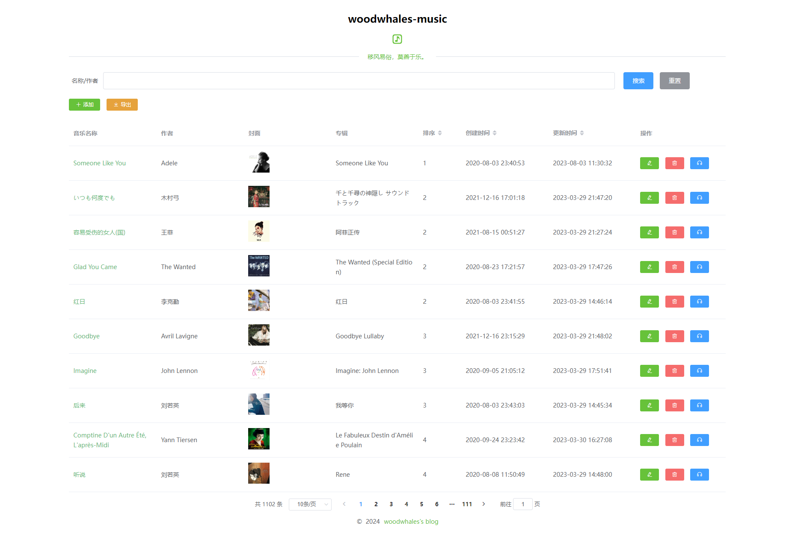
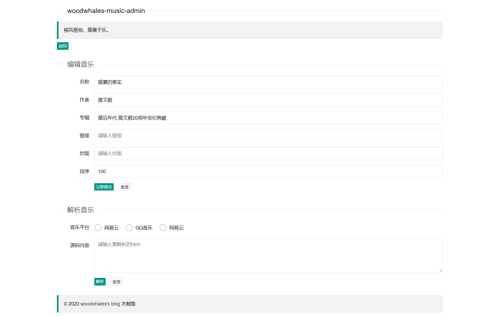

# woodwhales-music

 

> 基于 SpringBoot 的开源超简洁音乐播放器

环境要求：JDK1.8

技术栈：springboot + thymeleaf + layui + spring security + jsoup + mybatis plus + mysql 

配置说明：

- SQL 文件：woodwhales-music/doc/sql/open_music.sql
- 配置文件：woodwhales-music/src/main/resources/dev/application-dev.yml

## 功能说明

### 1.0.0

-   前端页面加载完毕，可离线播放。
-   后台系统可添加、编辑、删除音乐，并对音乐列表排序。
-   添加音乐：可从音乐平台 html 动态解析，支持：网易云、QQ云音乐、虾米音乐（平台已关闭）。

### 2.0.0

-   添加、编辑音乐信息时，当填写了音乐链接或者封面链接其中之一后，可自动填充另外一个文本内容。

### 3.0.0

- 支持导出已关联音乐清单。

###  3.5.0

- 引入 [woodwhales-common](https://github.com/woodwhales/woodwhales-common) 依赖

### 3.5.5

- 修复 cdn.jsdelivr.net 因未翻墙而无法访问题
- woodwhales-common 版本依赖更新

## 前台

访问端口：http://127.0.0.1:8084/music/

## 后台

访问端口：http://127.0.0.1:8084/music/admin/

dev 环境账号密码：admin / admin

### 首页

音乐名称为绿色字体，表示该音乐**已关联**音频链接和专辑封面链接。

音乐名称为红色字体，表示该音乐**未关联**音频链接和专辑封面链接。

### 添加/编辑

太懒了，加了个解析音乐平台的解析器，一旦解析成功，自动填充：音乐名称、作者、专辑名称。

> 支持：网易云、QQ 音乐、虾米音乐（平台已关闭）

### 解析

1. 复制要解析的 html 源码。

2. 选择要解析的平台，粘贴 html 源码，点击解析：

    

#### 网易云

class 为：`g-bd4 f-cb`的 html 源码

#### QQ 音乐

class 为：`main`的 html 源码

#### 虾米

class 为：`page-container`的 html 源码

## 歌单

| 序号 | 音乐名称 | 专辑 | 作者 |
| --- | ------ | ------ | --- |
| 1 | Someone Like You | Someone Like You | Adele |
| 2 | いつも何度でも | 千と千尋の神隠し サウンドトラック | 木村弓 |
| 3 | 容易受伤的女人(国) | 阿菲正传 | 王菲 |
| 4 | Glad You Came | The Wanted (Special Edition) | The Wanted |
| 5 | 红日 | 红日 | 李克勤 |
| 6 | Goodbye | Goodbye Lullaby | Avril Lavigne |
| 7 | Imagine | Imagine: John Lennon | John Lennon |
| 8 | 后来 | 我等你 | 刘若英 |
| 9 | Comptine D'un Autre Été, L'après-Midi | Le Fabuleux Destin d'Amélie Poulain | Yann Tiersen |
| 10 | 听说 | Rene | 刘若英 |
| 11 | Journey | Serenity | Capo Productions |
| 12 | 惊蛰 | 二十四节气 | 音阙诗听 / 王梓钰 |
| 13 | 关于郑州的记忆 | 《你好，郑州》 | 李志 |
| 14 | 哀歌 (M-5) | 犬夜叉 音楽篇 | 和田薫 |
| 15 | 野狼disco | 野狼disco | 宝石Gem |
| 16 | 童年 | 罗大佑自选辑 | 罗大佑 |
| 17 | For the Love of a Princess | Braveheart (Original Motion Picture Soundtrack) (Expanded Edition) | James Horner |
| 18 | 老街 | 小黄 | 李荣浩 |
| 19 | 恋曲1990 | 昨日情歌74-89 | 罗大佑 |
| 20 | 光阴的故事 | 命中注定最犀利 | 罗大佑 |
| 21 | 情非得已 | 遇见100%幸福1 烈爱红盘 | 庾澄庆 |
| 22 | 你要相信这不是最后一天 | 你要相信这不是最后一天 | 华晨宇 |
| 23 | 蜀绣 | 蜀绣 | 李宇春 |
| 24 | 追梦赤子心 | 追梦痴子心 | GALA |
| 25 | Jasmine Flower | Love Ballads | Kenny G |
| 26 | 太阳照常升起 | 太阳照常升起 电影原声大碟 | 久石譲 |
| 27 | Destiny | 마녀유희 OST | 李成旭 |
| 28 | 1965 | 1965 | Zella Day |
| 29 | A Thousand Years | A Thousand Years | Christina Perri |
| 30 | Come By the Hills | Song of the Irish Whistle 2 | Joanie Madden |
| 31 | La Valse D'Amelie | Le Fabuleux destin d'Amélie Poulain | Yann Tiersen |
| 32 | 理想三旬 | 浓烟下的诗歌电台 | 陈鸿宇 |
| 33 | 东风破  | 叶惠美 | 周杰伦 |
| 34 | The Long And Winding Street | Mellow Candle | Robert de Boron |
| 35 | 安和桥 | 安和桥北 | 宋冬野 |
| 36 | The Cello Song | The Piano Guys: Hits Volume 1 | Steven Sharp Nelson |
| 37 | 当我想你的时候 | 当我想你的时候 | 汪峰 |
| 38 | 明天，你好 | Lost & Found 去寻找 | 牛奶咖啡 |
| 39 | 芒种 | 二十四节气 | 音阙诗听 / 赵方婧 |
| 40 | 漂浮地铁 | N+1 Evolution 珍藏版 | 李宇春 |
| 41 | 别送我 | 别送我 | 陈鸿宇 / 苏紫旭 / 刘昊霖 / 寒洛&鼓润 |
| 42 | 稻香 | 魔杰座 | 周杰伦 |
| 43 | 认真的雪 | 未完成的歌 | 薛之谦 |
| 44 | 晚风花香 | 原乡情浓 | 邓丽君 |
| 45 | 沉默是金 | 张国荣经典金曲精选 | 张国荣 |
| 46 | Best of 2012: Payphone/Call Me Maybe/Wide Awake/Starship/We Are Young | Anthem Lights Covers | Anthem Lights |
| 47 | 为爱痴狂 | 收获 新歌+精选 | 刘若英 |
| 48 | Lemon Tree | Dish Of The Day | Fool's Garden |
| 49 | 广东十年爱情故事 | 广东十年爱情故事 | 广东雨神 |
| 50 | Turning Tables | 21 | Adele |
| 51 | Monsters | Monsters | Katie Sky |
| 52 | A Day at a Time | Life In a Day (O.S.T) | Ellie Goulding Matthew Herbert |
| 53 | 我的八十年代 | 别再问我什么是迪斯科 | 张蔷 |
| 54 | 南山南 | 南山南 | 马頔 |
| 55 | 后会无期 | 后会无期 | G.E.M.邓紫棋 |
| 56 | 画心 | 画心 | 张靓颖 |
| 57 | 为爱痴狂_陈梦嘉 | THUG LIFE | 陈梦嘉 |
| 58 | Yellow | Best Of British | Coldplay |
| 59 | 一百万个可能 | 一百万个可能 | Christine Welch |
| 60 | 习惯了寂寞 | 习惯了寂寞 | 牛奶咖啡 |
| 61 | 我的歌声里 | Everything In The World (白金庆功版) | 曲婉婷 |
| 62 | 一剪梅 | 花神 | 黄渤 /左小祖咒 |
| 63 | A Life So Changed | Titanic: Music from the Motion Picture Soundtrack | James Horner |
| 64 | Here We Are Again (纯音乐) (《喜剧之王》电影插曲) | Here We Are Again (纯音乐) (《喜剧之王》电影插曲) | Cagnet (キャグネット) |
| 65 | 相思好比小蚂蚁 | 特别的日子 | 张蔷 |
| 66 | Down By The Salley Gardens | camomile | 藤田恵美 (ふじた えみ) |
| 67 | 这世界那么多人 | 这世界那么多人 | 莫文蔚 |
| 68 | 明天你是否依然爱我 | 其实你不懂我的心 | 童安格 |
| 69 | With An Orchid | If I Could Tell You | Yanni |
| 70 | 爱如潮水 | 张信哲精选 | 张信哲 |
| 71 | 7 Years | The Young Pope (Original Series Sountrack) | Lukas Graham |
| 72 | The Sound of Silence (Reprise) | The Graduate | Simon & Garfunkel |
| 73 | BINGBIAN病变 (女声版) | BINGBIAN病变 (女声版) | 鞠文娴 |
| 74 | Don't You Remember | 21 | Adele |
| 75 | かごめと犬夜叉 (M-11+6) | 犬夜叉 音楽篇 | 和田薫 |
| 76 | 吉姆餐厅 | 吉姆餐厅 | 赵雷 |
| 77 | 很爱很爱你 | 很爱很爱你 | 刘若英 |
| 78 | 我们的时光 | 吉姆餐厅 | 赵雷 |
| 79 | Women of Ireland | Song of the Irish Whistle | Joanie Madden |
| 80 | Traveling Light | Traveling Light | Joel Hanson |
| 81 | 笑看风云 (Live) | 汪小敏 笑看风云 | 汪小敏 |
| 82 | 醉赤壁 | JJ陆 | 林俊杰 |
| 83 | 再度重相逢 | 泪桥 | 伍佰 & China Blue |
| 84 | The Way Of Life | 오! 필승 봉순영 OST | 吴硕浚 |
| 85 | 世界这么大还是遇见你 (清新的小女孩（中文版）) | 清新的小女孩（中文版） | 程响 |
| 86 | Chasing Pavements | Chasing Pavements | Adele |
| 87 | Right Here Waiting | Ballads | Richard Marx |
| 88 | 成都 | 成都 | 赵雷 |
| 89 | Faidherbe square (instrumental) | Curses from past times | ProleteR |
| 90 | Easy Breeze | Something Simple | Thomas Greenberg |
| 91 | Spring In My Step | Spring In My Step | Silent Partner |
| 92 | Free Loop | Cf, Movie & Drama Hits 广告，开麦拉！ | Daniel Powter |
| 93 | 不让我的眼泪陪我过夜 | 丝路 | 齐秦 |
| 94 | I Could Be The One | Acoustic | Donna Lewis |
| 95 | Unchained Melody | Ghost | Alex North |
| 96 | Let Her Go | All The Little Lights | Passenger |
| 97 | Jar Of Love | Everything In The World (白金庆功版) | 曲婉婷 |
| 98 | 菊花爆满山 | 菊花爆满山 | 马博 |
| 99 | John of the Glen | Song of the Irish Whistle 2 | Joanie Madden |
| 100 | Illusionary Daytime | Endless Daydream | Shirfine |
| 101 | Marry You | Now Los Mejores Exitos Del Ano 2012 | Bruno Mars |
| 102 | Seve | Seve | Tez Cadey |
| 103 | 似水流年 | Salute | 张国荣 |
| 104 | Rolling In The Deep | Rolling In The Deep | Adele |
| 105 | 喜欢你 | Beyond 25th Anniversary | Beyond |
| 106 | 我只在乎你 | 我只在乎你 | 邓丽君 |
| 107 | Coachella - Woodstock In My Mind | Lust For Life | Lana Del Rey |
| 108 | 海阔天空 | 乐与怒 | Beyond |
| 109 | 傲气傲笑万重浪 | 黄飞鸿系列电影原声精装版 | 黄霑 |
| 110 | 倩女幽魂 | Ultimate | 张国荣 |
| 111 | Angolan Women | Life In a Day (O.S.T) | The Three Angolan Women |
| 112 | 清明雨上 | 自定义 | 许嵩 |
| 113 | Set Fire to the Rain | 21 | Adele |
| 114 | That Girl | 24 HRS (Deluxe) | Olly Murs |
| 115 | 小情歌 | 小宇宙 | 苏打绿 |
| 116 | 阳光总在风雨后 | 都是夜归人 | 许美静 |
| 117 | Day by Day | 마녀유희 OST | 赵冠宇 |
| 118 | The Sound of Silence (Album Version) | Forever Friends 'Just For You' | Simon & Garfunkel |
| 119 | Refrain | Eternal Light | 阿南亮子 (あなん りょうこ) |
| 120 | 盛夏的果实 | 莫后年代 莫文蔚20周年世纪典藏 | 莫文蔚 |
| 121 | Dark Paradise (Alternative Demo) | Born To Die (Demos) | Lana Del Rey |
| 122 | Dirty Paws | Summer Acoustic | Of Monsters And Men |
| 123 | Miracle In The Middle Of My Heart (Original Mix) | Miracle In The Middle Of My Heart (Original Mix) | Clément Bcx |
| 124 | 老朋友 | 老朋友 | 杨尘,王旭(旭日阳刚) |
| 125 | Whistle | Glee: The Music - The Complete Season Four | Glee Cast |
| 126 | She | 7 Years and 50 Days | Groove Coverage |
| 127 | 十月：我和曾经的我们 | 迷藏 | 钟城 / 姚望 |
| 128 | Stronger | Kids Top 20 - De Grootste Hits Van 2013 - Summer Edition 2013 | Kelly Clarkson |
| 129 | The Immigrant | Song of the Irish Whistle | Joanie Madden |
| 130 | 家族の风景 | 虹の歌集 | 手嶌葵 |
| 131 | 爱拼才会赢 | 爱拼才会赢 | 叶启田 |
| 132 | 单身情歌 | 单身情歌．超炫精选 | 林志炫 |
| 133 | 丑八怪 | 意外 | 薛之谦 |
| 134 | 沧海一声笑 | 沧海一声笑 | 许冠杰 |
| 135 | 桔梗谣 | 桔梗谣 | 阿里郎 |
| 136 | Intro | xx | The xx |
| 137 | Need You Now | iTunes Session | Lady A |
| 138 | 父亲 | 父亲 | 筷子兄弟 |
| 139 | 桔梗谣 | 织谣 | 斯琴格日乐 |
| 140 | 老男孩 | 父亲 | 筷子兄弟 |
| 141 | 彩云之南 | 彩云之南 | 徐千雅 |
| 142 | Chasing Pavements | Chasing Pavements | Adele |
| 143 | 合肥的石头 | 赤脚青春 | 飘乐队 |
| 144 | 似夜流月 | 热门华语234 | 宗次郎 (そうじろう) |
| 145 | 芒种 | 二十四节气 | 音阙诗听 / 赵方婧 |
| 146 | Right Now (Na Na Na) | Right Now (Na Na Na) | Akon |
| 147 | Victory | Battlecry | Two Steps From Hell |
| 148 | 桔梗谣(道拉基) (朝鲜民谣) | 恋恋金达莱 | 蒋薇 |
| 149 | Down By the Salley Gardens | Song of the Irish Whistle | Joanie Madden |
| 150 | 故乡 | 我只有两天.许巍精选 | 许巍 |
| 151 | 小鱼儿的思绪 | 武侠音乐系列第二部之思情篇（截取版） | 麦振鸿 |
| 152 | Bubbly | So Fresh - The Hits Of Autumn 2008 | Colbie Caillat |
| 153 | 我很好 | I'm fine | 刘沁 |
| 154 | 江南 | 他是…JJ林俊杰 | 林俊杰 |
| 155 | 勇敢的心 | 勇敢的心 | 汪峰 |
| 156 | 年少有为 | 耳朵 | 李荣浩 |
| 157 | Price Tag | Price Tag | Jessie J / B.o.B |
| 158 | The Sound of Silence_轻音乐 | The Best Pan Pipes in the World...Ever! | Panpipes |
| 159 | Eversleeping | Eversleeping | Xandria |
| 160 | Breaking My Heart | Breaking My Heart | Lana Del Rey |
| 161 | Dying In the Sun | Bury the Hatchet | The Cranberries |
| 162 | See You Again | See You Again | See You Again |
| 163 | I Am You | I Am You | Kim Taylor |
| 164 | I'm Yours | I'm Yours | Jason Mraz |
| 165 | Innocence | The Best Damn Thing: Deluxe Edition | Avril Lavigne |
| 166 | 一生所爱 | 齐天周大圣之西游双记 电影歌乐游唱版 | 卢冠廷 / 莫文蔚 |
| 167 | 潇洒地走 | 潇洒地走 | 张蔷 |
| 168 | Apologize | Dreaming Out Loud (Tour Edition) | OneRepublic |
| 169 | Better Than One | The Score EP 2 | The Score |
| 170 | 停格 | 停格 | 蔡健雅 |
| 171 | When You're Gone | When You're Gone | Avril Lavigne |
| 172 | 容易受伤的女人 | 阿菲正传 | 王菲 |
| 173 | Astronomia | Astronomia | Vicetone / Tony Igy |
| 174 | River Flows In You | Kuschelklassik Piano Dreams, Vol. 2 | Martin Ermen |
| 175 | 倔强 | 神的孩子都在跳舞 | 五月天 |
| 176 | 牛仔很忙 | 我很忙 | 周杰伦 |
| 177 | Last Reunion | Lament of Valkyrie (Epicmusicvn Series) | Peter Roe |
| 178 | Concerning Hobbits | The Lord of the Rings: The Fellowship of the Ring (Original Motion Picture Soundtrack) | Howard Shore |
| 179 | 起风了 | 起风了 | 吴青峰 |
| 180 | 日晷之梦 | 幸福时光 精选辑 | Kevin Kern |
| 181 | 分手以后才知道最珍贵 | 回到家乡 | 胡力 |
| 182 | 叱咤红人 | 相依为命: 20年精彩印记 | 陈小春 |
| 183 | 天才白痴梦 | 天才与白痴 | 许冠杰 |
| 184 | 往事只能回味 | 怀念老歌一 | 高胜美 |
| 185 | 我这家伙的答案是你 | AsuRa BalBalTa | Leessang / 河琳 |
| 186 | 往事只能回味 | 我是歌手第四季 第9期 | 金志文 |
| 187 | 勇敢的心 | 最新热歌慢摇88 | Various Artists |
| 188 | 等一分钟 | 滕爱Teng Love | 徐誉滕 |
| 189 | 我想大声告诉你 (《蜗居》电视剧片尾曲) | 我想大声告诉你 | 樊凡 |
| 190 | 光阴的故事 | 光阴的故事 | 黄晓明 邓超 佟大为 |
| 191 | 越长大越孤单 | 越长大越孤单 | 牛奶咖啡 |
| 192 | 知足 | 知足 最真杰作选 | 五月天 |
| 193 | 往事只能回味 | 说时依旧 | 好妹妹 |
| 194 | 演员 | 绅士 | 薛之谦 |
| 195 | 一起摇摆 | 生来彷徨 | 汪峰 |
| 196 | 南方姑娘 | 赵小雷 | 赵雷 |
| 197 | 我最亲爱的 | 你在看我吗 | 张惠妹 |
| 198 | 문을 여시오 (New Ver.) 请开门 | 문을 여시오 | 任昌丁 / 金昌烈 |
| 199 | Cornfield Chase | Interstellar (Original Motion Picture Soundtrack) | Hans Zimmer |
| 200 | Riverside | Philharmonics (Deluxe Edition) | Agnes Obel |
| 201 | Gotta Have You | Say I Am You | The Weepies |
| 202 | Big Big World | Big Big World | Emilia |
| 203 | 认错 | 自定义 | 许嵩 |
| 204 | 月光下的凤尾竹 (葫芦丝) | 金耳朵.发烧民乐 | 纯音乐 |
| 205 | Love The Way You Lie | Life After Recovery | Eminem / Rihanna |
| 206 | 好汉歌 | 好汉歌 | 刘欢 |
| 207 | My Heart Will Go On | Love Ballads | Kenny G |
| 208 | 布拉格广场 | 看我72变 | 蔡依林 / 周杰伦 |
| 209 | 粉红色的回忆 | 粉红色的回忆 | 韩宝仪 |
| 210 | 穿越时空的思念 (DiESi Remix) | 穿越时空的思念 | DiESi |
| 211 | Hello | Hello | Adele |
| 212 | Chiru (Saisei No Uta) | Nostalgic | Robert de Boron |
| 213 | Southampton | Titanic: Music from the Motion Picture Soundtrack | James Horner |
| 214 | 雪见·落入凡尘 | 仙剑奇侠传三 电视剧原声带 | 麦振鸿 |
| 215 | 时间都去哪儿了 | 听得到的时间 | 王铮亮 |
| 216 | 土耳其进行曲 | 土耳其进行曲 | Various Artists |
| 217 | That's Not My Name | That's Not My Name | The Ting Tings |
| 218 | The Mountain of Women | Song of the Irish Whistle | Joanie Madden |
| 219 | Hymn To The Sea | Titanic: Music from the Motion Picture Soundtrack | James Horner |
| 220 | Don't push me | Jade - silver edition | sweetbox |
| 221 | Just Give Me A Reason | The Truth About Love | P!nk Nate Ruess |
| 222 | いつも何度でも | Prime Selection | 宗次郎 |
| 223 | 光年之外 | 光年之外 | G.E.M.邓紫棋 |
| 224 | Take It From Me | Say I Am You | The Weepies |
| 225 | 差生 | 少年中国 | 李宇春 |
| 226 | Nocturne No. 2 in E Flat Major, Op. 9, No. 2 | The Chopin Collection: The Nocturnes | Arthur Rubinstein |
| 227 | 青花瓷 | 我很忙 | 周杰伦 |
| 228 | Beyond The Memory | Beyond The Memory | July |
| 229 | 十年 | 黑白灰 | 陈奕迅 |
| 230 | 送别 | 送别 | 朴树 |
| 231 | 曹操 | 曹操 | 林俊杰 |
| 232 | 黑板情书 | 黑板情书 | 后弦 |
| 233 | I can't let this go on any further | I can't let this go on any further | Savior |
| 234 | 一辈子的孤单 | 涩女郎 电视原声带 | 刘若英 |
| 235 | 因为爱情 | Stranger Under My Skin | 陈奕迅 王菲 |
| 236 | 我从崖边跌落 | 算云烟 | 谢春花 |
| 237 | 往事只能回味 | 往事只能回味 | 岳云鹏 / 宋小宝 |
| 238 | Never An Absolution | Titanic: Music from the Motion Picture Soundtrack | James Horner |
| 239 | Rose | Titanic: Music from the Motion Picture Soundtrack | James Horner |
| 240 | 关于郑州的记忆 | 你好，郑州 | 李志 |
| 241 | 突然的自我 | 忘情1015精选辑 | 伍佰 & China Blue |
| 242 | Roses and Gold | Dust Diaries | Robin Jackson |
| 243 | 春风十里 | 所有的酒，都不如你 | 鹿先森乐队 |
| 244 | 星座书上 | 自定义 | 许嵩 |
| 245 | Yesterday Once More | Yesterday Once More | Carpenters |
| 246 | 粉末 | 粉末 | 李宇春 |
| 247 | 苏州城外的微笑 | 很有爱 | 后弦 |
| 248 | Hey Jude | It's a Battle | John Lennon / Paul McCartney / It's a Cover Up |
| 249 | 天下 | 明天过后 | 张杰 |
| 250 | Last Dance | 爱情的尽头 | 伍佰 & China Blue |
| 251 | Miss Misery | Good Will Hunting (Music from the Miramax Motion Picture) | Elliott Smith |
| 252 | 不再犹豫 | Beyond The Stage | Beyond |
| 253 | Take a Bow | Good Girl Gone Bad | Rihanna |
| 254 | 泡沫 | Xposed | G.E.M.邓紫棋 |
| 255 | 没有什么不同 | 我的歌声里 | 曲婉婷 |
| 256 | 夜太黑 | 夜太黑 | 林忆莲 |
| 257 | 故乡的原风景 | 武侠音乐精装特辑 | 宗次郎 |
| 258 | 亲爱的那不是爱情 | Ang 5.0 | 张韶涵 |
| 259 | 红色高跟鞋 | 若你碰到他 | 蔡健雅 |
| 260 | The End of the World | The End of the World | Skeeter Davis |
| 261 | 怒放的生命 | 怒放的生命 | 汪峰 |
| 262 | 大约在冬季 | 冬雨 | 齐秦 |
| 263 | 喜欢你 | 喜欢你 | G.E.M. 邓紫棋 |
| 264 | 挪威的森林 | 爱情的尽头 | 伍佰 & China Blue |
| 265 | 本草纲目 | 依然范特西 | 周杰伦 |
| 266 | 小刀会序曲 | 武侠音乐系列之豪气中天 | 商易 / 夏飞云 / 上海民族乐团 |
| 267 | 2 Soon | Not Thinking Bout 2morrow | Jon Young |
| 268 | 彩云追月 | Edell.Love | 爱戴 |
| 269 | 忧伤倒数 | 夫妻那些事 电视剧原声带 | 小昔米 |
| 270 | 爱情转移 | 认了吧 | 陈奕迅 |
| 271 | 阳光下的我们 | Say The Words | 曲婉婷 |
| 272 | 今天 | 真永远 | 刘德华 |
| 273 | Breaking My Heart | Unreleased | Lana Del Rey |
| 274 | 隐形的翅膀 | 潘朵拉 | 张韶涵 |
| 275 | 蝴蝶泉边 | 崽崽 | 黄雅莉 |
| 276 | Tassel | Dulcet Series spring special collection | Cymophane |
| 277 | Sugar | V | Maroon 5 |
| 278 | 七里香 | 七里香 | 周杰伦 |
| 279 | 庐州月 | 寻雾启示 | 许嵩 |
| 280 | Only Time | Only Time: The Collection (Box Set) | Enya |
| 281 | 香水有毒 (DJ版) | 香水有毒(宣传单曲) | 胡杨林 |
| 282 | 有何不可 | 自定义 | 许嵩 |
| 283 | 真的爱你 | BEYOND IV | Beyond |
| 284 | Remember The Time | The Ultimate Collection | Michael Jackson |
| 285 | Teenage Dream | Teenage Dream | Katy Perry |
| 286 | 莫扎特：《小夜曲》第一乐章 | 2008-2011 演奏实况合集 | 中国国家交响乐团 |
| 287 | Loves Me Not | t.A.T.u. - The Best | t.A.T.u. |
| 288 | 穿越时空的思念2 时代を超える想い2 | 映画“犬夜叉 时代を越える想い 音楽篇” | 和田薫 |
| 289 | 毕业说分手 | 毕业说分手 | 冰冰超人 |
| 290 | The South Wind | Song of the Irish Whistle | Joanie Madden |
| 291 | The Scientist | The Scientist | Coldplay |
| 292 | 大海 | 70老男孩 | 张雨生 |
| 293 | 八年的爱 | 八年的爱 | 冰冰超人 |
| 294 | TiK ToK | Animal | Kesha |
| 295 | Underneath Your Clothes | Laundry Service | Shakira |
| 296 | My Heart Will Go On | My Love: Ultimate Essential Collection (North American Version) | Celine Dion |
| 297 | 我变了 我没变 | 我变了 我没变 | 杨宗纬 |
| 298 | Trip | Trip | Axero |
| 299 | 断桥残雪 | 断桥残雪 | 许嵩 |
| 300 | 春天里 | 信仰在空中飘扬 | 汪峰 |
| 301 | What A Wonderful World | All Time Greatest Hits | Louis Armstrong |
| 302 | 光明 | 信仰在空中飘扬 | 汪峰 |
| 303 | 光辉岁月 | 光辉岁月 | Beyond |
| 304 | Rhythm Of The Rain | Let It Be Me | Jason Donovan |
| 305 | Five Hundred Miles (《醉乡民谣》电影主题曲|《一路繁花相送》电视剧插曲) | Inside Llewyn Davis: Original Soundtrack Recording | Justin Timberlake / Carey Mull |
| 306 | Snowdreams 雪之梦 | Rhine River | Bandari |
| 307 | Not a Single Day 하루도 | Rain's World (Special Edition) | Rain |
| 308 | Don't Wanna Know/We Don't Talk Anymore | Don't Wanna Know/We Don't Talk Anymore | Sam Tsui Alex Blue |
| 309 | Summer Vibe | Summer Vibe | Walk off the Earth |
| 310 | We Are One | Super Deluxe Sound I | Kelly Sweet |
| 311 | 北京北京 | 勇敢的心 | 汪峰 |
| 312 | We Don't Talk Anymore | We Don't Talk Anymore | Alex Blue TJ Brown |
| 313 | You Got Me | Breakthrough | Colbie Caillat |
| 314 | Where Is the Love | Best of Both Worlds | Josh Vietti |
| 315 | Love Story | Women's Day 2019 | Taylor Swift |
| 316 | BLUE | Blue Neighbourhood (Deluxe) | Troye Sivan Alex Hope |
| 317 | I Do | I Do | Colbie Caillat |
| 318 | A Little Story | My View | Valentin |
| 319 | Memories | 마녀유희 OST | 金有京 |
| 320 | MELANCHOLY | MELANCHOLY | White Cherry |
| 321 | Sundial Dreams | In the Enchanted Garden | Kevin Kern |
| 322 | If | 마녀유희 OST | 全慧彬 |
| 323 | 相思赋予谁 | 春生 | 好妹妹 |
| 324 | 筝锋 | 功夫 电影原声大碟 | 黄英华 |
| 325 | Thinking Out Loud | NOW That's What I Call Music! 90 | Ed Sheeran |
| 326 | Righteous Path | Introducing Mellow | Blazo |
| 327 | Somebody That I Used To Know | Making Mirrors | Gotye Kimbra |
| 328 | Aloha Heja He | Melancholie und Sturmflut (Bonus Tracks Edition) | Achim Reichel |
| 329 | 回家(萨克斯风) | 金耳朵Ⅲ | Kenny G |
| 330 | Palace Memories | Sound. Earth. Nature. Spirit. - Vol. Sound | S.E.N.S. |
| 331 | East of Eden | East of Eden | Zella Day |
| 332 | Breath and Life | The Platinum Series III: Eterna | Audiomachine |
| 333 | Carpe Diem | Dead Poets Society | Maurice Jarre |
| 334 | Beautiful In White (Demo) | Beautiful In White (Demo) | Shane Filan |
| 335 | Keating's Triumph | Dead Poets Society | Maurice Jarre |
| 336 | Better Man | Sing When You're Winning | Robbie Williams |
| 337 | Love Me Like You Do | Delirium | Ellie Goulding |
| 338 | Summer | ENCORE | 久石譲 |
| 339 | Viva La Vida | Viva La Vida Or Death And All His Friends | Coldplay |
| 340 | 爱向着我来的那天 사랑아 내게 오기만 해 (PartⅠ) | 마녀유희 OST | Ashily |
| 341 | Love The Way You Lie [Part III (Original Demo)] | Her Songs | Skylar Grey |
| 342 | You're Beautiful | So Beautiful 1 | James Blunt |
| 343 | 思念是一种病 | OK | 张震岳 / 蔡健雅 |
| 344 | Sunburst | Sunburst | Tobu / Itro |
| 345 | Farewell to Camraw | When the Pipers Play | Black Kilts Berlin /Robert Mathieson |
| 346 | 想太多 | 想太多 | 李玖哲 |
| 347 | Booty Music | Git Fresh | Deep Side |
| 348 | Genie | THE BEST ~New Edition~ | 少女时代 |
| 349 | 樱花草 | 花言乔语 (精装版) | Sweety |
| 350 | Girlfriend | The Best Damn Thing: Deluxe Edition | Avril Lavigne |
| 351 | Remember The Name | Sampler Mixtape | Fort Minor |
| 352 | The Long Way Home | The Bright Side | Lenka |
| 353 | Right Here Waiting_轻音乐 | Ballads | Richard Marx |
| 354 | 单车恋人 | 9公主 | 后弦 |
| 355 | 愤怒的消失 그게 말이죠 | 마녀유희 OST | 木单车 |
| 356 | 西厢 | 古·玩 | 后弦 |
| 357 | Bye Bye Bye | Rising Love | Lovestoned |
| 358 | Star of the County Down | Musique Celtic | Rosheen |
| 359 | Main Title (The Godfather Waltz) | The Godfather I | Nino Rota |
| 360 | 命运的恶作剧 운명의 장난 | 마녀유희 OST | MC 真理 / 哈哈 |
| 361 | Far Away From Home | Greatest Hits | Groove Coverage |
| 362 | Damn You | The Unreleased Collection | Lana Del Rey |
| 363 | Love Yourself (Natio Remix) | Love Yourself (Natio Remix) | Natio / Justin Bieber / Conor Maynard |
| 364 | Red River Valley | Journey Home | Bronn Journey |
| 365 | 去年夏天 | 去年夏天 | 王大毛 |
| 366 | My Happy Ending | Under My Skin (Special Edition) | Avril Lavigne |
| 367 | 友谊之光 | 监狱风云 | 玛莉亚 |
| 368 | The Moon Represents My Heart | Love Ballads | Kenny G |
| 369 | Auld Lang Syne | The Greatest Gift | Charlie Landsborough |
| 370 | 口弦 | 听见凉山 电视剧原声带 | 赵艺涵 |
| 371 | 奇异恩典 | 最新热歌慢摇73 | Various Artists |
| 372 | Flower Dance | A Cup Of Coffee | DJ Okawari |
| 373 | Come And Get It | Chartsurfer Vol. 30 | Selena Gomez |
| 374 | Heartbeats | Swings and Roundabouts | Amy Deasismont |
| 375 | Hero | Hero | Enrique Iglesias |
| 376 | I Just Wanna Run | Take Action! Volume 9 | The Downtown Fiction |
| 377 | 莫失莫忘 | 武侠音乐系列之后悔莫及 | 麦振鸿 |
| 378 | I Want You to Know | I Want You to Know | Zedd / Selena Gomez |
| 379 | We Are Young | Dancing Bear Best Of 2012 International | Fun. Janelle Monáe |
| 380 | The Day You Went Away | The Day You Went Away: The Best of M2M | M2M |
| 381 | Sleepyhead | Acoustic Daydreams | Galen Crew |
| 382 | Moon As My Heart | Harmonica Sound of Hong Kong | Robert Bonfiglio |
| 383 | 卡农D大调 | 胎教音乐 | 群星 |
| 384 | My Soul | Time... | July |
| 385 | 富士山下 | What's Going On…? | 陈奕迅 |
| 386 | New Soul | Irlande | Vox Angeli |
| 387 | If I Die Young | If I Die Young - Single | The Band Perry |
| 388 | The Godfather (Love Theme) | The Godfather I | Nino Rota |
| 389 | My Love (Radio Edit) | Coast to Coast | Westlife |
| 390 | What Are Words | What Are Words | Chris Medina |
| 391 | Young For You | Young For You | GALA |
| 392 | The Ludlows | Legends Of The Fall Original Motion Picture Soundtrack | James Horner |
| 393 | Pop Danthology 2012 | Pop Danthology | DJ Daniel Kim |
| 394 | Paris | Paris | Else |
| 395 | 呼唤 오나라 I | 대장금 OST | 김지현 |
| 396 | 爱向着我来的那天2 사랑아 내게 오기만 해 (Part II) | 마녀유희 OST | Ashily |
| 397 | 再见 | 再见 | 张震岳 |
| 398 | 千千阙歌 | 千千阙歌 | 陈慧娴 |
| 399 | Roses and Gold | Dust Diaries | Robin Jackson |
| 400 | Kiss The Rain 비를 맞다 | The Best - Reminiscent 10th Anniversary | Yiruma |
| 401 | Runner | Runner | Dustin O'Halloran |
| 402 | This Is the Life | Weathered | Angie Miller |
| 403 | Dead Poets Society (Finale) | Filmharmonic II | The Royal Philharmonic Orchestra Maurice Jarre |
| 404 | The sally gardens | Arias Ancora | Laure Green |
| 405 | 安静 钢琴版 | 纯音乐流行歌曲钢琴版 | Paul Liu |
| 406 | Wrecking Ball | Wrecking Ball | Miley Cyrus |
| 407 | 是啊 그래 | 마녀유희 OST | 나창현 |
| 408 | Six Feet Under | Six Feet Under | Billie Eilish |
| 409 | 穿越时空的思念1 时代を超える想い1 | 映画“犬夜叉 时代を越える想い 音楽篇” | 和田薫 |
| 410 | Umbrella | Now That's What I Call Music! 25 Years | Rihanna / Jay-Z |
| 411 | 桔梗谣 | 桔梗谣 | 阿里郎 |
| 412 | Waka Waka (Esto Es África) | Waka Waka (This Time For Africa) (The Official 2010 Fifa World Cup Song) | Shakira |
| 413 | Kiss The Rain 비를 맞다 | The Best - Reminiscent 10th Anniversary | Yiruma |
| 414 | In The End | In The End | Linkin Park |
| 415 | 野子 (Live) | 我是歌手第四季 第3期 | 苏运莹 |
| 416 | Monody | Monody | TheFatRat / Laura Brehm |
| 417 | The Show | The Show | Lenka |
| 418 | Ship In The Sand | Dear Me, Look Up | Marble Sounds |
| 419 | Summertime Sadness | Summertime Sadness | Lana Del Rey |
| 420 | 慕情 (M-4) | 犬夜叉 音楽篇 | 和田薫 |
| 421 | I Love You | I Love You | United Idol |
| 422 | 你还要我怎样 | 意外 | 薛之谦 |
| 423 | 发现爱 | 西界 | 林俊杰 / 金莎 |
| 424 | 桥边姑娘 | 桥边姑娘 | 海伦 |
| 425 | 犯错 | 犯错 | 顾峰 / 斯琴高丽 |
| 426 | 那年初夏 | 毕业了我们一无所有 | 任然 |
| 427 | 北京欢迎你 | 北京2008年奥运会歌曲专辑 | 群星 |
| 428 | Red River Valley | Cowboy Songs | Michael Martin Murphey |
| 429 | 500 Miles | Buck The Trend | Peter, Paul & Mary |
| 430 | 500 Miles | Christ Is My Hope | The Innocence Mission |
| 431 | 500 Miles | Let's Folk | The Brothers Four |
| 432 | 阿凡达与屌丝男 | 心花路放 电影原声带 | 许鹤缤 |
| 433 | Skinny Love | Skinny Love | Birdy |
| 434 | 我的歌声里 | 我的歌声里 | 李代沫 |
| 435 | 情人 | 海阔天空 | Beyond |
| 436 | 桔梗谣 | 노들강변 매화타령 민요 | 노들강변 매화타령 민요 |
| 437 | 为爱痴狂 | 歌曲合辑 | 金志文 |
| 438 | Mariage d'amour | Lettre à ma Mère | Richard Clayderman |
| 439 | 世界第一等 | 世界第一等 | 浪哥 |
| 440 | Unable To Stay, Unwilling To Leave | Titanic: Music from the Motion Picture Soundtrack | James Horner |
| 441 | Baby | Baby | Justin Bieber / Ludacris |
| 442 | 春娇与志明 | 春娇与志明 | 街道办GDC /欧阳耀莹 |
| 443 | Nevada | Monstercat - Best of 2016 | Vicetone / Cozi Zuehlsdorff |
| 444 | 听妈妈的话 | 依然范特西 | 周杰伦 |
| 445 | 红尘情歌 | 情路无悔 | 高安 /黑鸭子组合 |
| 446 | Jambalaya | 不朽的声音(人生最难忘的歌) | Carpenters |
| 447 | 安静 | 范特西 | 周杰伦 |
| 448 | 梦中蝶影 | 歌曲合辑 | 华语群星 |
| 449 | 姑娘我爱你 | 姑娘我爱你 | 索朗扎西 |
| 450 | 借我 | 算云烟 | 谢春花 |
| 451 | 兰亭序 | 魔杰座 | 周杰伦 |
| 452 | The Red Sun | 20 Years of Achievement around the World | Richard Clayderman |
| 453 | 纯真年代 | 大小世界 | 爱朵女孩 |
| 454 | 李白 | 模特 | 李荣浩 |
| 455 | 平凡之路 | 猎户星座 | 朴树 |
| 456 | Vincent | Legendary Don McLean | Don McLean |
| 457 | 意外 | 意外 | 薛之谦 |
| 458 | Coming Home | Coming Home | Skylar Grey / Diddy-Dirty Money |
| 459 | Turnin' | Young Rising Sons | Young Rising Sons |
| 460 | 那些年 | 那些年，我们一起追的女孩 电影原声带 | 胡夏 |
| 461 | 有一种爱叫做放手 | 有一种爱叫做放手 | 阿木 |
| 462 | 童年 | 童年 | 北京天使合唱团 |
| 463 | 我最亲爱的 | 我的歌声里 | 李代沫 |
| 464 | 我希望 | 匆匆那年 电视原声带 | 杨玏 |
| 465 | 知道不知道 | Rene | 刘若英 |
| 466 | Don't Worry Be Happy | Pretty Donkey Girl | Holly Dolly |
| 467 | Say Hello | These Friends Of Mine | Rosie Thomas / Sufjan Stevens |
| 468 | The Right Path | Age of Innocence (Original Soundtrack) | Thomas Greenberg |
| 469 | 相思 | 腔.调 | 毛阿敏 |
| 470 | 相对 | 子曰 第一册 | 子曰乐队 |
| 471 | Sally Gardens | Spring | The O'Neill Brothers |
| 472 | Valder Fields | A Plea en Vendredi | Tamas Wells |
| 473 | 刚好遇见你 | 刚好遇见你 | 李玉刚 |
| 474 | 海阔天空 | 一声所爱 大地飞歌（第九期） | 汪小敏 |
| 475 | Luv Letter | 髙橋大輔～フェイヴァリット・ミュージック～ | 神津裕之 |
| 476 | 万水千山总是情 | 万水千山总是情 电视剧原声带 | 汪明荃 |
| 477 | 希望 | Grace & Charm | 陈慧琳 |
| 478 | Never Say Good Bye | 마이걸 | Mario & Nesty (마리오&네스티) |
| 479 | 城府 | 自定义 | 许嵩 |
| 480 | The Long Way Home | The Bright Side | Lenka |
| 481 | All Falls Down | All Falls Down | Alan Walker / Noah Cyrus / Digital Farm Animals / Juliander |
| 482 | 梦中的婚礼 | Richard Clayderman | Richard Clayderman |
| 483 | Faded | Faded | Alan Walker / Iselin Solheim |
| 484 | Take It From Me | Say I Am You | The Weepies / Deb Talan / Steve Tannen |
| 485 | You Belong To Me | To You | Carla Bruni |
| 486 | 发如雪 | 十一月的萧邦 | 周杰伦 |
| 487 | Windy Hill（风之谷） | Windy Hill | 羽肿 |
| 488 | Bloom of Youth | クドわふたー オリジナル サウンドトラック | 清水淳一 |
| 489 | Your Man | Double Cream 5: 20 Years of Nashville #1's 1992-2012 | Josh Turner |
| 490 | Because of You | Because Of You | Kelly Clarkson |
| 491 | Demons | Continued Silence EP | Imagine Dragons |
| 492 | Take Me To Church | Bravo Hits 86 | Hozier |
| 493 | Just One Last Dance (Album Version) | Key To My Soul | Sarah Connor /Marc Terenzi |
| 494 | Love The Way You Lie (Part III (Original Demo)) | Relaxing Acoustic | Skylar Grey |
| 495 | 小苹果 | 老男孩之猛龙过江 电影原声 | 筷子兄弟 |
| 496 | 我是一只小小鸟 | 我是一只小小鸟 | 赵传 |
| 497 | 好久不见 | 认了吧 | 陈奕迅 |
| 498 | Be What You Wanna Be | Darin | Darin |
| 499 | A Place Called You | Enchanted | Emma Stevens |
| 500 | Young And Beautiful | Triple J Hottest 100 Vol 21 | Lana Del Rey |
| 501 | Scarborough Fair | The Very Best of Sarah Brightman 1990-2000 | Sarah Brightman |
| 502 | Frail Love | Frail Love | Cloves |
| 503 | 从头再来 | 经典20年 珍藏锦集 | 刘欢 |
| 504 | 浮夸 | U-87 | 陈奕迅 |
| 505 | The Ocean (Radio Edit) | The Ocean | Mike Perry / SHY Martin |
| 506 | When You're Gone | When You're Gone | Avril Lavigne |
| 507 | Lonely | Nana | Nana |
| 508 | Unity | Sounds of Syndication, Vol .1 (Presented by Syndicate) | TheFatRat |
| 509 | Hey, Soul Sister | Save Me, San Francisco | Train |
| 510 | Too Far | King in the Mirror | Anna F |
| 511 | Inspire | Serenity | Capo Productions |
| 512 | Please Don't Go | Please Don't Go | Joel Adams |
| 513 | 曾经的你 | 每一刻都是崭新的 | 许巍 |
| 514 | Sutter's Mill | The Music of Dan Fogelberg | Dan Fogelberg |
| 515 | Stay Alive | The Secret Life Of Walter Mitty (Music From And Inspired By The Motion Picture) | José González |
| 516 | 存在 | 生无所求 | 汪峰 |
| 517 | Stay Here Forever | Valentine's Day OST | Jewel |
| 518 | 易燃易爆炸 | 如也 | 陈粒 |
| 519 | 飞向别人的床 | 飞向别人的床 | 沉珂（C.K）& 光光 |
| 520 | 传奇 | 传奇 | 王菲 |
| 521 | Everybody | Everybody | Ingrid Michaelson |
| 522 | Astronomia（黑人抬棺古风版） | 黑人抬棺古风版 | litterzy、水玥儿 |
| 523 | 红颜 | MuSiC混合体 | 胡彦斌 |
| 524 | 혼자시킨 사랑 独自的爱情 | 명랑소녀 성공기 OST | True Bird |
| 525 | 潮湿的心 | 蜕变1少女的心情故事 | 卓依婷 |
| 526 | brave heart | brave heart | 宮崎歩 |
| 527 | 明天过后 | 明天过后 | 张杰 |
| 528 | Hymn To The Sea | Titanic: Music from the Motion Picture Soundtrack | James Horner |
| 529 | Love Theme | 명랑소녀 성공기 OST | 吴振宇 |
| 530 | Read My Mind | Jade | Sweetbox |
| 531 | Love Song | 명랑소녀 성공기 OST | 赵长赫 |
| 532 | Let It Out | Let It Out | Frances |
| 533 | 飞得更高 | 笑着哭 | 汪峰 |
| 534 | 花火 | 花火 | 汪峰 |
| 535 | 跟往事干杯 | 不朽金曲精选 Ⅰ | 姜育恒 |
| 536 | 直到永远 | 生死不离 我们在一起 | 汪峰 |
| 537 | 蓝莲花 | 时光.漫步 | 许巍 |
| 538 | 娃娃脸 | 娃娃脸 | 后弦 |
| 539 | 星象仪 プラネタリウム | プラネタリウム | 大塚爱 |
| 540 | 我爱你中国 | 怒放的生命 | 汪峰 |
| 541 | 莫失莫忘 | 仙侠音乐系列之仙剑奇侠传一 | 麦振鸿 |
| 542 | 一直很安静 | 寂寞在唱歌 | 阿桑 |
| 543 | 生活不止眼前的苟且 | 生活不止眼前的苟且 | 许巍 |
| 544 | 運命のルーレット廻して (转动命运之轮) | 運命のルーレット廻して | ZARD (ザード) |
| 545 | Tears Of A Clown | Mastercutor | U.D.O. |
| 546 | My Destiny (我的命运) | 별에서 온 그대 OST Part 1 | LYn (린) |
| 547 | 亲爱的路人 | 亲爱的路人 | 刘若英 |
| 548 | Call Me Maybe | Call Me Maybe | Carly Rae Jepsen |
| 549 | 如果不能好好爱 | 如果不能好好爱 | 吴克群 |
| 550 | 花开在眼前 | 花开在眼前 | 韩磊 |
| 551 | 童年 | 纵贯线演唱会 | 罗大佑、李宗盛、张震岳、周华健 |
| 552 | 魔訶不思議アドベンチャー! | ドラゴンボール全曲集 | 高橋洋樹 |
| 553 | The Monster | The Monster | Eminem / Rihanna |
| 554 | One Night In 北京 | SHIN 同名专辑 | 信乐团 |
| 555 | Amazing Grace 天赐恩宠 | 苏格兰音乐之旅 苏格兰风笛 | 群星 |
| 556 | 小仙女 | 武侠音乐系列之缠绵悱恻 （截取版） | 麦振鸿 |
| 557 | 喜剧之王 | 喜剧之王 | 李荣浩 |
| 558 | Scotland the Brave 苏格兰勇士 | 苏格兰音乐之旅 苏格兰风笛 | 群星 |
| 559 | Hallelujah | Warmer In The Winter (Deluxe Edition) | Lindsey Stirling |
| 560 | 二泉映月 | 阿炳全集 | 阿炳 |
| 561 | 男儿当自强 | 笑傲歌坛 传世经典 | 林子祥 |
| 562 | Summer | ENCORE | 久石譲 |
| 563 | 我和你 | 北京2008 奥运会、残奥会开闭幕式主题歌曲专辑 | 刘欢 / Sarah Brightman |
| 564 | 上海滩 | 上海滩 | 叶丽仪 |
| 565 | 算你狠 | 绝对收藏 | 陈小春 |
| 566 | 黄种人 | 黄·锋 | 谢霆锋 |
| 567 | Croatian Rhapsody | The Piano Player | Maksim Mrvica |
| 568 | He's a Pirate | Pirates of the Caribbean: The Curse of the Black Pearl | Klaus Badelt |
| 569 | 星月神话 | 女人又一次哭泣 | 金莎 |
| 570 | 夜上海 | 夜上海精选 | 周璇 |
| 571 | 带你去旅行 | 带你去旅行 | 校长（张驰） |
| 572 | 天下第一 | 武侠音乐系列之豪气中天 （截取版） | 麦振鸿 / 罗坚 |
| 573 | '97爱情宣言 | 狼 97黄金自选辑 | 齐秦 |
| 574 | 外面的世界 | 燃烧爱情（狼之旅） | 齐秦 |
| 575 | 小酒窝 | JJ陆 | 林俊杰 / 蔡卓妍 |
| 576 | 大约在冬季 | 摘金宝典 | 齐秦 |
| 577 | Go Time | Go Time | Mark Petrie |
| 578 | 往事随风 | 痛并快乐着 | 齐秦 |
| 579 | The Portrait | Titanic: Special Edition | James Horner |
| 580 | 你还欠我一个拥抱 | 很有爱 | 后弦 / Sara |
| 581 | 匆匆那年 | 匆匆那年 电影原声带 | 王菲 |
| 582 | 命运 운명 | 풀 하우스 OST (KBS 미니시리즈) | Why |
| 583 | 大海~ | Asia | THE JAYWALK |
| 584 | Flavor Of Life | Flavor Of Life | 宇多田ヒカル |
| 585 | Death Of Titanic | Titanic: Music from the Motion Picture Soundtrack | James Horner |
| 586 | 不如不见 | What's Going On…? | 陈奕迅 |
| 587 | Distant Memories | Titanic: Music from the Motion Picture Soundtrack | James Horner |
| 588 | 偏爱 | 破天荒 | 张芸京 |
| 589 | Diamonds | Diamonds | Rihanna |
| 590 | 我欲成仙 | 西游记后传片头曲 | 刘欢 |
| 591 | 希望 (国语) | 我是阳光的 | 陈慧琳 |

